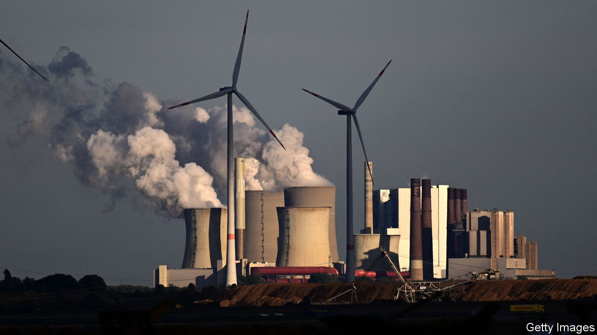
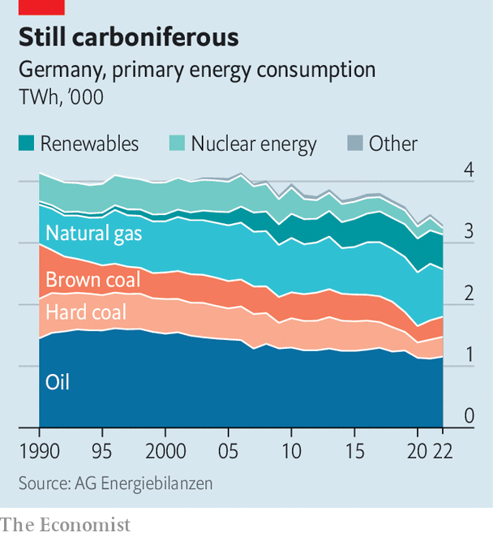

###### Energie-wander

# Angst mounts over Germany’s green transition 

##### Meeting its targets looks hard 

 

> Sep 21st 2023 

When Robert Habeck, co-leader of the Green party and the economy tsar in Germany’s ruling coalition, floated a bill last spring that mandated replacing gas and oil boilers with cleaner heat pumps, he got more heat than he bargained for. Tabloids screamed his “heat hammer” would push millions into debt. Whipped-up fury against “Green fascism” boosted ratings for the hard-right Alternative for Germany (AfD) party. The minister spent much of the summer tweaking his bill. His patience paid off. In early September the Bundestag passed it by a cosy 397-275 votes.

Yet the new law may prove a sign of things to come. For one thing, the spring storm exposed just how fast and how low enthusiasm for environmental initiatives can sink the moment they threaten wallets. Mr Habeck’s compromise also showed that despite much progress in Germany’s , the now two-decade-old national effort to shift entirely to clean energy remains a steep uphill climb. Indeed, at current rates it looks increasingly doubtful that Germany will reach its target of net carbon neutrality by 2045.

 


Home heating is a small part of the puzzle, but well illustrates the challenge. Some 80% of Germany’s buildings heat using fossil fuels, contributing about 15% of total COoutput. The draft law, which would have forced adoption of electric heat pumps starting next year, aimed to cut this in half by 2030. A longer time-frame and wider exemptions under the new law mean it will reach perhaps 75% of this goal, says Mr Habeck’s ministry. And that sounds optimistic. Trade groups say there are few skilled pump-fitters. Older buildings will need costly insulation upgrades. And the complexity of state subsidies for the pumps, which can cost upwards of €20,000 ($21,000), may slow take-up.

There is another problem. For all their efficiency, heat pumps draw on electricity that in Germany is largely still supplied by hydrocarbons. True, on good days solar and wind power now generate well over half the power supply. But with demand expected to grow by 20% by 2030—pushed up by millions of new electric cars and now heat pumps—the addition of renewables capacity will need to speed up markedly. So will investment in the already stressed distribution network, which must increasingly cope with capricious wind and solar rather than steady thermal inputs. 

And so, say many experts, will investment in dirty old thermal plants. A recent report on bottlenecks to German growth from Deutsche Bank is categorical: “The basic problem is that no cost-effective electricity-storage technologies on a large industrial scale are in sight…Germany will therefore continue to rely on traditional back-up power-generation capacity.” This means not just gas and coal but even stinkier domestic lignite: scrambling in 2022 to make up for cut-off Russian gas supplies, it relaunched no fewer than five mothballed “brown coal” plants.

Hans-Werner Sinn, an economist in Munich, is also blunt. The 40% decline since 1990 in the amount of CO that Germany emits, he said in a recent lecture, was reached by plucking “low-hanging fruit”, such as letting grimy smokestack industries in former East Germany die. In Germany’s current primary-energy mix, including such things as fuel used for transport and heating as well as electricity generation, the share of renewables still remains below 20%. Given that Germany abandoned nuclear energy earlier this year, Mr Sinn reckons that making the remainder clean would mean covering some 2% of Germany’s surface, as much as its entire transport network, in wind and solar farms. Maybe Germany should have invested in more nuclear power instead. ■

