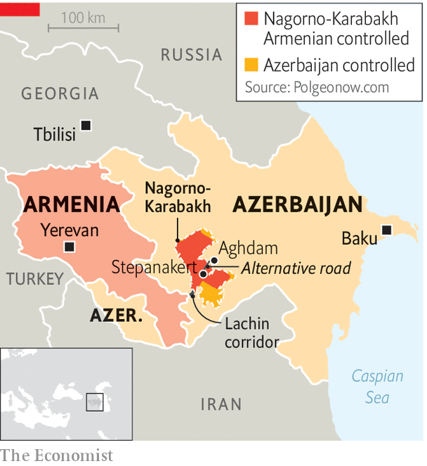

###### A one-day war

# Azerbaijan is close to taking control of Nagorno-Karabakh 

##### The ethnic-Armenian enclave has agreed to disarm 

 

> Sep 21st 2023 

Things could have got much nastier, and they still might in the days and weeks ahead. On September 20th, a day after Azerbaijan launched an armed offensive against Nagorno-Karabakh, an ethnic-Armenian enclave inside its borders, a ceasefire took hold. Under its terms, the region’s Armenian separatists agreed to surrender and disband, something Azerbaijan has insisted on for some time. 

The deal may have prevented a massacre on Europe’s doorstep; in a single day, Azerbaijan’s drones and bombs had reportedly killed at least 200 people across the region. Images showed Armenians hunkering down in basements as sirens sounded over Stepanakert, the regional capital. But the agreement, brokered by Russian peacekeepers deployed to the region three years ago, also appears to spell the end of the enclave’s semi-independent status. Thousands of Armenians have already abandoned their homes. Many more may decide to flee to Armenia.

Azerbaijan called the assault an “anti-terrorist operation” intended to restore constitutional order. Officials in Armenia, including the country’s prime minister, Nikol Pashinyan, called it an ethnic-cleansing campaign against Karabakh, home to some 100,000 ethnic Armenians. Azerbaijan says the offensive was in large part a response to elections held in the enclave on September 9th and to recent mine explosions that killed six Azerbaijanis, including four police officers. But the attack seems to have been in the making for some time. Armenia accused Azerbaijan of massing troops near the border separating the two countries and around Nagorno-Karabakh in early September. 

Nagorno-Karabakh, populated by Armenians but formally part of Azerbaijan, has been bloodied by two large wars in three decades. The most recent of these, in 2020, saw Azerbaijan recapture territories occupied by Armenian forces since the 1990s. Since last December, Azerbaijan has blocked the Lachin corridor, the only road connecting Karabakh with Armenia, so as to force its leaders to relinquish any dreams of autonomy. The government in Baku agreed to reopen the corridor on September 9th, in exchange for the opening of another road linking Nagorno-Karabakh with the rest of Azerbaijan. But the new offensive and the ceasefire agreement seem to have sealed Karabakh’s fate. 

Azerbaijan now plans to “reintegrate” Nagorno-Karabakh, says Hikmet Hajiyev, a presidential adviser. But how this is supposed to happen without an exodus of the region’s Armenians is unclear. The government in Baku refuses to offer them any special rights or security guarantees. “It will be just like any other region of Azerbaijan,” says Mr Hajiyev. For the Armenians, that is hardly a comforting thought. Following three decades of bloodletting on both sides, they are more likely to leave than to live under Azerbaijan’s rule and risk discrimination and retribution.

No one plans to stand in Azerbaijan’s way. Western powers have largely contented themselves with routine condemnations. Afraid of being drawn into a wider war with Azerbaijan, which it would almost surely lose, Armenia’s army claims to be staying out of the dispute. 

Striking in its absence has been any reaction from Russia, the region’s power-broker. As Azerbaijan massed its troops on the Armenian border and prepared to shell Nagorno-Karabakh, Mr Pashinyan accused Russia of failing in its peacekeeping duties. Margarita Simonyan, the boss of “Russia Today”, a Kremlin mouthpiece, openly mocked the Armenian leader. “He is asking for help from Russian peacekeepers,” she said. “Why doesn’t he ask NATO?” 

The conflict began in 1988 when the Armenians of Karabakh, then part of Soviet Azerbaijan, called for the region’s merger with Soviet Armenia. It snowballed into a brutal war in the early 1990s, after the Soviet empire collapsed. Armenia, backed by Russia, prevailed, and ended up in control of Karabakh, though the region formally remained part of Azerbaijan. Russia has since retained an army base in Armenia.

 


Since the 2020 war, Armenia has regularly accused Russia, with which it has a defence pact, of leaving it out in the cold, and drawn closer to America. The country recently hosted military exercises featuring a small number of American troops and has turned to India and other countries for weapons. Most insultingly for the Kremlin, Armenia has moved to join the International Criminal Court, which has issued an arrest warrant for Russia’s dictator, Vladimir Putin. Armenian officials were well aware of the risk they were taking in pivoting to the West. “But if we did nothing, we would almost certainly lose our statehood,” one says. By washing his hands of Nagorno-Karabakh, Mr Putin wants to show there is a price to be paid for leaders who turn their back on Russia. 

The ceasefire may have saved Karabakh from a bloodbath. Barring a breakdown in the newly announced talks between Azerbaijan and the Karabakh Armenians, the agreement will probably hold, because Baku has achieved its objectives. 

But there is little to celebrate. Officials in Baku claim the Karabakh Armenians are welcome to stay and enjoy the rights extended to Azerbaijan’s other minorities. But even assuming pure intentions, the bad blood between the two sides, the trauma of past wars and years of vile propaganda may be impossible to overcome. “It’s hard to see a scenario”, says Laurence Broers of Chatham House, a think-tank, “in which coexistence is possible.” ■

