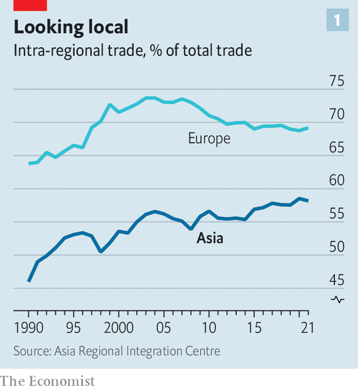

###### A new era

# How Asia is reinventing its economic model 

##### The continent’s future will involve less Western influence 

 

> Sep 19th 2023 

Seven hundred years ago, maritime trade routes that stretched from the coast of Japan to the Red Sea were peppered with Arab dhows, Chinese junks and Javanese djongs, ferrying ceramics, precious metals and textiles across the region. At its centre, a trading post known as Singapura flourished. The enormous intra-Asian commercial network was disrupted only by the arrival of sailors from rising European empires and the emergence of farther-flung markets for Asian goods.

 


Today another reconfiguration is under way. The “Factory Asia” model of the late 20th century, in which the continent produced products for American and European consumers, provided an astonishing boost to the prosperity of China, Japan, South Korea and Taiwan. In 1990 just 46% of Asian trade took place within the continent, as vast quantities of goods flowed to the West. Yet by 2021 that figure had reached 58%, closer to European levels of 69% (see chart 1). More regional trade has led to an increase in capital flows, too, binding countries tighter still. A new era of Asian commerce has begun—one that will reshape the continent’s economic and political future.

Its emergence began with the growth of sophisticated supply chains centred first on Japan in the 1990s, and later on China as well. Intermediate goods—components that will eventually become part of finished products—soon started to move across borders in greater numbers. They were followed by foreign direct investment (fdi). Asian investors now own 59% of the stock of fdi in their own region, excluding the financial hubs of Hong Kong and Singapore, up from 48% in 2010. In India, Indonesia, Japan, Malaysia and South Korea the share of direct investment from Asia rose by more than ten percentage points, to between 26% and 61%. 

After the global financial crisis of 2007-09, cross-border banking also became more Asian. Before the crisis hit, local banks accounted for around a third of the region’s overseas lending. They now account for more than half, having taken advantage of the retreat of Western financiers. China’s huge state banks led the way. Overseas loans by the Industrial and Commercial Bank of China more than doubled from 2012 to last year, rising to $203bn. Japan’s megabanks have also spread, in order to escape narrow margins at home, as have Singapore’s United Overseas Bank and Oversea-Chinese Banking Corporation. 

The presence of Western governments has also diminished. In a recent survey of South-East Asian researchers, businessfolk and policymakers by the iseas-Yusof Ishak Institute in Singapore, some 32% of respondents said they thought America was the most influential political power in the region. Yet just 11% of respondents called it the most influential economic power. State-led investment from China to the rest of the continent under the Belt and Road Initiative has captured attention, but official assistance and government-facilitated investment from Japan and South Korea are also growing. 

These trends are likely to accelerate. In the face of deteriorating relations between America and China, companies in the region that rely on Chinese factories are considering alternatives in India and South-East Asia. At the same time, few bosses expect to desert China entirely, meaning two Asian supply chains will be required, along with some doubling-up of investment. Trade deals will speed this along. A study published last year suggested that the Regional Comprehensive Economic Partnership, a broad but shallow pact signed in 2020, will increase investment in the region. By contrast, as a result of America’s abandonment of the Trans-Pacific Partnership trade deal in 2017, there is little chance of Asian exporters gaining greater access to the American market. 

 


The need to establish new supply chains means that transport and logistics are another area where intra-Asian investment will probably increase, notes Sabita Prakash of adm Capital, a private-credit firm. Matching investors searching for reliable income with projects looking for finance—the mission of such private-credit companies—has been a lucrative pastime in Asia, and is likely to become a more popular one. The size of the private-credit market in South-East Asia and India rose by around 50% between 2020 and mid-2022, to almost $80bn. Other big investors are turning to infrastructure, too. gic, Singapore’s sovereign wealth fund, which manages a portion of the country’s foreign reserves, is spending big on the building required for new supply chains.

Changes to Asian savings and demography will also speed up economic integration. China, Hong Kong, Japan, Singapore, South Korea and Taiwan have climbed the ranks of overseas investors, becoming some of the world’s largest. These richer and older parts of the continent have exported striking volumes of capital into the rest of the region, with cash following recently established trade links. In 2011 richer and older countries in Asia had about $329bn, in today’s money, invested in the younger and poorer economies of Bangladesh, Cambodia, India, Indonesia, Malaysia, the Philippines and Thailand. A decade later that figure had climbed to $698bn.

Silk flows

In India and South-East Asia, “you’ve still got urbanisation happening, and capital follows those trends,” says Raghu Narain of Natixis, an investment bank. Bigger cities require not only more infrastructure investment, but also new companies better suited to urban life. Asian cross-border merger-and-acquisitions (m&amp;a) activity is changing, according to Mr Narain, becoming more like that found in Europe and North America. Even as deals into and out of China have slowed considerably, m&amp;a activity has become more common elsewhere. Japanese banks, facing low interest rates and a slow-growing economy at home, are ravenous for deals. Over the past year Sumitomo Mitsui Financial Group and Mitsubishi ufj Financial Group have snapped up Indonesian, Philippine and Vietnamese financial firms. 

 


Meanwhile, rising Asian consumption makes local economies more attractive as markets. Whereas in Europe 70% or so of consumption goods are imported from the local region, just 44% are in Asia. This is likely to change. Of the 113m people expected next year to enter the global consumer class (spending over $12 a day in 2017 dollars, adjusted for purchasing power), some 91m will be in Asia, according to World Data Lab, a research firm. Even as Chinese income growth slows after decades of expansion, other countries will pick up the pace. The five largest economies in asean, a regional bloc—namely, Indonesia, Malaysia, the Philippines, Singapore and Thailand—are expected to see imports grow by 5.7% a year between 2023 and 2028, the most rapid pace of any region (see chart 3).

These regional trading patterns would represent a return to a more normal state of affairs. The globe-spanning export model that delivered first-world living standards to large parts of Asia, and encouraged investment from far afield, was a product of unique historical circumstances. The amount of goods that travel from the continent’s industrial cities to America is far higher than would be predicted by the relative size of their respective export and import markets, and the distance between them. Indeed, a paper by the Economic Research Institute for asean and East Asia suggests that machinery exports from North-East and South-East Asia to North America in 2019 were more than twice as high as such factors would suggest.

Closer commercial links will bind the business cycles of Asian economies even more tightly together. Despite the enduring use of the dollar in cross-border transactions and Asian investors’ continuing penchant for Western-listed markets, a study by the Asian Development Bank in 2021 concluded that Asian economies are now more exposed to spillovers from economic shocks in China than in America. This has been on display in recent months, as China’s faltering trade has hit exporters in South Korea and Taiwan. More trade, not just in intermediate parts but in finished goods for consumption, means the continent’s currencies and monetary-policy decisions will increasingly move together. 

This will have political ramifications. America will retain influence over Asian security, but its economic importance will decline. Local businessfolk and policymakers will be more interested in and receptive to their neighbours, rather than customers and countries farther afield. With local factories still being built, consumption growing and a deep pool of savings from Asia’s increasingly elderly savers desperate for projects to finance, the high point for regional integration has yet to be reached. The new era of Asian commerce will be more locally focused and less Western-facing. So will the continent itself. ■


