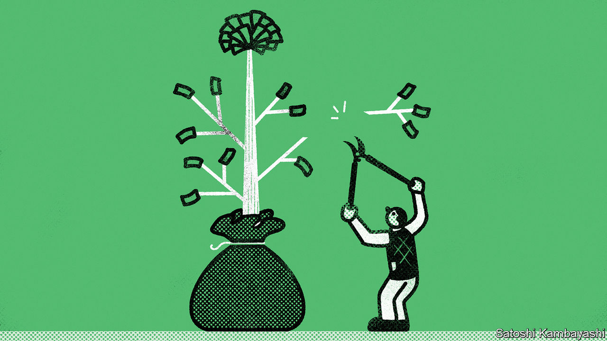

###### Buttonwood

# How to avoid a common investment mistake 

##### Think less about what to buy, and more about how much 

 

> Sep 21st 2023 

If you ever hear a professional investor talk about a trade that taught them a lot, prick up your ears. Usually, this is code for “a time I lost an absolutely colossal amount of money”, and you are in for one of the better stories about how finance works at the coalface.

On this front, Victor Haghani is a man to whom it is worth listening. He spent the mid-1990s as a partner and superstar bond trader at the hottest hedge fund on Wall Street. In its first four years, Long-Term Capital Management (ltcm) made its initial backers average returns of more than 30% a year and never lost money two months in a row. Moreover, its partners had been trading the capital of Salomon Brothers, an investment bank, for the preceding 20 years, with similar results. But in 1998 the wheels came off in spectacular fashion. ltcm lost 90% of its capital at a stroke. Despite a $3.6bn bail-out from a group of its trading counterparties, the fund was liquidated and its partners’ personal investments wiped out. Mr Haghani writes that he took “a nine-figure hit”.

Now, along with his present-day colleague James White, he has written a book that aims to spare other investors his mistakes. Fortunately, “The Missing Billionaires” is not a discussion of the minutiae of ltcm’s bond-arbitrage trades. Instead, it examines what its authors argue is a much more important—and neglected—question than picking the right investments to buy or sell: not “what” but “how much”.

People tend to answer this question badly. To show this, the book describes an experiment in which 61 youngsters (college students of finance and economics, plus some young professional financiers) were given $25 and asked to bet on a rigged coin at even odds. Each flip, they were told, had a 60% chance of coming up heads. They had time for about 300 tosses, could choose each bet’s size and would keep their winnings up to a cap of $250. This was an exceptionally good deal: simply betting 10% of the remaining pot on each toss had a 94% chance of yielding the maximum payout and none of going bust. Yet the players’ average payout was just $91, only a fifth of them hit the cap and 28% managed to lose everything.

A list of the coin-flippers’ mistakes reads like a parable of how not to invest in the stockmarket. Rather than picking a strategy and sticking to it, subjects bet erratically. Nearly a third wagered their entire pot on a single flip and, amazingly, some did so on the 40% chance of getting tails. Many doubled down on losses, even though doing so is a reliable way of making mild ones catastrophic. Others made small bets fixed in dollar amounts, avoiding ruin but also giving up the lion’s share of their potential returns. Few considered the optimal, lucrative strategy of betting a constant fraction of their wealth on an attractive opportunity. 

The rest of the book offers a corrective to these wealth-sapping instincts. Most important is to devise rules for spending, saving and allocating investments, expressed as fractions of your total wealth. Then you must stick to them, avoiding the temptation to chase hot assets or spend too much in the face of losses.

The authors’ great success is in offering a consistent and explicit framework within which to do all this. At its core is the concept of “expected utility”, or the pleasure derived from a given level of wealth. This accounts for the fact that most people are averse to risking large chunks of their capital. A happy consequence is that sizing investments to maximise expected utility, rather than wealth, can sharply reduce your chances of intolerable losses while keeping enough risk for a shot at decent returns. 

In practical terms, the book’s crowning achievement is its explanation of the “Merton share”. This is a simple rule of thumb for determining asset allocation, which says that allocations should rise in proportion to expected returns, fall in proportion to the investor’s risk aversion and fall a lot in proportion to volatility (specifically, to its square). 

This is not to suggest the book makes for light reading. The authors prescribe calculations that will appeal to only the most dogged investors, ideally with access to a Bloomberg terminal. Most will conclude that they need a wealth-management firm to help them; conveniently enough, Messrs Haghani and White run one. Yet for those investing in their own business—or, indeed, a hotshot hedge fund—it is worth reading simply for Mr Haghani’s reflection on how much he ought to have ploughed into ltcm all those years ago. Spoiler alert: it was rather less than he did. ■


