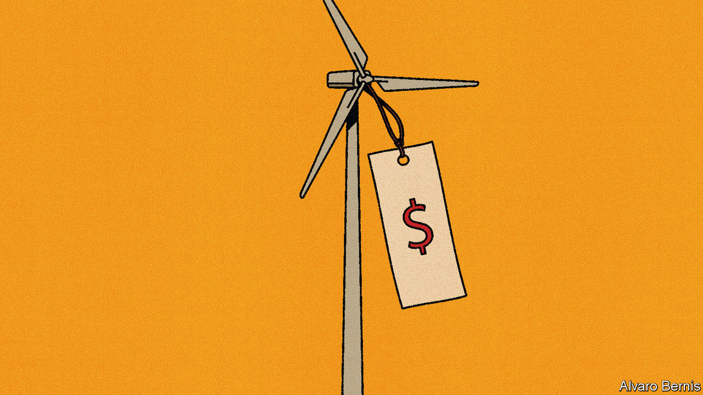

###### Free exchange

# Renewable energy has hidden costs 

##### Why it is often more expensive than policymakers expect to go green 

 

> Sep 21st 2023 

It matters when electricity is produced. A barrel of oil may be a barrel of oil whether it is pumped at midday or midnight, but a megawatt hour (mwh) of electricity is worth a great deal less when you are sleeping than during the middle of the day or, indeed, during moments when everyone decides to boil the kettle. The difficulty of bottling electricity makes its economics unusual: it is a question not just of “how much” but also “when”. 

At the same time, if there is one thing that everyone knows about renewable energy, it is that it is getting cheaper. Each year, or so the story goes, the costs of wind and solar power fall as the world improves its ability to harness natural resources. In 2014 the levelised cost of offshore wind, a measure for comparing different methods of generating electricity, was around $200 per mwh, according to America’s Energy Information Administration (eia), an official agency; by 2023 it had fallen to $127, excluding subsidies. Yet the industry is struggling. Six state governors recently begged Joe Biden to intervene to keep producers alive, according to Bloomberg, a news service. In Britain the latest annual offshore wind auction attracted no bids whatsoever. 

To understand what is going on, consider the levelised cost of energy in more detail. Do away with sun and wind, too, and return to a world where the choice is gas, coal or nuclear energy. These differ in terms of both their fixed and variable costs. The costs of a nuclear plant are mostly fixed: once built it is inexpensive to produce another unit of electricity. Natural-gas plants are the opposite: most of the costs are the fuel, and are thus variable.

A levelised cost means taking these fixed and variable costs over the lifetime of the plant and weighting them by the expected number of watt-hours the plant will produce. This gives a comparable measure. According to the eia, the levelised cost of nuclear power is $91 per mwh. Natural gas comes to $43. Compare that with expectations for the price of electricity and you should have a good idea of whether or not a new plant is worthwhile.

Yet these costs vary depending on how often a source is producing energy. A nuclear plant will be cheapest if it is running constantly, as the high upfront costs will have produced greater output. Gas, with low fixed costs and high variable costs, has lower economies of scale. Coal sits somewhere between the two. Considered purely on the financial merits, the optimal power mix is to have nuclear cover the “baseload”, or minimal level of demand, coal for the “mid-load” and, finally, natural gas for the “peak load”, when demand is highest. Add a carbon price and the coal will be displaced by natural gas, which is less dirty, as has happened in Europe over the past few decades. 

Unfortunately, this dynamic is upset by renewables, which provide power according to the weather and often require the rest of the energy system to accommodate them. Gas, with its low fixed but high variable costs, can do so easily. Nuclear, with high fixed and low variable costs, becomes much more expensive. It is costly to build a nuclear power plant to cover only the windless hours. 

As such, solar panels and wind turbines are themselves less beneficial than they might seem. If they cannot reliably produce electricity when it is needed, then their generating capacity is not as valuable as that of a regular power plant. To truly compare the two requires a measure of not just how much each megawatt hour costs to produce, but the value of that particular hour.

In an idealised market, with prices updating moment-to-moment and geographically from node-to-node on the grid, the relative benefit of any energy source would be easy to calculate: it would depend on the “capture rate”. This is the difference between the market price that a source receives and the average price for electricity over a period. Prices should be higher when people most want electricity, boosting the capture rate of sources that produce at that time. Fortunately for renewables, this is usually during daylight hours, making solar useful, or during the cold windy months. But as more renewables join the grid the capture rate will fall, since an abundance of solar panels means that when it is sunny electricity prices are very low, or even negative.

Consider these costs, as measured by the eia in America, and most renewables look less competitive: solar’s cost of $23 per mwh falls below an average capture rate of $20 for the electricity generated. That is still sufficiently good to beat everything other than onshore wind, geothermal energy and adding more battery storage to the grid. Offshore wind, by contrast, looks downright uncompetitive: the capture rate of its electricity is around $30 compared with a cost of $100 per mwh—only nuclear and coal have lower ratios. Add in rising costs, due to higher interest rates and disrupted supply chains, and it is no wonder many offshore-wind providers are struggling.

Scottish power

Most electricity markets are not ideal. Prices do not reflect the true value of time and place, meaning they are not a perfect guide to how much society wants each mwh of electricity. Look at Britain. Wholesale electricity prices are settled for half-hour blocks, which should mean pricing will give a decent idea if renewables are producing at the wrong times of day. But there is only one price for the whole country. Most onshore wind is in Scotland, since England until recently had a de facto ban on building such wind farms, though more of the demand for electricity is in the south of England. A lack of capacity on the grid to move the electricity south means that the grid manager pays to turn off Scotland’s wind turbines while gas power plants in England are turned on. 

Eventually, increasing the grid’s capacity to shift and store electricity will solve such problems. But for the moment, comparing costs with the capture rate would not give an accurate idea of the relative benefits of building more Scottish wind power. The true costs of renewable energy are greater than they appear. ■


