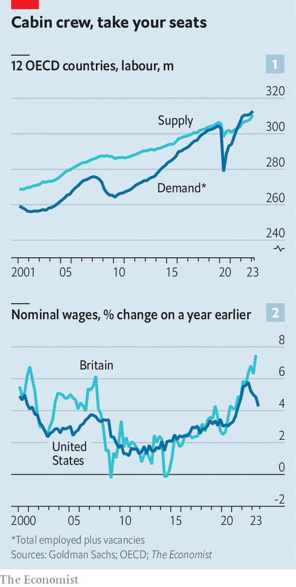

###### The price battle

# Why aren’t more people being sacked? 

##### How inflation has fallen without mass casualties 

 

> Sep 17th 2023 

If central bankers are to defeat inflation, they must cool the labour market. For the past couple of years growth in rich-world wages has added to corporate costs, sending prices relentlessly upwards. But as they began  to slow the economy, monetary policymakers hoped for an even rosier outcome. They wanted to achieve a “soft landing”, which involves both bringing down inflation and doing so without mass job losses. It is a lot to ask of a tool as blunt as monetary policy. 

So far, and unexpectedly, labour markets from San Francisco to Sydney are co-operating. Central bankers started to raise rates at a time when demand for labour had almost never been so strong (see chart 1). Last year the unemployment rate across the oecd club of rich countries, measuring the share of people in the labour force who would like a job, was a shade under 5%, which was close to an all-time low. Excess demand for labour showed up in an unprecedented surge in unfilled vacancies, which reached an all-time high. Workers bargained for higher wages, knowing that they had plenty of options elsewhere. 

The scale of the task central bankers set themselves was illustrated by the historical record. Research by Alex Domash and Larry Summers, both of Harvard University, found that there had never been an instance in which the American vacancy rate had fallen substantially without unemployment rising significantly. Last year Michael Feroli of JPMorgan Chase, a bank, studied past episodes and noted that “whenever the vacancy rate goes down a little it goes down a lot, and the economy lands in recession”.

 


To assess progress in rich-world labour markets, we have assembled data from the oecd and Indeed, a listings website, covering 16 countries. In this group, employers have reduced open vacancies by more than 20% on average from their peak—a historically rapid decline. Some countries, such as France, have seen relatively modest falls of 10% or so. In others, such as Canada, Japan and Switzerland, unfilled job postings are down by a quarter or more. 

Declining vacancies are helping to trim wage growth. In America the annual rate of pay rises has slipped from 6% in late 2022 to below 5% today (see chart 2). Canadian wage growth is also falling fast. The story is less clear elsewhere, not least because the quality of the earnings data is worse. In Germany and Italy wage growth has probably stopped rising, though there remain pockets of concern, including in Britain, where year-on-year pay growth is edging up towards 8%. Yet even here forward-looking surveys, which quiz firms and consumers on expectations for wage growth, point to sharp future reductions. 

For policymakers, this would feel a bit soiled if it came with a sharp rise in joblessness. According to the rules of thumb for America discussed by Messrs Domash and Summers, in normal times you would expect a 20%-plus fall in vacancies to come alongside a rise in unemployment of three or so percentage points within a year. 

In reality, a year or so after vacancies started heading down, something else appears to be happening. Recently the  in the oecd has held steady. Job growth, at 500,000 a month across the rich world, is about as fast as it was in the second half of last year. The working-age employment rate—the share of people aged 16-64 who are actually in a job—has risen to an all-time high in around half of oecd countries. Even places known for high unemployment, such as Italy and Portugal, have found jobs for an unprecedented share of their working-age population. 

Why are labour markets breaking the historical rule? One possibility relates to “the great resignation” during the covid-19 pandemic. In 2021, spooked by stories of employees quitting to start crypto firms and write novels, some employers may have put up job vacancies as an insurance policy. Now, as fewer folk leave their jobs, they are taking them down again. 

A second possibility relates to “labour hoarding”. During lockdowns in 2020 many companies laid off workers, only to struggle to rehire them when the economy opened up. Bosses do not want to make the same mistake twice. So today, even as the economy slows and firms cut job ads, they are trying to hang on to existing workers. According to recent research published by the Federal Reserve’s San Francisco branch, unemployment in America is “notably lower” than expected given the current rate of economic growth. We find similar trends across the rich world.

Central bankers still have a difficult task on their hands, as inflation in many places remains uncomfortably elevated. Even in America and Canada, demand for labour is high relative to supply. Across the rich world, wage growth exceeds productivity growth, adding to the inflationary pressure. And Messrs Domash and Summers could still be proved right if unemployment jumps in the coming months. But after two years of bad inflation data, and warning after warning that their strategy was sure to fail, policymakers nevertheless have reason to be hopeful. ■


