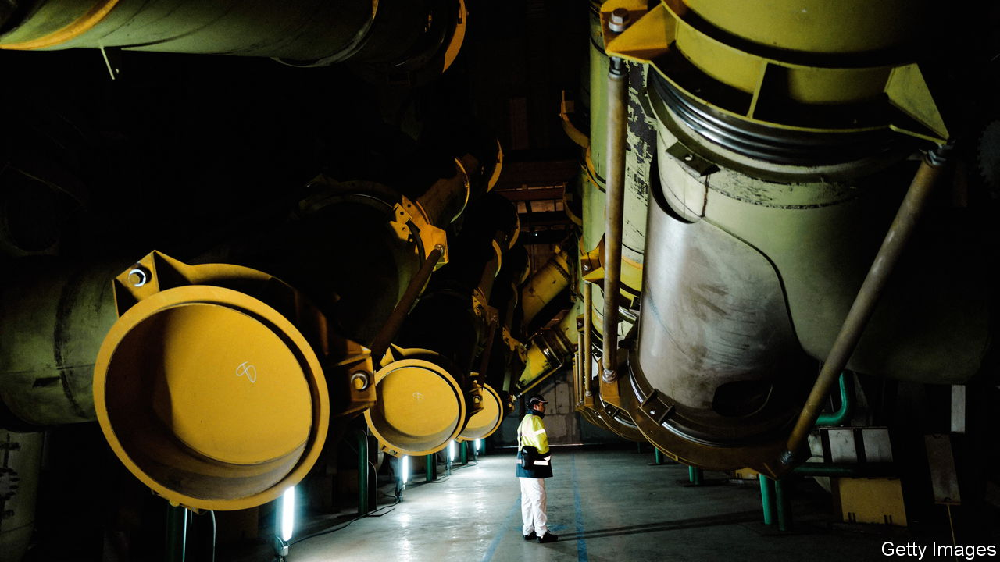
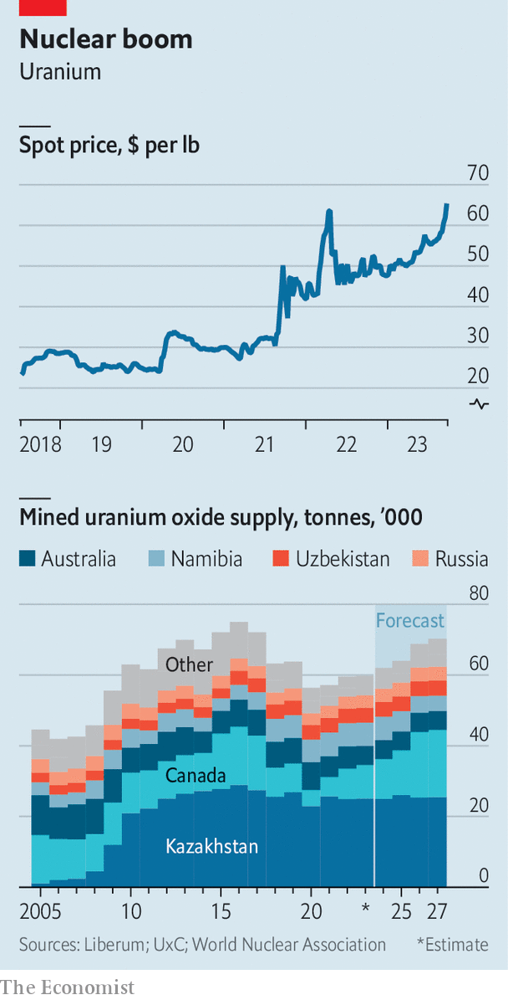

###### Rod stewards

# Why uranium prices are soaring 

##### Conflicts and resurgent demand combine to radioactive effect 

 

> Sep 21st 2023 

When russia invaded Ukraine, panic gripped Europe’s nuclear experts—the civilian variety, that is. Ukraine, where 15 reactors relied on Russia for their uranium, rushed to sign an unusually long 12-year deal with Canada. European utilities, also reliant on Russia, drew the maximum they could under other contracts. Most exposed were operators in Finland and eastern Europe that owned Russian-made reactors, which only Russian firms knew how to feed. Finding an American rival that could bundle uranium rods into the hexagonal blocks such plants demand took a year. Now they are searching for the metal needed to restart the atomic Tetris. 

Such last-minute procurement of uranium is very rare, notes Per Jander of wmc, a trader. Utilities usually take deliveries two to three years after signing a contract. The scramble is just one illustration of the fallout of the war on a once-sedate market already squeezed by rising demand, supply shocks and speculation. In the week to September 18th uranium’s spot price hit $65 a pound, its highest since 2011, reports uxc, a data firm. At the industry’s yearly shindig in London, which drew a record 700 delegates this month, some warned it could reach $100. The two largest producers are sold out until 2027; some utilities are thought to be short for 2024. 

 


Just 85,000 tonnes of uranium are used each year. This compares with 170,000 for niche metals like cobalt and many millions for industrial ones like copper. Unlike coal or gas plants, nuclear reactors cost a lot to build but little to run, so utilities mostly opt to keep them going regardless of, say, the economic cycle, making demand for fuel predictable. It also means that utilities cannot afford to run out, which is why they buy the stuff via long-term contracts.

Most supply comes directly from mines. Canada and Kazakhstan, two reliable exporters, account for 60% of such “primary” supply. A quarter of total global supply arrives from “secondary” sources. Exhausted fuel blocks, replaced every three-to-four years, are re-enriched and re-used. Fuel is also made by diluting weapons-grade uranium, which contains more than 90% fissile elements, to concentrations of just 3-4%. In the two decades following the cold war the dilution of just 30 tonnes a year displaced 10,000 tonnes of annual mine output. More supply is regularly released from stockpiles. America, China, France and Japan hold a combined stash worth years of global use, which can be drawn from when prices are high. 

This tranquil trade is now being rocked by two forces. One is resurgent demand. For years after the Fukushima disaster in 2011 the closure of plants in Japan, Germany and elsewhere pushed the market into surplus. But the search for steady sources of low-carbon power, and Russia’s war in Ukraine, have led governments back to nuclear energy, which emits about the same as wind power and can operate even if pipelines are shut. Some 60 new reactors are under construction, which should add an additional 15% to the world’s nuclear-power-generation capacity over the next decade, reckons Liberum, a bank. Small “modular” reactors—cheap and easy to build—could turbocharge demand for fuel. The World Nuclear Association, an industry body, forecasts that they could make up half of France’s nuclear capacity by 2040. 

Uranium’s glowing prospects are not lost on financiers. In recent years several listed funds have launched. Sprott Physical Uranium Trust and Yellow Cake, the two biggest, have bought 22,000 tonnes in the past two years, equivalent to over a quarter of annual demand. Both are set up for the long run, with no fixed date or target price at which they will liquidate their holdings. 

Meanwhile, supply is looking precarious—the second reason why prices are soaring. Early panic aside, Russian ores can still be obtained. But a coup in Niger in July has put 4% of mined supply in jeopardy. Last week Orano, France’s state-owned giant, said it had halted its ore processing there owing to a lack of critical chemicals. Logistical headaches are causing Kazatomprom, the leading Kazakh supplier, to ship less uranium than expected (it typically passes through Russia). Cameco, Canada’s champion, recently cut its production forecast by 9% after hiccups at two mines. 

All this will probably keep the market in deficit next year, as it has been since 2018. Outright shortages remain unlikely, however. Major utilities retain stocks. And the fuel blocks inserted into operating reactors have another one-to-three years of life left, with a year’s extension possible at limited costs. Most also have the next block ready to go. Thus the risk of running out lies more than four years ahead. 

That leaves time for supply to respond. Cameco and Kazatomprom, which have lots of unused capacity after trimming output during the dreary 2010s, will not like to see higher-cost producers nab market share. Tom Price of Liberum estimates that they could add another 15-20% to global supply in as little as 12-18 months. If that fails to tame the market, then a sustained rise in price will incentivise the opening of new mines. Jonathan Hinze of uxc reckons a spot price of $70-80 would be enough to get many projects started. Supply snags are also unlikely to last too long. Niger’s junta has a beef with France, but not with China, which runs other mines in the country. If all else fails, Kazatomprom can always decide to export uranium by plane.

So the most likely outcome is high prices for a few years, with a surplus returning by the middle of the decade. No one anticipates a repeat of 2007, when buying by the first uranium fund and floods at big mines combined to push the spot price beyond $135 a pound. Utilities have ample room for absorbing price shocks anyway. Because uranium is heavily processed, raw materials are worth less than half as much as finished fuel, which itself accounts for just 10% of a plant’s operating costs (against 70% for natural gas). The rally matters more to speculators than to the cost of what comes out of your socket. ■


