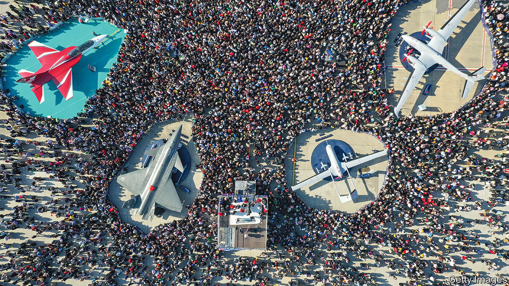
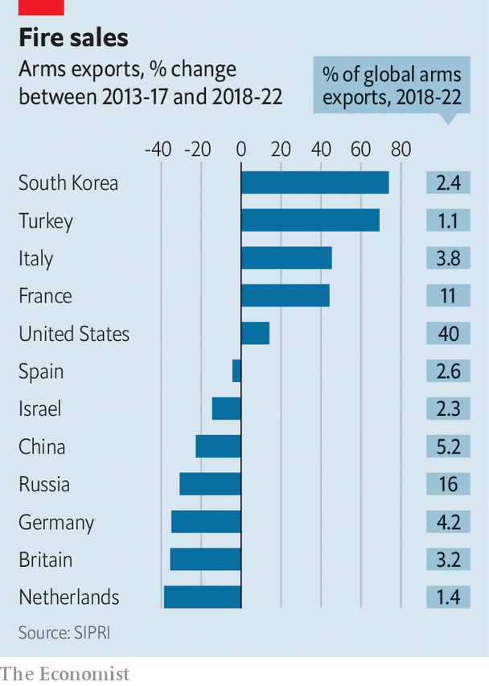

###### Young guns

# Meet the world’s new arms dealers 

##### Where to buy drones, fighters and tanks on the cheap 

 

> Sep 19th 2023 

THE SIGHT of North Korea’s chubby leader, Kim Jong Un, shaking hands  on September 13th—having travelled by train to a spaceport in Russia’s far east to discuss selling its dictator a stash of North Korean weapons—was remarkable both on its own terms and for what it said about the business of selling arms. The world’s five biggest arms-sellers (America, Russia, France, China and Germany) account for more than three-quarters of exports. But up-and-coming weapons producers are giving the old guard a run for their money. They are making the most of opportunities created by shifting geopolitics. And they are benefiting from the Russian invasion of Ukraine.

Mr Kim’s trip to Russia followed a visit to Pyongyang in July by Sergei Shoigu, Russia’s defence minister, who wanted to see if North Korea could provide gear that would help his country’s faltering war effort. North Korea would love to find buyers for its kit. And few regimes are willing to sell Russia arms. China has  from providing much more than dual-purpose chips (although it could yet channel more lethal stuff through North Korea). Only Iran has obliged, selling some 2,400 of its . 

North Korea could provide a wider range of stuff. As well as drones and missiles such as the KN-23, which is almost a replica of the Russian Iskander ballistic missile, it could offer self-propelled howitzers and multi-launch rocket systems. According to sources in American intelligence, North Korea has been delivering 152mm shells and Katyusha-type rockets to Russia for the best part of a year. Russia is shopping in Pyongyang and Tehran because both regimes are already so heavily targeted by international sanctions that they have nothing to lose and much to gain by doing business with Mr Putin’s government. They are not so much an “axis of evil” as a marketplace of pariahs. 

 


If the North Korean arms industry is being boosted by the war in Ukraine, its southern foe is doing even better. South Korea’s arms exporters were cleaning up even before the conflict. In the five years to 2022 the country rose to ninth place in a ranking of weapons-sellers compiled by the Stockholm International Peace Research Institute (SIPRI), a think-tank (see chart). The government aspires to make South Korea the world’s fourth-largest arms exporter by 2027. Last year it sold arms worth $17bn, more than twice as much as in 2021. Some $14.5bn came from sales to Poland. 

The size and scope of the agreements South Korea has reached with Poland, which sees itself as a front-line country in Europe’s defence against a revanchist Russia, are jaw-dropping. The deal includes 1,000 K2 Black Panther tanks, 180 of them delivered rapidly from the army’s own inventory and 820 to be made under licence in Poland. That is more tanks than are operating in the armies of Britain, France, Germany and Italy combined. It also includes 672 K9 Thunder self-propelled howitzers; 288 K239 Chunmoo multiple-rocket launchers; and 48 Golden Eagle FA-50s, a cut-price fourth-generation fighter jet. 

 in the arms business is down to competitive costs, high-quality weaponry and swift delivery, says Tom Waldwyn at the International Institute for Strategic Studies, a think-tank based in London. Its prices reflect South Korea’s efficient manufacturing. The quality derives from South Korea’s experience working with the best American weaponry, and from its own high-tech civil sector. Speedy delivery is possible because the South Koreans, facing a major threat across their northern border, run hot production lines that can also ramp up quickly.

Siemon Wezeman, a researcher with SIPRI’s arms-transfer programme, says wholehearted support from government and attractive credit arrangements are also critical to South Korea’s success. Asian customers like the fact that it has close ties to America without being America, which is often seen as an unreliable ally. This could also help South Korea clinch a $45bn deal to renew Canada’s submarine fleet. Questions for the future include how far South Korea will go in transferring technology to its customers—a crucial issue for Poland, which sees itself as an exporting partner of South Korea’s, competing with Germany and France in the European market.

If South Korea is the undisputed leader among emerging arms exporters, second place goes to Turkey. Since the ruling AK party came to power in 2002 it has poured money into its defence industry. A goal of achieving near-autarky in weapons production has become more pressing in the face of American and European sanctions—the former imposed in 2019 after Turkey, a NATO member, bought Russian S-400 surface-to-air missiles. 

Rocket-fuelled

SIPRI thinks that between 2018 and 2022 Turkey’s weapons exports increased by 69% compared with the previous five-year period, and that its share of the global arms market doubled. According to a report in July by a local industry body, the value of its defence and aerospace exports rose by 38% in 2022, compared with the previous year, reaching $4.4bn. The target for this year is $6bn. Pakistan is receiving modernised submarines from Turkey. And the last of four corvettes which Turkey has sold to the Pakistan navy was launched last month. More sales to other countries are likely, both because Turkey’s ships are competitively priced and because Turkey has few qualms about who it will sell to. 

Yet Turkey’s export charge is led by armed drones. On July 18th Turkey signed a $3bn agreement with Saudi Arabia to supply the Akinci unmanned combat aerial vehicle (UCAV). It was made by Baykar, which also produces the Bayraktar TB2—a drone that has been used in combat by Azerbaijan, Ethiopia, Libya and Ukraine. The TB2 was developed to hunt Kurdish militants after America refused to sell Turkey its Predator drone. More than 20 countries lined up to buy it because it was cheaper and more readily available than the American alternative, and more reliable than the Chinese UCAVs that had previously dominated the non-Western market. 

The Akinci (pictured right, next to the TB2) is more powerful. It can carry lots of big weapons, including air-to-air missiles and the SOM-A, a stealthy cruise missile with a range of 250km. It will find buyers among several other Gulf countries, such as Oman, Qatar and the UAE, which are keen to hedge against souring relations with America by reducing their reliance on its weaponry. These countries also have ambitions to build their own defence industries; they see Turkey as a willing partner and as an example to follow. 

Turkey’s ambitions are shown by what else is in the pipeline. Its new navy flagship, the  is a 25,000-tonne amphibious assault ship and light aircraft-carrier that will carry Bayraktar UCAVs. At least one Gulf country is said to be in talks to buy a similar ship. Turkey’s fifth-generation fighter jet, the KAAN, in which Pakistan and Azerbaijan are partners, should fly before the end of the year. Developed with help from Britain’s BAE Systems and Rolls-Royce, the KAAN could be seen as a response to Turkey’s ejection from the F-35 partner programme (as punishment for buying the S-400). Turkey will market the plane to anyone America will not sell F-35s to—or who balks at the conditions. Once again, Gulf countries may be first in line. 

South Korea and Turkey have benefited from the woes of their main competitors.  between 2018 and 2022 were 31% lower than in the preceding five-year period, according to SIPRI. It is facing further large declines because of the strain its war of aggression is putting on its defence industries, its geopolitical isolation and the efforts of two major customers, India and China, to reduce their reliance on Russian weaponry. 

India, previously Russia’s biggest customer, cut its purchases of Russian arms by 37% in the 2018-22 period. It is probably wishing it had gone further: Russia’s largely state-controlled arms industry is having to put its own army’s needs ahead of commitments to customers. Many of India’s 272 Su-30MKIs, the backbone of its air force, are kaput because Russia cannot supply parts. Some of Russia’s weapons have performed poorly in Ukraine compared with NATO kit. And sanctions on Russia are limiting trade in things such as microchips, ball-bearings, machine tools and optical systems, which will hinder Russia’s ability to sell combat aircraft, attack helicopters and other lethal contraptions. The longer the war in Ukraine lasts, the more Russia will struggle to claw back its position in the global arms market.

Damp squibs

As for China, over half its arms exports in the 2018-22 period went to just one country, Pakistan, which it sees as an ally against India. Nearly 80% of Pakistan’s major weapons needs are met by China, according to SIPRI. These include combat aircraft, missiles, frigates and submarines. Beijing has no interest in its customers’ human-rights records, how they plan to use what China sends or whether they are under Western sanctions. 

But China’s arms industry also has its problems. One challenge, says Mr Waldwyn, is that although China set out to dominate the military drone market a decade ago, its customers got fed up with poor quality and even worse support, opening a door for Turkey. A second is that, with the exception of a putative submarine deal with Thailand and a package of weapons for Myanmar, countries in South-East Asia are tired of Chinese bullying and “won’t touch them”, says Mr Wezeman. 

At least China does not have to worry about competition from India. Despite much effort, India’s growth as an arms exporter has been glacial. The government of Narendra Modi has listed a huge range of weapons parts that must be made in India; it hopes home-made light tanks and artillery will enter service by the end of the decade. But India has relied for too long on the transfer of technology from Russia under production-licensing agreements for aircraft, tanks and warships that have failed to deliver. Investment is wastefully channelled through state-owned bodies. Red tape suffocates initiative. 

Projects such as the Tejas light combat aircraft have taken decades to reach production and remain fraught with problems. The Dhruv light helicopter, launched in 2002, has crashed dozens of times. After decades in development, the Arjun Mk-2 tank turned out to be too heavy for deployment across the border with Pakistan. Locally made kit is often rejected by India’s own armed forces. “If they don’t want it, exporting it becomes impossible,” says Mr Wezeman. South Korea and Turkey show how countries can build lucrative arms businesses that underpin domestic security. India, for all its bombast, is a lesson in how not to do it. ■

