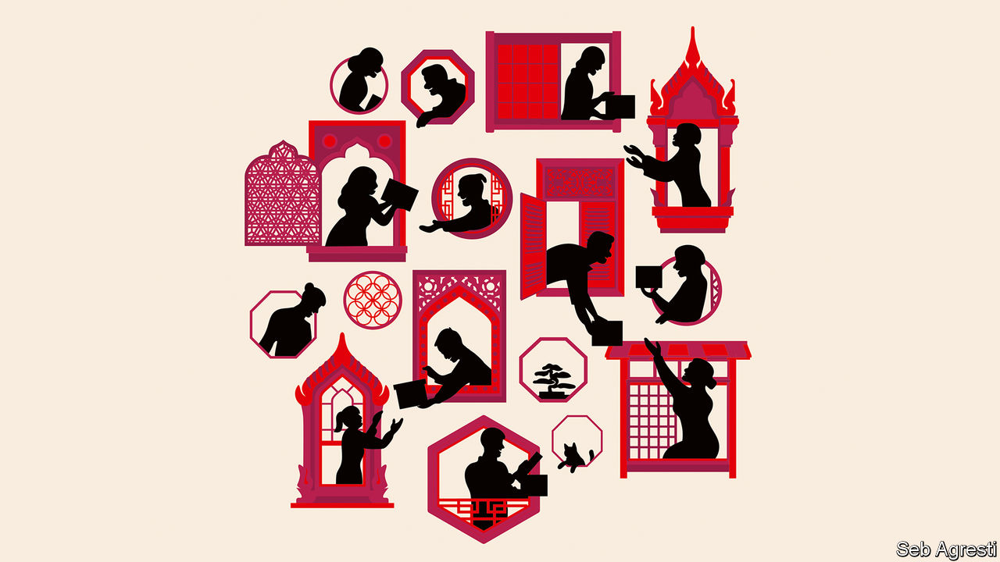

###### From Asia to Asia

# Asian economies are investing more in the neighbourhood 

##### The continent’s economies are coming closer together, with profound consequences for the world 

 

> Sep 21st 2023 

The phrase “factory Asia” describes one of history’s most impressive economic achievements. Over the past half-century Japan, South Korea, Taiwan and, more recently, China became bustling hubs for manufacturing goods, which they then exported to the rest of the world, especially the well-off West. Millions of Asians escaped poverty by making stuff; many grew prosperous. Now the region’s economic model is shifting again, with consequences for Asia and for the world. 

Asia’s long manufacturing boom fostered a wave of trade integration. In 1990, 46% of Asian trade took place within the region. By 2021 that figure had risen to 58%, making it the most integrated continent after Europe. As Asia has become richer and its firms more muscular, investment flows are becoming more regional, too. 

Over the past decade Asian firms have been enthusiastic investors in their own neighbourhood. Foreign direct investment into Asia by other Asians has grown almost twice as quickly as that by Western investors. Much of it has come from rich and ageing Japan and South Korea, as well as from China, and has gone to poorer, younger places. As a result, in 2021 Asians owned 59% of the stock of foreign direct investment in Asia (excluding the financial hubs of Hong Kong and Singapore), up from 48% in 2010. The West’s share, meanwhile, has fallen. 

A similar picture emerges from other . Asia’s share of cross-border bank lending has risen from less than 40% before the global financial crisis to 54% today. Firms like the Industrial and Commercial Bank of China, Japan’s Mitsubishi ufj Financial Group and Singapore’s United Overseas Bank have expanded in the region even as Western lenders have retreated.

What  is done in the region by America is done in large part through multilateral banks. Asian countries are bigger lenders, and direct ones too. Between 2015 and 2021 China committed an average of $5.5bn to the region annually, compared with $4bn from Japan and $2.9bn from South Korea. Much of this is accompanied by the transfer of technical expertise. Visit Ho Chi Minh City’s nearly completed metro stations, and you cannot miss that they were built with Japanese support. Few infrastructure projects across the region are bedecked in the Stars and Stripes. 

Asian integration is likely to deepen. Newish trade agreements such as the Regional Comprehensive Economic Partnership have removed some of the barriers to commerce. As supply chains become still more complex, more cross-border investment in logistics will be needed. Even where regional firms are scrambling to reduce their reliance on China, many are looking to set up factories in India or Vietnam instead. 

More important, Asia’s rising consumers should turbocharge integration. For now a large share of intra-Asian trade is in intermediate inputs, used to produce finished goods, rather than consumer items. But over the next five years, the imf predicts, emerging and developing Asian economies are likely to grow by 4.5% a year, three times as quickly as advanced countries. As consumers get richer they will buy more from their neighbours. 

The economic implications are exciting. Today the disparities in income across Asia are vast, with gdp per person ranging from $8,000 in India to $49,000 in Japan, adjusting for purchasing power. Just as integration with the eu helped incomes in eastern Europe catch up with those in the west, so too integration in Asia should lift incomes in the south and south-east. The savings of richer, ageing Asian countries are being put to good use in poorer and younger ones, where they are helping to spread prosperity while generating healthy returns for investors. Increased trade should reduce prices for consumers, and more investment should bring down the cost of capital. 

What of the political consequences? Unlike in Europe, deeper economic ties in Asia do not herald political integration. The European project was propelled by a desire to avoid another continental war; in Asia today there is no similar impetus. Asian countries are fiercely independent, and their political systems are too varied—from liberal democracy to war-scorched tyranny—to make an Asian Union feasible. An Asian mosaic is more likely, with several powers vying for influence. 

Although America remains an important investor in the region, its economic and political sway will be diminished. In relative terms, it has lost financial clout, so it stands to gain relatively less from Asia’s coming boom. Moreover, support for free-trade deals has evaporated on both sides of the aisle in Washington. When seeking to build alliances in Asia, America has fewer economic carrots to offer than in the past. 

Yet this does not mean that the region will be dominated by China, the regional heavyweight. True, China has gained influence through its huge trading heft and the Belt and Road Initiative. But many Asian countries are wary of China, not least because its foreign policy has grown more abrasive under President Xi Jinping. Indians tell pollsters they are no fans of China. Socialist Vietnam is playing both sides, as President Joe Biden’s recent trip to the country shows. 

Rich, mature Asian democracies such as Japan and South Korea will be an important counterweight to China. Japan’s long-standing development aid to South-East Asia helps explain why regional elites say it is the most trusted power in the region, according to a survey by the ISEAS-Yusof Ishak Institute in Singapore. South Korea takes pride in its  from aid recipient to big donor. Both Japan and South Korea are much friendlier to America than they are to China. 

Pan-Pacific prosperity

Even though America’s relative economic weight is diminishing in Asia, it can still wield influence through its partners. At a summit last month Mr Biden welcomed South Korea’s president, Yoon Suk-yeol, and Japan’s prime minister, Kishida Fumio; the three leaders all reaffirmed their support for a rules-based order. As Asian countries grow richer together, America should remember that it, too, is a Pacific nation, and should resist the temptation to turn inward. ■


