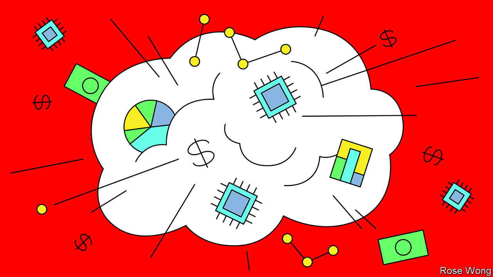

###### Beyond the hype

# ChatGPT mania may be cooling, but a serious new industry is taking shape 

##### Three forces will shape the business of generative AI 

 

> Sep 21st 2023 

The first wave of excitement about generative  (ai) was like nothing else the world had seen. Within two months of its launch in November 2022, ChatGPT had racked up 100m users. Internet searches for “artificial intelligence” surged; more than $40bn in  flowed into ai firms in the first half of this year alone.

The craze for consumer experimentation has since cooled a little: ChatGPT use has fallen and fewer people are Googling “ai”. Son Masayoshi, a Japanese investor notorious for diving into already frothy markets, is thought to be interested in investing in , Chatgpt’s creator. But a second, more serious phase is beginning. An entirely new industry centred on supercharged ai models is taking shape. Three forces will determine what it eventually looks like—and whether OpenAI stays dominant, or other players prevail. 

The first factor is computing power, the cost of which is forcing model-builders to become more efficient. Faced with the eye-watering costs of training and running more powerful models, for instance, Openai is not yet training its next big model, gpt-5, but gpt-4.5 instead, a more efficient version of its current leading product. That could give deep-pocketed rivals such as Google a chance to catch up. Gemini, the tech giant’s soon-to-be-released cutting-edge model, is thought to be more powerful than OpenAI’s current version. 

High computing costs have also encouraged the proliferation of much smaller models, which are trained on specific data to do specific things. Replit, a startup, has trained a model on computer code to help developers write programs, for instance. Open-source models are also making it easier for people and companies to plunge into the world of generative ai. According to a count maintained by Hugging Face, an ai firm, roughly 1,500 versions of such fine-tuned models exist. 

All these models are now —the second force shaping the generative-ai industry. The biggest, such as Openai’s and Google’s, are gluttonous: they are trained on more than 1trn words, the equivalent of over 250 English-language Wikipedias. As they grow bigger they will get hungrier. But the internet is close to being exhausted. Many model-makers are therefore signing deals with news and photography agencies. Others are racing to create “synthetic” training data using algorithms; still others are trying to work with new forms of data, such as video. The prize is a model that beats the rivals. 

Generative AI’s hunger for data and power makes a third ingredient more important still: money. Many model-makers are already turning away from Chatgpt-style bots for the general public, and looking instead to fee-paying businesses. OpenAI, which started life in 2015 as a non-profit venture, has been especially energetic in this regard. It has not just licensed its models to Microsoft, but is setting up bespoke tools for companies including Morgan Stanley and Salesforce. Abu Dhabi plans to establish a company to help commercialise applications of Falcon, its open-source ai model. 

Another approach is to appeal to software developers, in the hope of getting them addicted to your model and creating the network effects that are so prized in tech. OpenAI is offering tools to help developers build products using its models; Meta hopes that llamA, its open-source model, will help create a loyal community of programmers. 

Who will emerge victorious? Firms like OpenAI, with its vast number of users, and Google, with its deep pockets, have a clear early advantage. But for as long as computing power and data remain constraints, the rewards for clever ways around them will be large. A model-builder with the most efficient approach, the most ingenious method to synthesise data or the most appealing pitch to customers could yet steal the lead. The hype may have cooled. But the drama is just beginning. ■

