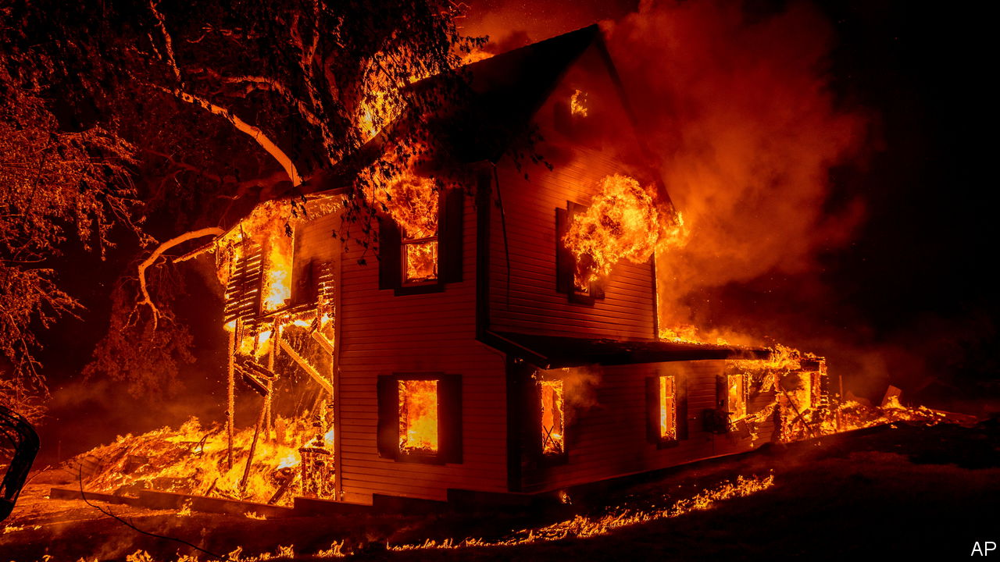

###### Uninsurable America

# Climate change is coming for America’s property market 

##### Insurance is supposed to signal risk. Policymakers should let it 

 

> Sep 21st 2023 

FOR DECADES Americans have been moving to beautiful places that are vulnerable to extreme weather. Florida, once a swampy frontier, is now America’s third-most populous state. It is also the state most often hit by hurricanes. By 2015, the Atlantic and Gulf coasts boasted more than $13trn of real estate. Look West and the story is similar. Homes are proliferating in the wildland-urban interface, where nature and development anxiously coexist and wildfire season seems never to end. 

It is climate change that makes extreme weather more common. But the financial cost of storms and fires depends, more than anything else, on how many homes people choose to build in risky places. After adjusting for inflation, there have been more billion-dollar disasters so far in 2023 than any year since America’s National Oceanic and Atmospheric Administration began keeping records. Losses as a proportion of GDP have kept stable over the past four decades. But there are big local exceptions: last year hurricane damage cost Florida between 7.5% and 10% of the state’s GDP. 

Those who enjoy the benefits of living in high-risk areas (such as a majestic ocean view) should shoulder the costs. However, both federal and state governments ensure that they do not, by subsidising or suppressing property insurance rates in such places. This has encouraged reckless building. A new report from the First Street Foundation, a non-profit research group, finds that if proper account is taken of climate risk, nearly a quarter of all properties in the continental United States are overvalued. These 39m properties represent a climate-insurance bubble inflated by government. 

Private insurers burned by huge payouts after disasters are abandoning  such as Florida and California. Homeowners are turning to state-backed insurers of last resort, which offer less coverage for a higher price. When these plans cannot cover claims, taxpayers are often left with the bill. As climate change continues, the uninsurable parts of America will only grow. 

At the federal level the National Flood Insurance Programme, which offers subsidised flood insurance to homeowners in hazardous places, is drowning in debt. America’s Federal Emergency Management Agency (FEMA), which runs the programme, is in the process of raising rates to keep it solvent. But property-owners are rebelling by cancelling their policies, and the politicians who represent them are threatening to intervene. 

Such intransigence is bipartisan. State and national politicians, Democrats and Republicans, prefer to keep rates artificially low, constituents happy and their tax bases intact. This is short-sighted. So long as disaster risk is underpriced, people will take too much of it. And it is unclear how long taxpayers who live in comparatively safe places will be happy to subsidise insurance for those who don’t, especially when the subsidy-guzzlers are rich. A Congressional Budget Office study from 2007 found that 23% of coastal properties with subsidised flood insurance were second homes. Taxpayers should not be helping the Real Housewives of Miami build seaside castles. 

Instead, policymakers should allow private insurers to set actuarially sound rates, so they can keep writing coverage. Realistic premiums would deter reckless new construction. They would also hurt existing homeowners, so politicians would probably have to keep offering government flood insurance, at least temporarily, to those who cannot afford anything else. 

Eventually, though, some Americans will need to move to keep safe from rising seas, roaring floods and fast-encroaching flames. The government should ease the transition: for example, FEMA could offer buyouts to homeowners who cannot afford their insurance. But make no mistake: the longer politicians subsidise building in dangerous places, the worse the pain will be, and the bigger the final bill. ■


