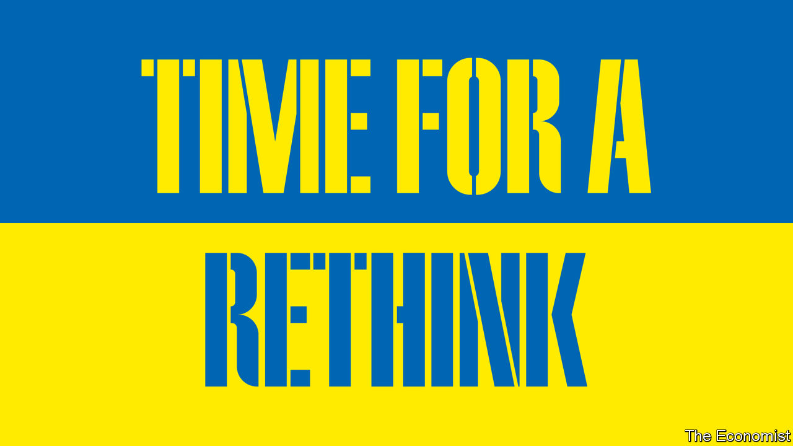

###### Ukraine

# Ukraine faces a long war. A change of course is needed 

##### Its backers should pray for a speedy victory—but plan for a long struggle 

 

> Sep 21st 2023 

The war in Ukraine has repeatedly confounded expectations. It is now doing so again. The counter-offensive that began in June was based on the hope that Ukrainian soldiers, equipped with modern Western weapons and after training in Germany, would recapture enough territory to put their leaders in a strong position at any subsequent negotiations.

This . Despite heroic efforts and breaches of Russian defences near Robotyne, Ukraine has liberated less than 0.25% of the territory that Russia occupied in June. The 1,000km front line has barely shifted. Ukraine’s army could still make a breakthrough in the coming weeks, triggering the collapse of brittle Russian forces. But on the evidence of the past three months, it would be a mistake to bank on that. 

Asking for a ceasefire or peace talks is pointless. Vladimir Putin shows no sign of wanting to negotiate and, even if he did, could not be trusted to stick to a deal. He is waiting for the West to tire and hoping that Donald Trump is re-elected. Mr Putin needs war to underpin his domestic dictatorship; any ceasefire would simply be a pause to re-arm and get ready to attack again. If Ukrainians stop fighting, they could lose their country. 

Both Ukraine and its Western supporters are coming to realise that this will be a grinding war of attrition. President Volodymyr Zelensky visited Washington this week for talks. “I have to be ready for the long war,” he told . But unfortunately, Ukraine is not yet ready; nor are its . Both are still fixated on the counter-offensive. They need to rethink Ukraine’s military strategy and how its economy is run. Instead of aiming to “win” and then rebuild, the goal should be to ensure that Ukraine has the staying power to wage a long war—and can thrive despite it.

The first recalibration is military. Ukraine’s soldiers are exhausted; many of its finest have been killed. Despite conscription, it lacks the manpower to sustain a permanent large-scale counter-offensive. It needs to husband resources, and to change the game. New tactics and technologies can take the fight to Russia. Ukraine’s tech-savvy entrepreneurs are ramping up drone production: Ukrainian drones recently destroyed Russian warships; its missiles seem to have damaged a big air-defence system in Crimea. Many more strikes are likely, to degrade Russia’s military infrastructure and deny its navy sanctuary in the Black Sea. Don’t expect a knockout blow. Russia has also scaled up its drone production. Still, Ukraine can hit back when Russia bombs it, and perhaps even deter some attacks. 

Alongside this offensive capability, Ukraine needs to boost its resilience. As well as heavy weaponry, it needs help with maintenance to sustain a multi-year fight: humdrum repairs, reliable supplies of artillery and training. More than anything, a long war requires better air defence. Ukraine cannot thrive if Russia blasts infrastructure and civilians with impunity, as it has for the past 18 months. Kyiv is a surprisingly vibrant city because it has effective defences against non-stop aerial attacks. The same set-up is needed for other cities, which is why squadrons of f-16s and more missile-defence systems are essential.

An economic recalibration is needed, too. That means fewer highfalutin plans for post-war reconstruction and more attention to boosting output and capital spending now. The economy has shrunk by a third and almost half of Ukraine’s budget is paid for with Western cash. In an odd kind of wartime Dutch disease the currency, the hryvnia, has strengthened even as private investment has plunged. With around 1m people bearing arms and millions having fled from the country, workers are scarce.

Ukraine’s economy needs to shift from relying on aid to attracting investment, even as the conflict keeps raging. From making more arms to processing more of what it grows on its farms, Ukraine has plenty of potential. The challenge is to get local and foreign firms to invest more, and to lure more Ukrainians back to the calmer parts of the country in the west. 

Better security can help. The stronger Ukraine’s air defences, the lower the risk that a new factory will be blown up. The farther Russia’s navy is pushed back, the more safely exports can flow through Ukraine’s ports on the Black Sea. But economic reforms matter, too. More must be done to curb Ukraine’s long-standing corruption, with a priority on making the judiciary clean and impartial. And more action is needed to make doing business easier, from recognising qualifications that refugees have earned abroad to offering firms war insurance. 

All this requires political will from Ukraine, but also from its friends in the West. In the long term, the best guarantee of Ukraine’s security is nato membership. Short of that, partners have promised a web of bilateral security guarantees. Equally important is what the European Union can offer: not just cash, but the prospect of membership. It is not easy to nurture a flourishing economy while being barraged with explosives—even Israel never had to face such a powerful aggressor. But Ukraine, unlike Israel, could one day be integrated into the world’s richest economic bloc. A roadmap for EU accession over, say, a decade, with clear milestones, would offer hope to Ukrainians and accelerate economic reforms, just as the same promise galvanised much of eastern Europe in the 1990s. 

A new member of the club

For that to happen a shift in mindset is needed in Europe. It has committed as much weaponry as America and far more financial aid. Yet it needs to step up further. If Mr Trump wins in 2024, he may cut back American military assistance. Even if he loses, Europe will eventually need to carry more of the burden. That means beefing up its defence industry and reforming the eu’s decision-making so it can handle more members.

The stakes could hardly be higher. Defeat would mean a failed state on the eu’s flank and Mr Putin’s killing machine closer to more of its borders. Success would mean a new eu member with 30m well-educated people, Europe’s biggest army and a large agricultural and industrial base. Too many conversations about Ukraine are predicated on an “end to the war”. That needs to change. Pray for a speedy victory, but plan for a long struggle—and a Ukraine that can survive and thrive nonetheless.■


