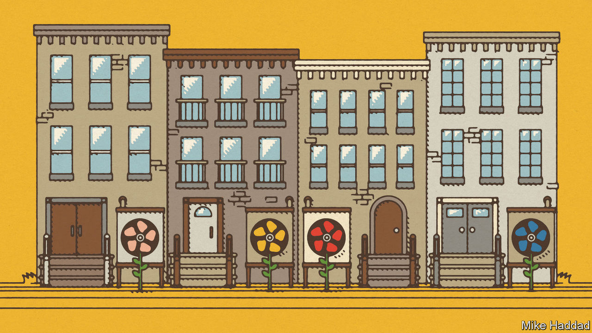

###### On nuclear weapons, business agglomerations, Germany, heat pumps, the EU’s Council of Ministers, inoculations, headline wordplay

# Letters to the editor 

##### A selection of correspondence 

 

> Sep 21st 2023 

Destroy nuclear weapons

The recommendations in your leader on persuading America, China and Russia to rein in their nuclear-arms race were sound but didn’t go far enough (“”, September 2nd). The United States and Russia need to resume notifications and verification measures under the New START treaty and China should join confidence-building measures. But to reduce and remove the rising nuclear danger effectively, all three of these powers, together with the six other nuclear-armed states, should engage with the 140 countries that support the United Nations Treaty on the Prohibition of Nuclear Weapons. 

The current strategy of the nuclear-armed countries to grant these weapons legitimacy and claim they are necessary for self-defence perpetuates their existence and the threat they pose to us all. These states need to start upholding their responsibilities. As long as nuclear weapons are seen as valuable, they will be coveted. As long as nuclear weapons exist, they pose a threat to more than the countries that have them. 

Ever since the invention of the atom bomb, various ideas have been floated on how to break this cycle, but none has proved successful. The only sure way to rid the world of the nuclear threat is to eliminate the weapons for good. That is what the treaty prohibiting nuclear weapons is there to do. It includes timelines for weapons (and weapons-production facilities) to be dismantled and destroyed, mandates support for the victims of nuclear use and testing, and has widespread global support. As we said in our Nobel peace-prize lecture, the TPNW provides the pathway forward at a moment of growing global crisis. All nuclear-armed states should engage with it.

Melissa Parke

Executive director

International Campaign to Abolish Nuclear Weapons


Dispersed companies

The merits of agglomeration for businesses can be overstated (“”, August 26th). Fleet Street was once the location of Britain’s national newspapers, with printing presses in the basements, compositors and other craftsmen above, and editorial staff on the upper floors. The cluster benefited from shared suppliers, workers and gossip. But there were offsetting downsides, notably the cost of getting newsprint into the centre of London each day, sending out newspapers each night and restrictive labour practices. When computerised typesetting became possible, the print works moved to peripheral locations, the editorial offices dispersed around London, and the power of the print unions was broken. Nowadays, “Fleet Street” is a metaphor more than a location. With hindsight, the benefits of agglomeration were less than they had appeared.

The coronavirus pandemic has prompted changes in working habits, aided by technology that permits remote working and meetings. Although it is too early to tell, it may turn out that the benefits of agglomerations in city centres are less than we had supposed, not least on account of the reluctance of commuters to pack sardine-like on trains and buses.

David Metz

Honorary professor

Centre for Transport Studies

University College London

 


Germany benefited from a cheap currency

After he stepped down as chairman of the Bundesbank, I remarked to Hans Tietmeyer that Germany’s exporting industry was benefiting from the euro being a 20% cheaper currency than the Deutsche Mark would have been. “Oh, no,” Mr Tietmeyer replied, “I think the euro’s exchange-rate subsidy to our exporters could well be 40%.” “Maybe”, he added, “a bit more.”

By then to Mr Tietmeyer, himself a creator of the euro, the common currency now risked being a cheap semi-Greek/Italian/Spanish currency in a way that mighty Germany’s very own high-value D-mark had never been.

This cheap-currency prop to one of the world’s most legendary exporting nations simply feathered its bed over a decade or more in a way that the expensive D-mark never had. From this stemmed those too-easy manufacturing years, the multiple inefficiencies, and Germany’s loss of rigorous mission, which you so vividly describe (“”, August 19th).

As your newspaper has long said, exchange rates fixed between unequal economies remain fixed at a price. As Germany prospered on a too-cheap currency, Spain suffered years of 40%-plus youth unemployment from the same common currency being so German and so dear. And do not mention Greece.

Andrew Knight


 


Better heat pumps

Air-source heat pumps work at cross purposes to nature, attempting to transfer heat outside when it is hot and to move heat indoors when it is cold (“”, September 9th). Heat pumps work by transferring heat from one place to another, but air-source heat pumps use the worst available source from an energy perspective.

Ground-source heat pumps would be far more efficient, taking advantage of temperature averages over the year. When the weather is cold (that is, below average for the year), the ground is warmer than the air and a better source of heat energy. Conversely, when the weather is hotter than the annual average, the ground is cooler than the air and a more effective place to dump heat from inside buildings. And ground-source systems do not require noisy and energy-gobbling fans. They typically use water to bring about the transfer of energy.

The only advantage of air-source heat pumps is that you can thoughtlessly bolt them onto the outside of a building with a minimum of plumbing. Perhaps this reflects humankind’s reluctance to invest in infrastructure, like plumbing and insulation, or its own future. 

Max Arai


It’s not just owners of older houses that face difficult choices on insulation and heat pumps. Modern British homes, those built since 2000, are already pared back in space to the minimum, with, inside, no hall, no cupboards, rooms barely big enough to contain all the furniture needed for their function (bed, clothes storage, table, TV). Outside, there is minimum space for a bin at the side and nugatory garden space. If a large heat pump and extra wall insulation is necessary, where will all this go? Maybe we genetically engineer the inhabitants to be half-size?

Dr Hillary Shaw


 


Who’d want to be president?

Charlemagne’s call to scale back the rotating presidency of the European Union’s Council of Ministers () underestimates the extent to which this has already been done and overestimates the extent to which further reform would help. The council presidency was always overhyped. It was never the “president of the EU”, as some countries like to portray it (especially when it’s their turn) but simply the chairmanship of one of the EU’s several institutions, for a short six-month period, with a largely inherited agenda, and with no extra powers nor any formal power to put forward new legislation. 

Since 2010, the country holding the rotating presidency no longer hosts or chairs the European Council summit of heads of government, who are now free to choose their own president. It no longer represents the EU externally, as that job is now given to a jointly chosen high representative/vice-president of the European Commission who heads the European External Action Service with its own diplomatic representations across the world (that task, too, no longer rotating among national embassies). It doesn’t even always chair the council. When foreign affairs or security are discussed, the high representative chairs it.

Further reforms along the lines suggested by Charlemagne, whereby each configuration of council elects a specific minister from across a variety of countries, has some attractions, but risks a confusing fragmentation. Much time and effort would be needed to secure balance among the member states. The term of office would presumably be longer than six months, but cease when there was a change of minister in the country concerned. Longer term and more visible presidents might also cause confusion in public perceptions with the role of the corresponding commission member.

In short, much effort for little further gain.

Richard Corbett

Former member of the European Parliament


 


A pioneer in inoculation

Your review of Simon Schama’s book, “Foreign Bodies”, (“”, September 9th) neglected the role of Lady Mary Wortley Montagu, who brought smallpox inoculation from the Ottoman empire to England in 1721. Though ridiculed by many for inoculating her children, she deserves credit for popularising the practice.

Incidentally, by the time of Edward Jenner’s vaccine in 1796, it had long been known among dairy farmers that exposure to the milder cowpox protected against the more dangerous smallpox.

Padraic Rohan


A day of RICOening

As a fan of your publication’s witty wordplay titles, I was surprised at the headline “” (August 19th) for an article describing Donald Trump’s indictment in Georgia for allegedly violating the Racketeer Influenced and Corrupt Organisations Act. I didn’t get the connection,  meaning “harbour” in Spanish notwithstanding. If the point was to use the acronym RICO, a more applicable title might have been “RICO and famous” or “On the RICOrd”, that would be my RICOmmendation.

Pedro Spivakovsky-Gonzalez

Lecturer on law

Harvard Law School


