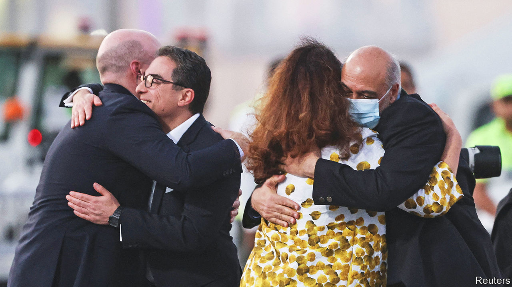

###### Hostages and a fortune

# Iran’s $6bn hostage deal is part of a broader diplomatic strategy 

##### But inside the country, tensions are running high 

 

> Sep 18th 2023 

FEW IRANIAN acts outrage its enemies more than its taking of hostages. Foreigners are offered visas to visit Iran and are then seized on departure by the Islamic Revolutionary Guard Corps, Iran’s strongest force. Iran then uses them as bargaining chips for prisoner swaps and cash, among other things. “The Islamic republic isn’t a banana republic, but…it still behaves like a mafia state,” says a Western diplomat, previously based in Iran.

On September 18th Iran and America each exchanged five prisoners in a deal sweetened by America’s unfreezing of $6bn of Iranian funds—mainly payments for its oil—held in South Korea. The released hostages include Siamak Namazi, an Iranian-American businessman held since 2015, and Morad Tahbaz, an Iranian-American environmentalist who also holds British citizenship. But perhaps a dozen Westerners and several dozen more dual nationals remain behind bars as leverage for future deals. And on September 16th Iran arrested another dual national in Karaj, a city west of the capital, Tehran.

Iranian officials claim they have no choice but to take prisoners, since their adversaries also flout international law. Their ire has been stoked by America’s imposition of sanctions and by the unloading last month of Iranian oil from a tanker America had seized and taken to Texas.

Over the longer run such hostage-taking cripples Iran’s hopes of developing a tourism industry and hampers foreign investment and trade. But the cash it generates is tempting for a regime that faces discontent amid soaring inflation and a currency that earlier this year fell to a record low (before rebounding on hopes of a prisoner-for-cash deal). America’s Treasury will monitor how Iran spends the $6bn to ensure that funds are used by Iran only for humanitarian purposes. But, says Norman Roule, a former American spy in the region, the deal could free up cash for Iran’s military programmes, too. Iran might also gain a sanctions-waiver mechanism that could be reused in other financial transactions. “This could be a learning moment for future diplomacy over sanctions relief,” says Esfandyar Batmanghelidj, an Iranian-American economist in London.

A flurry of diplomatic activity has followed. Iran’s president, Ebrahim Raisi, went to New York to address the un General Assembly. Further talks are planned between the Iranians and their erstwhile regional foe, Saudi Arabia, together with the other five Arab states of the Gulf Co-operation Council on the sidelines of the un meetings. And to coincide with the prisoner release, Iranian and European officials met for talks, too.

But in the wake of the deal, the two belligerents toughened their stance. America unveiled new sanctions targeting Iran’s drone production. Mr Raisi used the un podium to denounce “the project to Americanise the world”. And buoyed by the prisoner deal, Iran’s parliament passed a law imposing jail sentences of up to ten years on women who flout the dress code (it still needs to be approved by the country’s Guardian Council) .

Few observers see this as the first step towards reviving the jcpoa, an agreement signed in 2015 that was intended to prevent Iran from enriching uranium to a level that would have put it on the “threshold” of acquiring nuclear weapons. The Trump administration withdrew from the deal in 2018, prompting Iran to ignore its key restrictions. “Iran is already a threshold state so that horse has bolted,” says a mediator. In protest at Iran’s enrichment of uranium beyond civilian levels of 60%, Britain, France and Germany announced earlier this month that they were enshrining un sanctions in national law before they expired under the terms of the jcpoa.

Still, the hostage deal continues a remarkable diplomatic offensive under Mr Raisi, a supposed clerical hardliner in a historically xenophobic regime. In recent months his administration has restored diplomatic relations with its regional competitor, Saudi Arabia, begun talks on joining the brics, a club of big emerging markets, and finally joined the Shanghai Co-operation Organisation of Eurasian countries. Even the Israeli prime minister, Binyamin Netanyahu, has muted his criticism, apparently for fear of exacerbating tensions with the Biden administration and spoiling his own hopes of establishing diplomatic ties with Saudi Arabia. 

But hubris in the wake of the prisoner deal may get the better of the regime. The clerics need to shore up international support as the Islamic Republic grapples with plans for the succession of its 84-year-old supreme leader, Ayatollah Ali Khamenei, and tackles its greatest threat—its disgruntled population. 

The ayatollahs’ opponents have criticised the deal as a slap in the face by America, particularly since it coincides with the first anniversary of the death of Mahsa Amini, an Iranian woman detained for showing her hair. More than 500 Iranians were killed in the months of protests that followed. In Iran, riot police and bully boys on motorbikes are roaming the streets to prevent demonstrations. 

For now the regime has the upper hand. The few small protests that have occurred in Tehran have been rapidly dispersed. In the province of Kurdistan, where Ms Amini lived, the security forces reportedly used live ammunition. But Iranians speak of mounting tension. Many have resorted to civil disobedience. Women continue to discard their headscarves and refuse to pay fines for doing so. Implementation of the new law carries risks. Renewed unrest could reopen the rift that the last bout exposed between hardline clerics and less ideological commanders in the irgc. Iran might have hoped to mollify international opinion, at least temporarily, but Iranians’ anger remains unassuaged. ■

