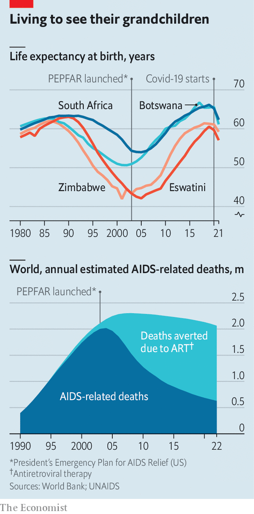
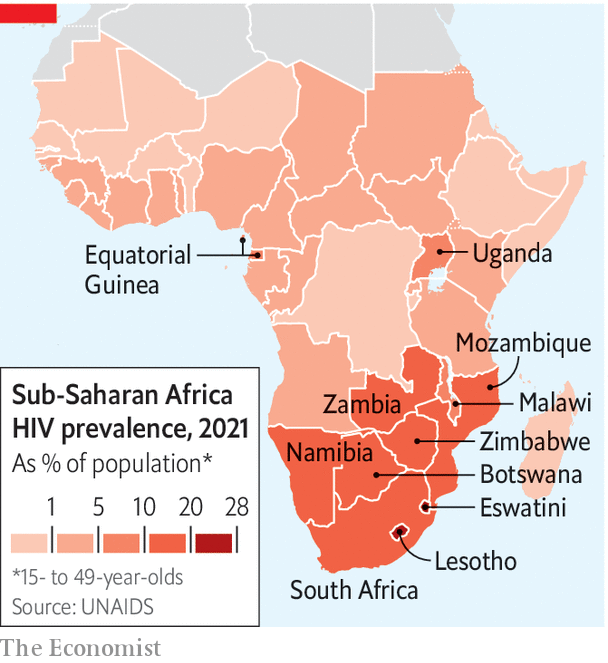
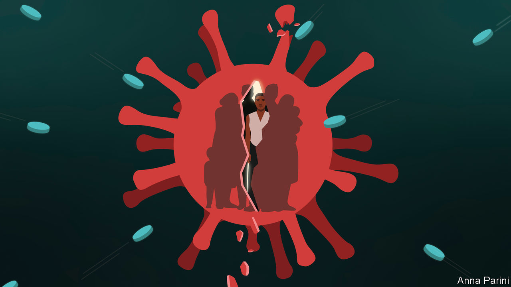

###### Making sex safer again

# Is the end of AIDS in sight? 

##### The virus can be brought under control, but it’s complicated 

 

> Sep 18th 2023 

How can cotton wool help in the fight against AIDS? The answer is surprising, and illuminates how complicated it will be to beat the  of all time. The struggle involves not only dazzling science but also old-fashioned insights into human behaviour, rational and irrational.

Many people who do not have HIV, the virus that causes AIDS, know they are at risk. They can take pre-exposure prophylaxis (PrEP), a kind of drug that reduces their chance of contracting it by 99% or so. This comes as a daily pill, and is popular among gay men in rich countries. 

However, there is a much larger group of people at high risk, for whom a daily pill is far from ideal: heterosexual women in poor places where HIV is still very common. If their boyfriends discover they are taking the pill, they may conclude that their girlfriend does not trust them, or that she is planning to cheat on them. And a depressing number of boyfriends who suspect such things react violently. 

A  is on the horizon: cabotegravir, from ViiV Healthcare, a single injection that lasts for two months and is much more discreet than a daily pill. Alas, it is new, costly and not widely available, especially in Africa, where the virus is most widespread. So Patrick Mdletshe of the KwaZulu Natal Provincial Council on AIDS in South Africa offers a low-tech fix: stuff cotton wool in the bottle so the daily pills don’t rattle and your boyfriend won’t notice that you are taking them. 

UNAIDS, a UN body, hopes to end AIDS as a major public-health threat by 2030, building on the staggering success of the past two decades. AIDS, which weakens the immune system, has killed about 40m people—more than covid-19. However, the pace at which people are dying of it has fallen dramatically. In the early 2000s it was 2m a year, largely in poor countries, where hardly anyone could afford $10,000 a year for life-prolonging pills. In some African countries between a fifth and quarter of the adult population was infected with HIV; nearly all were expected to die of it. Life expectancy in Zimbabwe and Eswatini fell by two decades.

AIDS slaughtered adults in their productive prime—slowly. Breadwinners sickened, stopped earning and needed care. Their spouses looked after them until they, too, fell ill. Daughters dropped out of school to care for ailing parents. Households headed by orphaned children became frighteningly common. 

 


Then the price of antiretroviral pills plummeted, as drug firms offered steep discounts for poor countries and donors chipped in billions to pay for them. Today a year’s supply can cost a mere $45. Between 2001 and 2019 life expectancy in sub-Saharan Africa rose by 17%—and much more in the worst-affected countries (see chart). Globally, some 21m deaths have been averted, by one estimate. Today, three-quarters of those infected—roughly 30m people—are receiving treatment. 

Unfortunately, triumph has bred complacency, argues Peter Sands, the head of the Global Fund to Fight AIDS, Tuberculosis and Malaria, a donor-financed body. “There’s a diminishing sense of urgency,” he says. Or worse. The biggest donor by far is America. Its global AIDS programme, PEPFAR, which was set up by President George W. Bush, expires on September 30th and some Republicans are trying to block its reauthorisation. A recent report from a conservative think-tank described AIDS as “primarily a lifestyle disease” and griped that PEPFAR was being used to promote a “radical social agenda overseas”. (It does not bar aid recipients from talking about abortion.) Mr Bush is horrified. “To abandon our commitment now would forfeit two decades of unimaginable progress and raise further questions about the worth of America’s word,” he fumed in the  on September 13th. 

 


An estimated 39m people are HIV positive—more than half of them in Africa. All will need lifelong treatment unless a cure is found. Meanwhile, the virus is still spreading. Some 1.3m people were freshly infected last year. In eastern Europe and the Middle East, the numbers of new infections in 2022 were 49% and 61% higher than in 2010, albeit from low bases.

There are two main approaches to tackling the virus. One is to invent new medicines: ideally a cure or an effective vaccine. The other is to reach more people with existing technology. Both approaches—in the lab and on the ground—are being pursued in tandem by governments, private companies, donors and ngos. 

A cure seems a long way off. A vaccine may be closer, but HIV is an elusive target. It is highly mutable, and hides its DNA inside some of the immune cells that are supposed to destroy it. Nina Russell of the Gates Foundation, who has worked on HIV vaccines for “many, many, many, many” years, is nonetheless hopeful.

From past failures scientists have discovered that they need to design vaccines that can teach the body to make antibodies to tackle a wide range of viral strains. They might have to create three, four or five different vaccines and jab people with all of them, in the correct order. Firms such as Moderna and BioNTech are using mRNA technology to speed up the process. However, even optimists do not expect success this decade. So hitting the 2030 target will depend largely on two things. First, finding and treating more infected people. Second, identifying those who are at risk of infection and helping them avoid it. 

UNAIDS urges countries to aim for “95-95-95”: where 95% of those who have the virus know they have it, 95% of those who know they have it are receiving treatment, and crucially that 95% of those in treatment are “virally suppressed”. If the drugs suppress the virus to a level where it is undetectable—and keep it there—it cannot be passed on sexually. 

If the world were to reach 95-95-95, the disease would be brought under control, UNAIDS reckons, though tens of millions would still be living with it. In 2022 the figures were 86-76-71, a hefty improvement on 71-48-40 in 2015. But the “last mile” will be hard. “You have to be much more creative,” says Dr Quarraisha Abdool Karim of CAPRISA, a research centre in Durban.

One enormous, tricky group is men. They are less likely to get tested than women, not least because they do not get pregnant. Prenatal clinics are a wonderfully convenient place to test women who have recently had unprotected sex. If they test positive, many countries now offer them free drugs, which protect mother, child and future romantic partners. 

There is no male equivalent of a prenatal clinic. Also, some men have a macho reluctance to seek medical help. They “get very sick before they get tested”, says Sibongile Tshabalala, the chair of the Treatment Action Campaign, an NGO in South Africa. 

“As men, we’re embarrassed to go to a clinic. We’re taught we need to be strong, so we cannot be seen to be sick,” says Ronnie Sibisi, a 60-year-old from Vosloorus, a township near Johannesburg. He was “a player” with many girlfriends, he says. He knew how the virus was transmitted, but seldom used condoms. “I didn’t think about it,” he shrugs. He did not get tested until he collapsed and woke up in hospital.

It is, perhaps, most crucial to reach young women and girls. In sub-Saharan Africa HIV is three times more common among females aged 15-24 than among their male peers. This is because older men often seek younger partners. There is peer pressure on young women to have trendy clothes and hairstyles, says Ms Tshabalala. These cost money, which impels some girls to sleep with older men. And only 36% of young women in eastern and southern Africa report having used a condom the last time they had sex with a casual partner. In West Africa it is only 25%. 

If their “sugar daddies” infect them, the girls may pass the virus to a partner of their own age. This is the most common way that HIV passes from one age cohort to the next. Breaking that link would allow the younger cohort, who are largely virus-free before they become sexually active, to stay that way. If you can reduce new infections among young girls, “you break the back of the pandemic in Africa,” says Dr Salim Abdool Karim, an epidemiologist (who is married to Quarraisha Abdool Karim). 

A tangle of social problems makes everything harder. Poverty is one. If you are poor, getting tested can be a challenge even if the test is free. A day off work and a bus fare to the clinic can scupper your budget. 

Male violence is another obstacle. A study in six African countries found that women who had been physically abused in the previous year were 3.2 times more likely to have been infected with HIV recently. Women who live in fear may find it harder to say no to unprotected sex. And the first wave of AIDS, by killing so many parents, made families in some countries even poorer and more unstable than they already were. In South Africa, for example, thanks to a long tradition of migrant labour under apartheid and the recent ravages of AIDS, only a third of children live with both biological parents. 

Social dysfunction helps the virus spread. Thulina Moukangwe was raped by four different relatives, starting when she was 11. She does not know which one infected her. She did not get tested until she was 17, “because I was young and ignorant”, she says. She received little support from her chaotic family, and did not seek treatment for another five years.

Fear of death can make bad boyfriends behave even worse. After Makhosazana Molotsane tested positive her partner was furious. For years he refused to get tested himself, drunkenly sang in the street that she was bringing disease into his home, and burned the condoms Ms Molotsane wanted to use. He seized her antiretroviral drugs and tossed them away. She hid her pills in a nappy bag. He beat her up; eventually she left him. 

Both women’s fortunes eventually improved. Ms Molotsane, who is 40, found a more supportive partner, who reminds her to take her drugs. Her viral load is low enough that her doctor tells her it is safe for them to have a baby. Ms Moukangwe, who is now 29, has become a “peer educator”: a volunteer who helps people make informed decisions about their health. 

This is one area where NGOs are especially useful. Health services are overstretched, and people often resist instructions from officials. A more effective way to persuade scared, reluctant people to take the right medicine is for them to talk to people from similar backgrounds. Ms Moukangwe, who had heard that antiretroviral drugs “made you crazy”, started taking them after she saw that a friendly volunteer, who had been taking them for years, was sane and healthy. “You can’t just tell people to go to a clinic,” says Ms Moukangwe. “I talk about myself, as a way of encouraging others.”

Testing, testing

Private companies pitch in, too. Mining firms in southern Africa saw AIDS as a huge threat two decades ago. Their workers were often migrants, who lived far from their families in hostels surrounded by prostitutes. Companies such as Anglo American started offering staff free testing and antiretroviral drugs even as South Africa’s president at the time, Thabo Mbeki, publicly questioned their efficacy. It was a delicate task, recalls Brian Brink, who used to run Anglo’s AIDS programme. Unions had to be convinced that tests would not be used to identify sick staff and fire them.

Stigma lingers even in countries where nearly everyone knows someone with hiv. People worry that if they get tested near home, or pick up antiretrovirals from a pharmacy, a neighbour will spot them, says Mr Mdletshe. This makes it less likely that they will get tested in the first place, or stick to a lifelong drug regimen.

 


Sometimes stigma is compounded by law. Aspects of sex work are criminalised by 168 governments. This deters sex workers from seeking help. Nokwanda Gambushe, an activist in Durban, complains that cops search sex workers’ handbags and, if they find condoms, arrest them. This hardly encourages safe sex. 

In addition, 145 countries criminalise drug use and 67 criminalise gay sex. The sharp increase in infections in eastern Europe and the Middle East is largely due to a lack of prevention services for marginalised populations, reckons UNAIDS. Uganda introduced the death penalty this year for “aggravated homosexuality”, which might make gay Ugandans think twice before walking into a clinic to get tested. 

Policy can make a huge difference. President Mbeki’s AIDS denialism cost an estimated 300,000 South African lives. However, when he was sacked by his party in 2008, experts persuaded a caretaker government to adopt a first-rate AIDS policy. Drugs were swiftly rolled out, and between 2009 and 2012 the proportion of children under five in South Africa who were orphans plunged from 12% to 7.3%. 

The best foundation for fighting AIDS is a well-functioning public-health system with short queues and sensitive staff, says Mr Mdletshe. Many countries fall short. Waiting times are often long, pharmacies run out of pills, staff are sometimes judgmental. When Ms Moukangwe tested positive, a nurse shouted at her for her lax morals. Even in rich countries, governments that fail to prioritise the disease tend to deal with it badly. The proportion of infected people taking antiretroviral drugs is actually lower in eastern Europe and central Asia than in sub-Saharan Africa. 

Governments do not work in a vacuum. The places that have come closest to hitting the 95-95-95 targets are typically African countries where donors are pouring in resources and expertise, such as Botswana, Rwanda, Tanzania and Zimbabwe. The second tier are often rich countries with generous public services (Denmark, Saudi Arabia) or places that developed a serious anti-AIDS strategy early on in the pandemic, such as Cambodia and Thailand.

One of the biggest obstacles to curbing the spread of HIV is that the symptoms take a long time to appear. “Recently infected people have high viral loads, and are more likely to infect others. The problem is that those who have been infected don’t yet know it,” laments Dr Salim Abdool Karim. “The gap between being infected and being tested is usually years.”

So he suggests something radical: offering PrEP to girls in schools. Instead of waiting for those who think they are at risk to come to a clinic, health workers should go to schools and offer PrEP to all the girls above a certain age, along with testing, contraception and health-care services. This could meet stiff resistance from traditionalists who think it would encourage promiscuity. Also, it is “only feasible if you have a PrEP that lasts six months,” says Dr Salim Abdool Karim. “You can’t keep going to the schools more than…once every six months. It’s not practical.”

Longer-lasting drugs are in the pipeline, and could “change the trajectory” of the disease, says Deborah Waterhouse, the boss of ViiV. The first not-for-profit delivery of ViiV’s two-month injection, to PEPFAR, will be in October. It has regulatory approval in four southern African countries, and has been licensed to cheap generic manufacturers. Gilead, an American firm, has a drug called lenacapavir, which is already used as a treatment, and which breaks down so slowly that it might work as a prophylaxis for six months. It is in clinical trials among girls in South Africa and Uganda.

Rolling out new drugs would cost a lot. Roughly $21bn was spent on fighting HIV in poor and middle-income countries in 2022, with slightly less than half coming from donors; UNAIDS thinks $29bn will be needed in 2025. To those who would penny-pinch, Mr Sands retorts that it is “rational to hit this thing hard and fast”. Fighting AIDS slowly would be “much more expensive…If you don’t reduce the number of new infections, every new infection is translating into a lifetime of antiretroviral treatments...and complications.”

A lifetime of treating someone with HIV in a poor country costs around $5,000, by one estimate; in rich countries, it is $380,000. By comparison, the cost of averting an infection in Zambia or South Africa is $2,000-$3,000, according to a different study published in the  in 2021. And so long as the virus is circulating somewhere, nowhere is safe. ■

