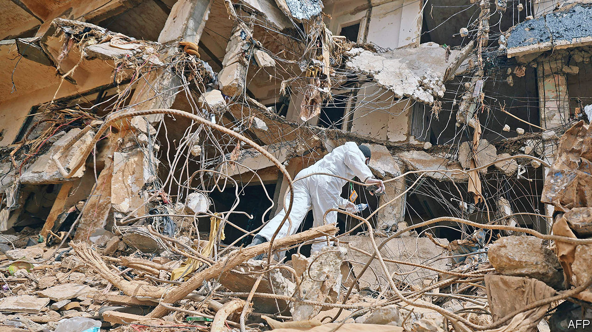

###### Never let a crisis go to waste

# Khalifa Haftar will use Libya’s floods to deepen his control 

##### His son is in charge of disaster aid, while talk of elections will be put on hold 

 

> Sep 21st 2023 

IN THE days after a disaster, even the most maladroit politician knows to follow a script: soothe survivors, praise aid workers, vow to rebuild. For thugs who dominate eastern Libya, however, even such basic displays of human decency are a struggle. One, clad in army fatigues, tooled around a flood-battered city behind the wheel of a Humvee, more conquering general than contrite governor. Another blamed the victims for their own deaths.

The response was tone-deaf but hardly surprising. Khalifa Haftar, the warlord who controls Libya’s east, cares only about empowering his family. A catastrophe that could have been prevented is, for him, a chance to consolidate power.

Rescuers describe scenes of utter despair in Derna, the city walloped earlier this month by a Mediterranean storm called Daniel. Record rainfall caused two dams south of Derna to fail. Floodwaters surged through the narrow , or riverbed, that bisects the city, sweeping away entire neighbourhoods in minutes.

The Libyan Red Crescent says that 11,300 people died, while the World Health Organisation (WHO) says it has identified 3,958 bodies, with another 9,000 people missing. The final toll may not be known for months, if ever. Many bodies were washed out to sea or buried under rubble. Libya has not conducted a census since 2006.

Aid has trickled in, but slowly. The west of the chaotic country is run by a rival regime. The divisions make Libya a hard place to work. Hospitals are overwhelmed. Survivors are terrified that rotting bodies will spread cholera and other diseases (although the WHO says such fears are overblown). Many residents are homeless.

On September 18th hundreds of angry protesters gathered outside a well-known Derna mosque. They chanted slogans against Aguila Saleh, the head of Libya’s eastern parliament. Some then burnt the home of the mayor, who was suspended after the flood (and is Mr Saleh’s nephew).

While the crowds were not large, they were evidently too big for the military men who run the region. The next morning, telephone and internet links to Derna went down. Authorities blamed a severed fibre-optic cable. But then journalists began receiving orders to leave within hours. A United Nations team scheduled to travel from Benghazi to Derna was barred from entering the city. Libyans fear the Haftars are preparing for a violent crackdown. Mr Haftar once laid siege to Derna for months to root out Islamist groups.

The floods could have been lessened if Libya had invested in repairing the dams, which were half a century old. But Mr Haftar cares little for upgrading Libya’s infrastructure. His son Saddam, whose name is a homage to the late Iraqi dictator, has taken charge of relief efforts. That helps cement the family’s control, but it offers little succour to survivors. Asked by a journalist from Sky News if the flood could have been prevented, Saddam all but shrugged: , he replied, everything is fine.

Another son, Elseddik, claimed that residents ignored Mr Haftar’s warnings to leave. “My father, thanks to his wise leadership, sensed things before the disaster hit,” he said. Never mind that Mr Haftar issued no such evacuation order: he is the saviour, the victims are the villains.

Elseddik recently launched a long-shot bid to become president. After the flood, though, talk of elections—which the UN had hoped would happen this year—is probably on hold. That will not bother Khalifa Haftar, who runs eastern Libya as a military regime and has no interest in a fair vote. Municipal elections in Derna were cancelled earlier this month after his men arrested the front-runner.

The Haftars were not the only ones to find fault elsewhere. Kais Saied, the authoritarian president of neighbouring Tunisia, knows who to blame for the flood: Jews. At a cabinet meeting on September 18th he noted that the storm’s name was also that of a Hebrew prophet. To Mr Saied this was no coincidence; it was proof of how deeply Zionists had “penetrated mind and thought”. Libyans need help from their rulers and their neighbours. What they get instead is repression, condescension and occasional anti-Semitic rambling. ■

