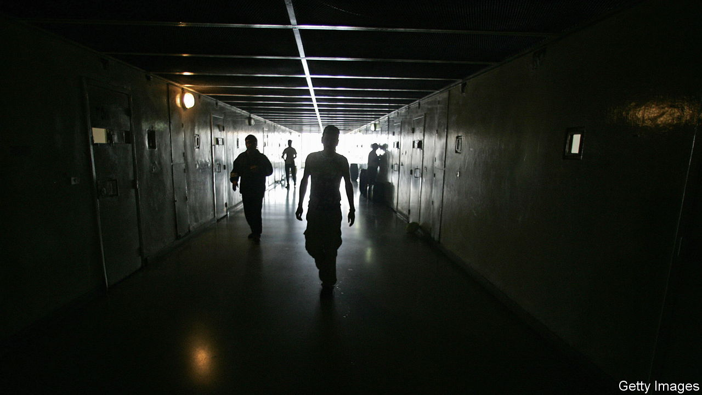

###### Prison blues

# Lebanon’s prison inmates are running short of food 

##### And most have not even been convicted 

 

> Sep 21st 2023 

When rabea, a small-time drug dealer from Tripoli in northern Lebanon, was caught with two kilos of hash in 2017, he knew what to expect. His local lock-up, Qubbah Prison, where he would spend the next five years, was already filled with men from his neighbourhood. He knew about the years-long wait to see a judge. And he had heard about the crowded cells where 60 detainees take it in turns to sleep on the floor, the gangs and the fights. 

But Rabea did not know that things were about to get even worse. In 2019, halfway through his sentence, Lebanon’s economy went into meltdown. The country’s economic crisis—in the course of which its gdp has contracted by almost 40%—caused havoc in its prisons. Food and medical supplies became ever scarcer and violence surged in jails that are now at 323% of capacity.

Amid a multitude of crises, the welfare of Lebanon’s prisoners is not a priority. The budget for the interior ministry, which runs the prisons, has officially increased in recent years. But a collapsing currency—the lira has lost 98% of its value since 2019—and soaring annual inflation (official figures put it at over 250% in July) mean that its purchasing power has been steadily eroded. 

Inflation also means that families struggle to afford to buy food to supplement prisoners’ increasingly meagre rations. By the end of his sentence, Rabea says he was expected to survive on as little as a spoonful of bulgar wheat a day. Amid budget cuts, prisoners are being denied crucial medical treatment. More than 800 were taken to hospital in 2018; only 107 were taken in 2022, even as the total prison population has remained stable, according to Amnesty International, a human-rights charity. Deaths in prisons almost doubled between 2018 and 2022.

Meanwhile, the vast majority of Lebanese detainees are technically not guilty—not yet at least. Some 82% of prisoners have yet to see a judge, compared with 54% in 2017. When Rabea at last had his day in court, he had already been in jail for almost three years. Budget cuts within the justice ministry are slowing the government’s ability to clear the backlog, so the proportion of detainees in pre-trial detention is expected to grow. In 2022 just 2,672 criminals were convicted compared with 4,772 in 2020. Strikes by judicial officials and shrinking resources are making the problem worse. At least one recent trial was suspended when prison wardens had insufficient petrol to transport the accused to court.

Time keeps draggin’ on

When Rabea was released in 2022 almost everyone in his cell was awaiting trial. Some had been incarcerated for ten years, he says, only to be handed a one-year sentence. He watched with envy as a lucky few took advantage of the country’s chaos to secure a quicker release. “If you’ve got money, you can pay a good lawyer and he can get your case torn up,” Rabea says. “But if you haven’t, you’re not going anywhere.”■

