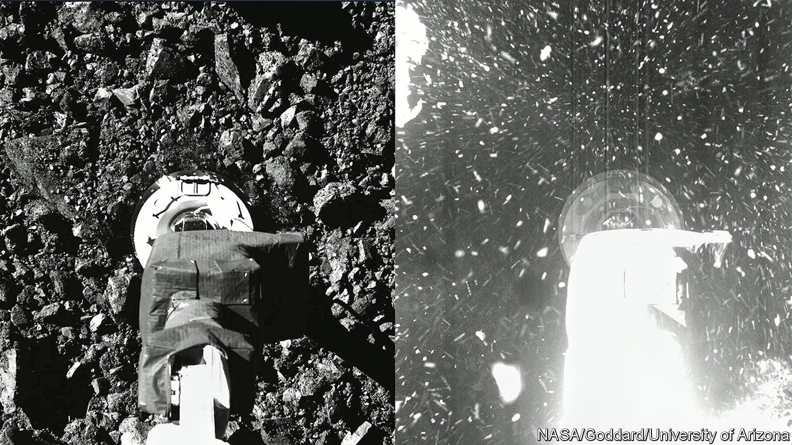

###### Creation and destruction

# A chunk of asteroid is coming to Earth 

##### It could shed light on the origins of life—and how to protect it 

 

> Sep 20th 2023 

ON SEPTEMBER 24TH, if all goes according to plan, scientists will hit Earth with part of an asteroid. That is less alarming than it sounds, for the chunk of rock in question weighs at most a few hundred grams. It will arrive in a small capsule, complete with parachute, that will drift gently to the ground in the Utah desert.

The rock is from an asteroid named Bennu, which was visited in 2018 by an American spacecraft called . The probe will drop its cargo off en route to another asteroid, Apophis, at which it is due to arrive in 2029. 

Astronomers take a great interest in . The solar system was formed around 4.5bn years ago, when a cloud of dust and gas collapsed under its own gravity into a disc, which in turn agglomerated into the sun and its planets. Asteroids are leftover chunks that never accrued enough mass to become planets. Studying them thus offers a window into the ancient astronomical past. 

This will not be the first time that bits of asteroids have been brought to Earth. In 2010 , a Japanese spacecraft, visited an asteroid called Itokawa but returned with less than a milligram of it. Its successor, , was able to procure five grams of rock from an asteroid named Ryugu in 2020. ’s dig did not go quite according to plan. Some of the excavated material is thought to have jammed its digger, allowing some of the sample to fall back out. But NASA is confident that the mission has exceeded its minimum target of 60 grams. Compared with previous missions, that will be a bounty. 

Researchers are interested in Bennu in particular for two reasons. One is that it appears to be rich in carbon, the element whose complicated chemistry underlies all life on Earth. When scientists analysed Ryugu, the carbon-rich asteroid explored by , they found a smorgasbord of organic compounds (that is, those containing carbon), including several different amino acids, the chemical building blocks of proteins. Examining ’s cargo should allow scientists to cross-check those results. 

Bennu also contains traces of another vital ingredient of life: water. When researchers looked at spectral data collected by  while it was in orbit around the asteroid, they found molecules with oxygen and hydrogen atoms bonded together in clay. The asteroid also appears to have large stores of carbonate minerals. On Earth these are found, among other places, near deep-sea hydrothermal vents. Such vents, which provide a steady stream of chemical energy, are one candidate for the origins of Earthly life. 

Scientists are interested in asteroids for a more immediately relevant reason, too: self-preservation. It was an asteroid colliding with Earth that wiped out the dinosaurs (and plenty of other organisms), around 65m years ago. Bennu is one of around 2,400 asteroids that NASA has deemed a modern-day collision risk (there is thought to be about a 1-in-1,750 chance of it colliding with Earth by 2300). Bennu is roughly spherical, with a diameter of about 500 metres. That makes it much smaller than the asteroid that ended the dinosaurs, which is thought to have been between 11km and 81km across. But a collision would still inflict a great deal of damage. 

Scientists are therefore keen to characterise such asteroids in order to work out how a looming impact might be averted. “If we don’t know what they’re made of or how their materials behave, then it’s hard to find an effective method to deflect these asteroids,” argues Philipp Heck, senior director of research at the Field Museum of Natural History, in Chicago.

Several more missions are therefore planned. In October another NASA spacecraft will begin a mission to a metal-rich asteroid named Psyche. In 2024 the European Space Agency will launch a probe named . It will visit Didymos, a pair of asteroids visited in 2022 by yet another NASA mission named . That mission involved crashing a spacecraft into one of the asteroids in an attempt to alter its orbit.  will help analyse the aftermath. 

That is also why, after dropping off its cargo,  is due to visit Apophis. This asteroid’s orbit also comes uncomfortably close to Earth’s. In April 2029 it is due to whizz by within 20,000 miles of Earth’s surface, an altitude below the orbits of some satellites. The vagaries of orbital mechanics mean that  will not reach its quarry until a few days after that hair-raising astronomical near miss. ■


