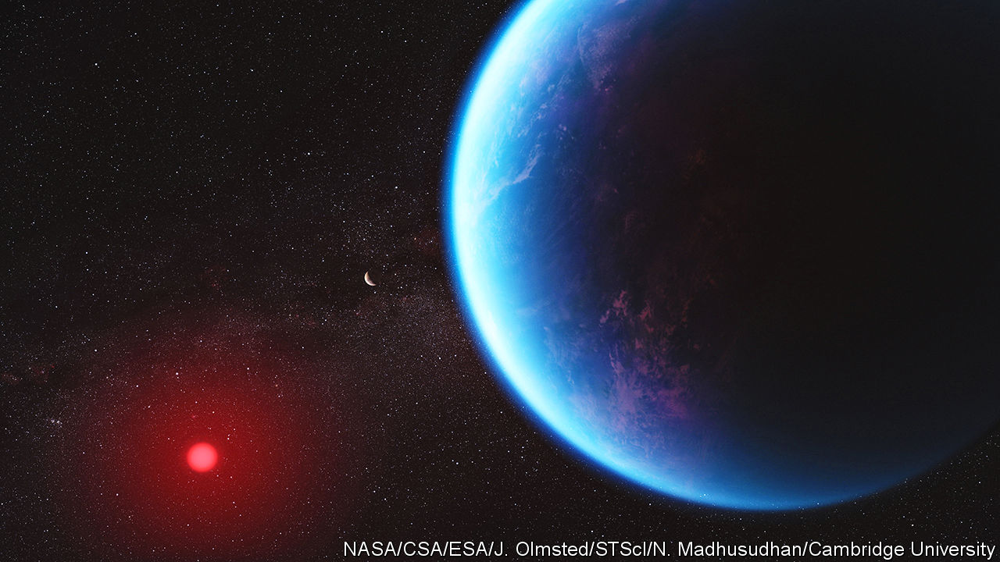
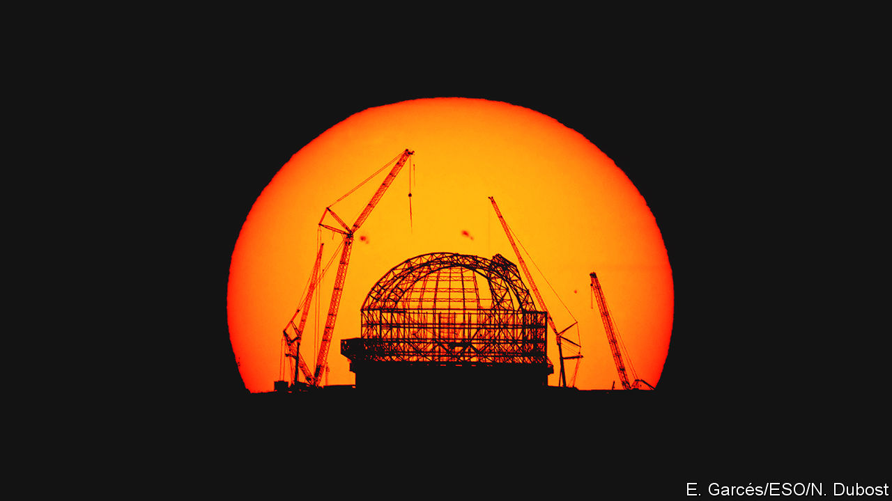

###### Godforsaken rocks

# Finding alien life may require finding new sorts of planets 

##### For now, telescopes can examine only small, inhospitable kinds of star 

 

> Sep 20th 2023 

On September 12th, at a conference on life in the universe hosted by Harvard University, David Charbonneau, an astronomer at that same university, gave a talk titled “The terrestrial planets of the smallest and closest stars”. The unofficial title, as revealed on his second slide, was “Small angry stars and the many godforsaken rocks which orbit them”. 

Astronomers have now found more than 5,500 planets around other stars, or exoplanets, most of them detected by means of the small dip in the star’s light that happens when the planet passes across its face, and the planet’s shadow thus passes across the Earth. Hundreds of these sit in their parent star’s “habitable zone”, which means they orbit neither so close that any water on their surfaces would boil away, nor so far that it would be frozen. Since water is vital to every form of life known on Earth, such potential sogginess is much prized by scientists interested in whether some exoplanets might harbour life of their own. 

What astrobiologists most want to do when they come across a planet in the “Goldilocks zone” is look at its atmosphere. The Earth’s atmospheric chemistry betrays the presence of life on its surface in a number of ways. The same should hold true for exoplanets that carry life. The launch in 2021 of the James Webb Space Telescope (JWST) brings with it the chance that such signs might be seen in planets around other stars. The prosaically named Extremely Large Telescope (ELT), presently being built in Chile and due to start work in 2028, will also be able to look at the atmospheres of nearby exoplanets.

Unfortunately, there is a catch. Powerful as they are, these instruments cannot look at planets in habitable zones around stars like the Sun, or many other types of potentially interesting star. The only habitable-zone atmospheres into which they can peer belong to exoplanets which orbit “M-class” stars, one of two types of star commonly known as red dwarfs. 

Being limited to one type of star is unfortunate. Being limited to M-class stars in particular may be doubly so, for they are the small, angry stars of which Dr Chabonneau spoke. The physical characteristics of M-class stars make their habitable zones look a lot less hospitable than the term implies, especially if the life in question favours smallish rocky planets like the Earth. 

But rocky planets are not the only sort on offer. There are a fair few red dwarfs with bigger, less dense companions in their habitable zones, planets ten times the mass of the Earth and two or three times its radius. That makes them a bit smaller than Neptune, the smallest of the outer solar system’s gas giants. Their density makes it certain that these “sub-Neptunes” have atmospheres; were they solid rock they would be more heavy. Their other attributes are mysterious. Some astronomers think that they, rather than their rocky neighbours, may offer the best chance of discovering signs of life elsewhere. The first JWST study of such a planet, one called K2-18 b, which was published on September 11th, did not do that. But the presentation of the data was still one of the highlights of the conference. 

Red dwarfs are good targets for study because they are small, dim and very common. Quite how common is only appreciated by astronomers. Being small (between half to a tenth the radius of the Sun) makes them so dim (0.3%-7% as bright as the Sun) that none of them, not even Proxima Centauri, the nearest star to the Sun, is visible to the naked eye. But there are more M-dwarfs in the nearby sky than stars of all other types put together. 

The ubiquity of M-class stars means there are plenty for telescopes to look at. Their small size and dimness, meanwhile, makes it easier to study the planets that orbit them. Studying their atmospheres is done by looking at what happens to light from the star when it passes through the orbiting planet’s atmosphere. The smaller the star, the larger the proportion of its light that passes through the atmosphere. The dimmer the star, meanwhile, the less likely the signal from the atmosphere is to be swamped by the light from the rest of the star’s disk. 

But if the stars’ smallness helps with the study of their planets’ atmospheres, it also makes the very existence of such atmospheres—at least around rocky planets in the habitable zone—less likely. Young M-class stars have complex internal dynamics which give rise to very powerful magnetic fields. These lead to stellar flares, sometimes very dramatic ones, and to powerful emissions of X-ray and ultraviolet radiation. In the billion years or so it takes a young M-class dwarf to settle down into mature quietude, that radiation could be more than enough to strip the atmospheres from any rocky planets in the Goldilocks zone. This may have been the fate of Trappist-1 c, a planet in the habitable zone of a red dwarf 40 light years away; in June astronomers announced that, having looked at it with the JWST, they could see no clear evidence of any atmosphere at all.

Another problem with M-class stars is that few seem to possess big planets that orbit beyond their habitable zones, as Jupiter does in the solar system. Jupiter’s powerful gravity throws icy comets from the outer reaches of the solar system towards the rocky planets closer to the sun. That is thought to have delivered water and other simple molecules, such as nitrogen, to the early Earth. Without such Jupiter analogues, rocky planets around M-class dwarfs could be starved of such bounty. 

The depths of somewhat less despair

All this makes rocky Earth-like planets in such habitable zones poor prospects for life. Neither factor is so much of a problem for sub-Neptune planets. They are known to have atmospheres, and those atmospheres may well contain the sort of molecules Earth had to have delivered from the outer solar system. In 2019 a group of astronomers at University College London used the Hubble Space Telescope to look at the atmosphere of such a planet: K2-18 b, which orbits an M-class star 124 light years away in the constellation of Leo. One of the things they thought they saw was evidence of water vapour. 

This inspired Nikku Madhusudhan, an astronomer at the University of Cambridge, to imagine a sort of sub-Neptune that would be truly habitable. He calls the result of his imaginings “Hycean” worlds after their two vital features: hydrogen atmospheres (whence the hy-) and oceans (hence the -cean).

Dr Madhusudhan began with the mass of K2-18 b, its radius and thus its average density. He also knew how the pressure, volume and temperature of various gases and liquids are related to one another, relations called “equations of state”. That allowed him to make a self-consistent model of K2-18 b with a dense rocky core, a watery high-pressure shell around that core and a thinnish atmosphere of hydrogen on top.

That model is not the only one that fits what little data there are. What singles out the Hycean idea is that it allows the upper reaches of the planet’s water layer to be liquid and temperate. It would be an odd ocean, admittedly; one with no continents and no islands, and which instead of having a rocky or muddy sea floor is underlain by ice (high-pressure ices are denser than liquid water). But any ocean looks better, to an astrobiologist, than bare rock. 

 


Dr Madhusudhan asked for and got time on the JWST to see if K2-18 b might match up to his speculations. As he told the conference, in some ways it did. Chemical modelling predicts that, if it were indeed a Hycean planet, its mostly hydrogen atmosphere should contain detectable amounts of carbon dioxide and methane. Both had indeed been found. There were also signs in the starlight compatible with the presence of dimethyl sulphide. On Earth, that molecule is produced only by life. That would make its presence on K2-18 b a possible “biosignature”, the sort of thing which triggers great excitement. As things stand, though, the evidence for its presence is sufficiently weak that no such excitement is warranted. A more conservative scientist might not even have mentioned the possible sighting.

There were also some things which were not seen. One was ammonia. The processes which produce methane in such an atmosphere should also produce ammonia. Dr Madhusudhan interprets its absence as circumstantial evidence for an underlying ocean. Ammonia dissolves in water in a way that methane does not; the ocean may be swallowing it up leaving only the methane for the atmosphere.

The other thing not seen, oddly, was water vapour. Given that it was the supposed detection of water vapour that provided the spur for Dr Madhusudhan’s theorising, its absence might be seen as a problem. But it does not have to be. The error bars on the initial detection were very wide. Some of the water signal might in fact have been methane; it is also possible that the water vapour is there, just at a level low enough that the JWST cannot see it. 

Even if the Hubble measurements were simply wrong, and there is no water in the signal after all, that does not necessarily rule out an ocean. After all, Earth is a wet planet. But its upper atmosphere is dry, because above a certain altitude water vapour freezes out of the air. And the observations of K2-18 b looked only at the highest reaches of its atmosphere.

Now Hycean, now you don’t

Dr Madhusudhan was careful to stress that his results were merely compatible with the idea of K2-18 b being a Hycean world, not proof that that it is one. Just as well: many of his peers remain sceptical of the whole idea. Hydrogen is a potent greenhouse gas. So is water vapour. Water vapour from the surface of an ocean warmed by a hydrogen greenhouse will add to the warming, producing more water vapour. Some see this as likely to lead to a “runaway greenhouse effect” which will get rid of all the liquid water, leaving behind only steam and high-pressure, high-temperature, “supercritical” HO. To escape such a fate, a Hycean world would need to start off with just the right amount of hydrogen. That may be a very rare occurrence. 

The JWST should help sort all this out. There are already more observations of K2-18 b on its schedule. Other rocky and Neptune-like planets in orbits that bring them across the face of their parent stars will come under scrutiny, too. The ELT, for its part, will take a keen interest in Proxima Centauri b, the closest habitable-zone exoplanet to Earth. As seen from Earth it does not pass across the face of its star. But the huge telescope may be able to study its atmosphere, should it have one, directly. 

What is for sure is that, for the time being, the habitable zones around M-dwarfs are the only such game in town. Telescopes that can see planets in such zones around other sorts of star are decades away. But if that sounds like a long time to wait, consider that a generation ago the ability to study exoplanets of any kind, around any sort of star, seemed almost too much to hope for. Now the field is alight with fresh observations and new ideas, if not yet with signs of life. ■


