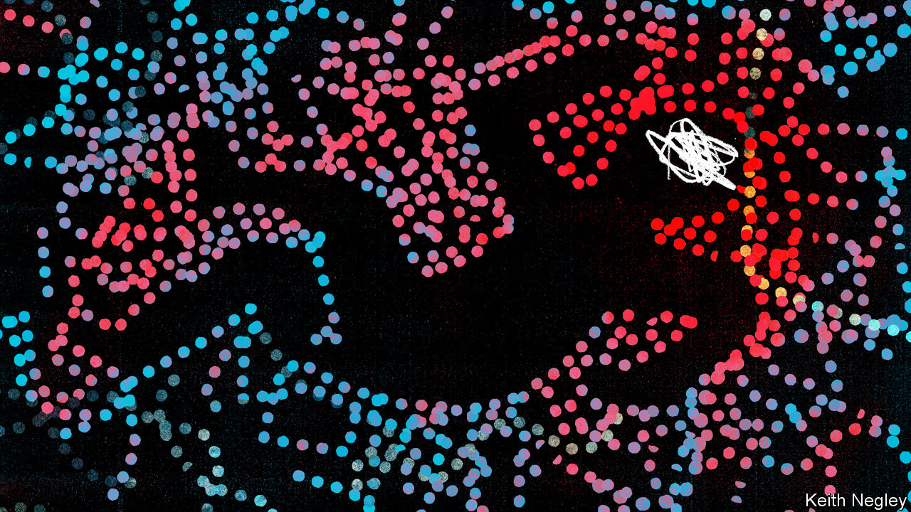

###### PANDA-monium

# How common infections can spark psychiatric illnesses in children 

##### And why many doctors do not realise it 

 

> Sep 20th 2023 

It was a sunny day in September 2007 when Garrett Pohlman, then seven years old, came home from school. Crying, he warned his mother that radiation was coming out of the house’s electrical sockets. If they went outside, he said, birds would peck them to death. These pronouncements were accompanied by odd facial movements. The boy would stick his tongue out and jerk his arms and legs. The day before, Garrett had been a normal boy. Both the paranoia and the tics had come out of the blue, but they proved to be the start of a horrifying mental decline. 

In the end, Garrett was lucky. A hospital scan three months later revealed a bacterial sinus infection. A course of antibiotics cured the infection and brought about a striking improvement in his psychiatric symptoms. Garrett had been suffering from PANDAS, which stands for Paediatric Autoimmune-Neuropsychiatric Disorders Associated with . 

Many other children are not so fortunate; some have suffered long-term damage. In plain English, Garrett’s unsettling behaviour was the result of an immune system gone haywire following an infection with group A , a common bacterium. (A similar illness, triggered by other infections, goes by the acronym PANS, for Paediatric Acute-onset Neuropsychiatric Syndrome.) 

Yet many doctors have heard of neither PANDAS nor PANS. Some have dismissed them as fictitious diseases. Very few countries issue guidance on their diagnosis or treatment. Diana Pohlman, Garrett’s mother, says she is “exhausted” by years spent campaigning to get doctors to take the illnesses seriously. 

That is starting to change. Scientists are beginning to characterise the conditions in detail and determine exactly what is going wrong with the immune systems of sufferers. On September 12th Maria Caulfield, a British health minister, weighed in, telling legislators that PANDAS and PANS exist and are triggered by infections. 

Such efforts are starting from a low base. In a 2020 survey for PANS PANDAS UK, a charity, 95% of parents whose children have PANDAS said their family doctors had not offered the diagnosis, suggesting awareness is low. Things were only a little better among specialists. Around half of paediatricians said they had never heard of the disease. Nearly one in five of the parents surveyed said their paediatrician felt that the diagnosis was controversial. 

That ignorance carries costs. In many countries children with PANDAS are presented with an alphabet soup of psychiatric misdiagnoses. These can include attention-deficit hyperactivity disorder, autism and sensory-processing disorders. Children can be given inappropriate drugs like antipsychotics, many of which have unpleasant side-effects and which do nothing to treat the cause of their disease. 

In some cases parents have been accused of inventing or inducing their children’s illness.  has spoken to parents who say their children have been committed to mental-health services against their will, or removed from their care altogether. According to testimony provided in Parliament, one doctor told a child that he would not treat “an American illness”. In 2019 several dozen children with PANDAS and PANS were discharged from a British hospital. Their parents were told they had a “functional neurological disorder”—a diagnosis that has evolved from the old (and discredited) idea of hysteria, and which some doctors joke grimly means “finding no diagnosis”. 

Exactly why the diagnosis is controversial remains unclear. After all, the idea that the aftermath of an infection can cause psychiatric symptoms is not new. Sydenham’s chorea, in which patients suffer from jerky movements of the face and body, is likewise the result of a streptococcal infection.  contacted a number of psychiatrists and professional bodies for comment. Some did not reply. Others said they were unable to offer any comment. The Royal College of Psychiatrists said it was struggling to find an available spokesperson. 

The body and the mind

But as evidence accumulates that PANS and PANDAS are real, attitudes are beginning to shift. Scientists who study the disorder now believe it is caused by an auto-immune reaction, in which the body’s immune system mistakenly attacks brain tissue. After infection with , the theory goes, children begin producing antibodies that cause inflammation in their own brains, which in turn causes the psychiatric symptoms.

In 2018 Christopher Pittenger, a psychiatrist at Yale University, and his colleagues extracted antibodies from the blood of children with PANDAS and introduced them into laboratory mice. They found that the antibodies attacked cholinergic interneurons in particular, a group of cells in parts of the brain associated with tic disorders, which are one of the features of PANDAS. Chandra Menendez, a researcher at the University of Oklahoma Health Sciences Centre, says she has found a “correlation between antibodies that target dopamine receptors D1 and D2 and the PANDAS phenotype”. This sort of work could help develop diagnostic tests.

A paper by Dritan Agalliu, a neurologist at Columbia University, currently under review by a scientific journal, suggests that blocking a particular part of the immune system—a type of lymphocyte called T helper 17 cells—with anti-inflammatory drugs reduces damage to the brain, at least in mice. Other work suggests that damage to the blood-brain barrier, a filter designed to protect the brain from potentially harmful substances in the blood, could also be part of the story. 

Such findings may have significance beyond a single obscure, debilitating illness. For they fit an intriguing, and growing, body of evidence that other kinds of psychiatric conditions might also result from infections. Dr Pittenger says it is now clear that covid-19 infections can trigger psychosis, fatigue and other neuro-psychiatric symptoms. A misbehaving immune system is thought to be the culprit. The idea that schizophrenia may, at least sometimes, likewise be an auto-immune disorder is also under investigation. (Intriguingly, people with any kind of auto-immune disorder appear to be about 40% more likely to develop psychotic disorders such as schizophrenia.) 

How long it takes doctors to pick up on this change of thinking is another matter. Some of the prodding now comes not from patients, but from governments. Robin Millar, a British MP who chairs a parliamentary group on PANDAS and PANS, says Britain’s government is committed to working out how to diagnose and assess the illnesses. It has begun discussions with doctors, and is pondering a research project to work out how prevalent the diseases are. A pan-European patient group called EXPAND, founded in 2018, is also pushing to improve understanding.

Such efforts are sorely needed. As Garrett Pohlman’s case shows, if infections are caught early, treatment can be very effective, avoiding long-term damage. Now 23, Mr Pohlman graduated in 2022 with high honours from the University of California, Berkeley, in chemical engineering, and these days runs his own company. Not every patient has been so lucky. ■


