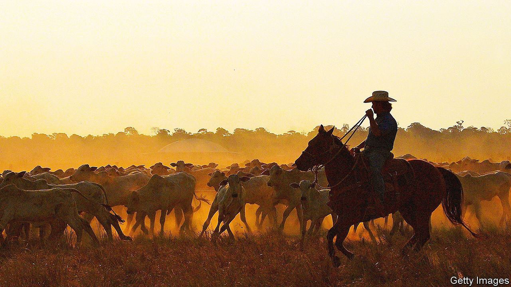
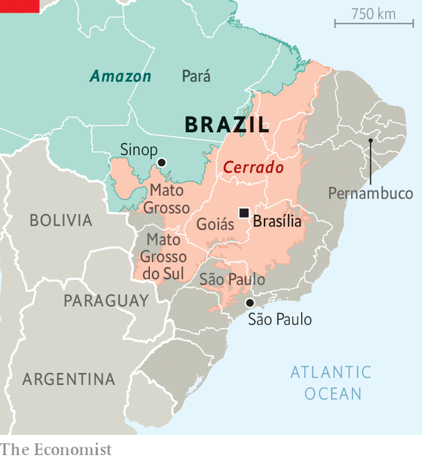
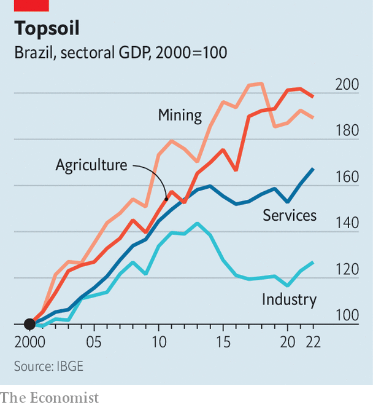

###### Sertanejo swagger

# Brazil’s hinterland now resembles Texas 

##### It is a land of “roughs”, not playboys 

 

> Sep 21st 2023 

THINK OF BRAZIL and, if you’re like most people, you’ll think of palm-lined beaches, samba and caipirinhas. The cliché needs updating. In the past two decades the centre of political and economic gravity has started shifting from the humid coasts, to which Brazilians were said to cling “like crabs”, to the vast, arid plains of the interior. Its soundtrack is  (country music). The preferred beverage is cold beer. 

 


Brazil’s census, its first in 12 years, showed a notable trend when it was published in June. Seven of the ten municipalities that have grown most are in the farmbelt in the southern half of the country and the centre-west. The population of the centre-west, which includes the states of Goiás, Mato Grosso and Mato Grosso do Sul plus the capital, Brasília (see map), grew by 1.2% a year, more than double the national rate. The south-east still has the most people and money—São Paulo state alone produces a third of Brazil’s GDP and is home to a fifth of its population. But even within that state, it is in the farmbelt where the population and economy are growing most. 

Migrations within Brazil are nothing new. A movement from the poor north-east to the industrial hub around the city of São Paulo did much to shape the country’s economy and culture in the second half of the 20th century. Brazil’s current president, Luiz Inácio Lula da Silva, is the most famous of the millions who made that journey. After a famine struck his birthplace in Pernambuco, his mother packed her eight children onto a  (macaw’s perch), a flatbed truck, and headed south. Lula rose to prominence as a trade-union leader in the car industry near São Paulo. Now when people leave the poor north-east they tend to head to the interior. What has changed is the perception of which activity can offer better lives, says Carlos Vian of the University of São Paulo. “Before, it was industry; not any more.” 

The magnet that drew Lula to São Paulo has lost strength. In the mid-1980s manufacturing accounted for a third of Brazil’s GDP; now it represents just 10%. The country’s surplus in manufacturing trade, $6bn in 2005, became a deficit of $108bn by 2019. Productivity in manufacturing and services has stagnated or shrunk.

 


Cultivation, the basis of Brazil’s economy in the 19th century, has made a comeback. The country still exports coffee and sugar, which were once grown on plantations worked by slaves. Since the early 2000s voracious demand from China has encouraged a rise in production of soyabeans, grains and meat (see chart). Agricultural exports as a share of the total have more than quadrupled since 2000, to 40%. Today the sector accounts for a quarter of GDP and employs a similar share of workers. From 2002 to 2020 the economy of Mato Grosso, the soyabean heartland, grew by 4.7% a year in real terms, more than that of any other state and more than double the national rate. 

The agri-business boom is slowly changing demography and culture. In the 1970s, more than four-fifths of population growth occurred in the biggest cities. In the past 12 years, during which the population grew more slowly, two-thirds of the growth has taken place in mid-size towns. 

Sinop, a soyabean centre in Mato Grosso, typifies the trend. The state, whose name means “dense forest”, had few inhabitants until the middle of the 20th century. A succession of Brazilian governments set out to populate the country’s hinterland. Agencies were established to offer land and cheap credit to people who moved west. They flourished during a military dictatorship, which ruled from 1964 to 1985. Sinop, founded in 1974, is named after one such company. 

Life at first was hard for the settlers (though harder for the indigenous people they pushed out). The rust-coloured earth yielded little and disease was rampant. Technology came to the rescue. In the 1980s Embrapa, the national agricultural-research agency, developed a variety of soyabean that thrived in the region’s acidic soils. Among the beneficiaries was the father of Juliano Antoniolli, who arrived in Sinop in 1981, before farms had access to electricity. Back then, downtown was “just a big mud bath”, says Mr Antoniolli, a 38-year-old farmer. 

Now 4,000 head of cattle roam alongside the soyabean fields and rows of maize on his 2,400 hectares near Sinop. Drones spray fertiliser and John Deere tractors pull ploughs. Three base stations from Starlink, owned by Elon Musk, connect the farm to the internet. Mr Antoniolli employs 12 people full-time, plus temporary workers during the harvest. He pays an average wage of 8,000 reais ($1,600) a month, three times Brazil’s median salary. He sells most of his produce to cofco, a Chinese food giant. 

Sertanejo’s soft power

Thanks to the money and jobs brought by the farming boom, not just for farmhands but for construction workers and others, Sinop’s population has swelled by 73% in the past 12 years, to 200,000. Now a city of roundabouts and car dealerships, it resembles a settlement in the United States’ deep South more than Brazil’s coastal metropolises. A petrol station calls itself Texas; a butcher, Super Beef. 

With economic clout comes other sorts of influence.  is Brazil’s most popular music. In 2003 16% of the top songs on Brazilian radio were of that genre. By 2022 three-quarters were. A sub-genre, , praises big agriculture. Luan Pereira, a lanky singer, wrote a hit song about fooling around in a Dodge Ram, a muscular American pickup truck favoured by soya barons. The video has been viewed almost 100m times in the past six months on YouTube. Some country singers style themselves “roughs”, as opposed to “playboys” from the city. “Five playboys can’t do what one rough can,” boasts a cowboy-hatted DJ Kévin, joined by Mr Pereira.

 self-confidence poses a challenge for Lula and his government. On the one hand, they welcome the economic growth that comes with agricultural expansion. On the other, they worry about its environmental cost and its political implications. Farmland is growing partly at the expense of the  (tropical savannah), Brazil’s second-largest biome after the Amazon. Its owners tend to be fans of Jair Bolsonaro, the right-wing president whom Lula defeated in the election last year. (Indeed, according to a news website, Mr Antoniolli was present in January this year when supporters of the former president attacked federal buildings in Brasília to protest against Lula’s inauguration. He told the website that he left as soon as the vandalism began.) In response to the census, Brazil’s Supreme Court in August ordered the first reapportionment of seats in the lower house of Congress since 1993. The Lula-friendly north-east will lose; the farmbelt will gain. 

Lula began his third term in January (he had been president from 2003 to 2010) as a foe of farming and ranching. During the election campaign he proposed limiting beef exports to hold down domestic prices. Yet he has since tried to get along with agri-business, offering more support while cajoling it to be greener. On June 27th he announced 364bn reais of subsidised loans to farmers, Brazil’s biggest-ever agricultural-credit plan. Farmers who use renewable energy and non-chemical pesticides will qualify for the cheapest loans. The national development bank, set up in the 1950s to promote industry, is shifting towards financing agriculture. In 2009 agri-business received just 5% of the bank’s loans. Last year nearly a quarter of its financing went to agriculture, and less than a fifth to industry. The balance is unlikely to shift back under Lula’s government. 

Many farmers profess to support the government’s push to make farming greener. Daniel Freire, the head of a chain of slaughterhouses in Pará, an Amazonian state, says that his company needs environmental permits to export to Europe and the United States. “To ship to the best markets in the world, it’s important to improve our sanitary and environmental standards,” he says. In April the European Parliament passed a law that from the end of next year will oblige producers of commodities to verify that their goods have not contributed to deforestation since 2020. 

But privately many farmers grumble about environmental rules. They oppose, and sometimes flout, the national forest code, which obliges farmers in the  to maintain native vegetation on 20-35% of their land. Some growers and ranchers move into the rainforest in states such as Pará, where the requirement is stricter (80% of their forest has to be preserved) but enforcement is even weaker. 

Brazil is one of the few countries where farmland is still expanding. The us Department of Agriculture estimates that by 2031 another 20m hectares, close to a quarter of the area now planted with crops, will be brought into production. Growth need not mean destroying trees. Some 170m hectares of pasture are thought to be under-used. If farmers grew soyabeans on just 10m of those hectares, they could raise output by 40m tonnes a year over the next decade, roughly a tenth of today’s global output, says Daniel Amaral of the Association of Brazilian Vegetable Oil Industries. The productivity of each hectare could also increase. Brazilian maize farmers grow an average of six metric tonnes per hectare, half the yields American farmers achieve. Better infrastructure could boost profits and investment. The lorries that carry Mato Grosso’s grains to port must travel along a single 1,000km pothole-filled road. Brazil’s logistics costs are the equivalent of 12.1% of gross national product, compared with 7.6% in the United States. Farmers have much to gain from a government that would invest in reducing them. 

In places like Sinop the future looks bright. But fears are growing that the success of Brazil’s farmers could contain the seeds of its undoing. Deforestation of the  could eventually reduce rainfall. Already signs of stress from global climate change are beginning to appear.  could some day lose its swagger. ■

