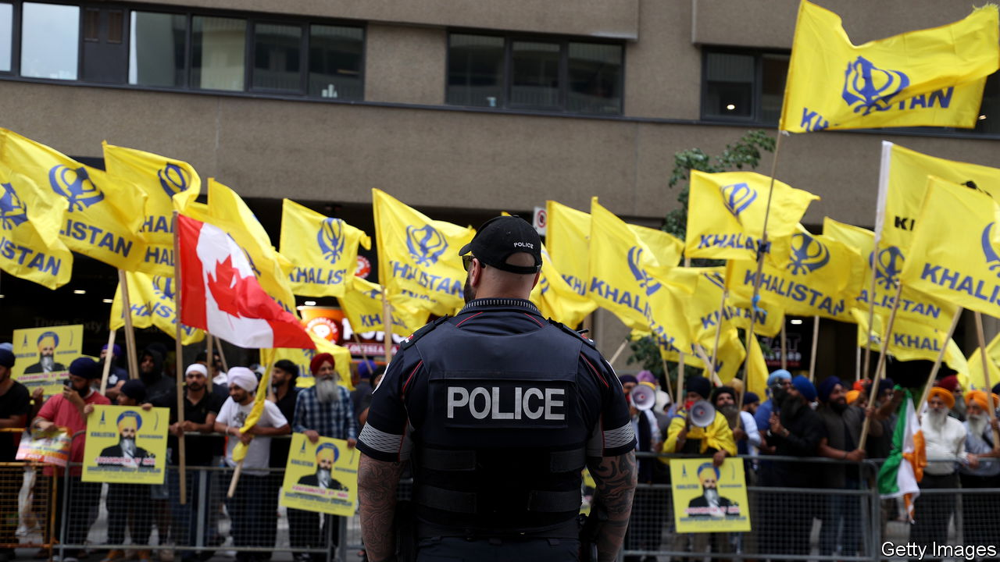

###### The Economist explains

# What is Khalistan, the independent homeland some Sikhs yearn for? 

##### The separatist movement is now largely propagated from abroad 

 

> Sep 19th 2023 

WHEN INDIA gained independence from Britain in 1947, few outside the country believed that a union of such diverse states could hold together. India has survived—but not without threats to its unity. One of the most enduring has been the Khalistan movement, which seeks to establish an independent homeland for Sikhs. On September 18th Canada’s prime minister, Justin Trudeau,  that Indian government agents were behind the killing, in June, of Hardeep Singh Nijjar, a Canadian Sikh leader who supported independence for Khalistan. India’s government, which denies any involvement, has accused Canada of harbouring “terrorists and separatists”. How serious is the Khalistan movement?

The origins of Khalistan lie in Sikhism, a religion practised by 23m people in India and 3m more around the world. The faith emerged in the 15th century in Punjab, a region in northern India, then ruled by the Mughals. In 1699, frustrated by life under Muslim rule and corruption among Sikh priests, Guru Gobind Singh, the faith’s leader, reformed the religion. The  (or pure) tradition he initiated radically changed the way Sikhism was practised and organised. It also came with a political vision: to ensure Sikh rule in Punjab.

At independence, some Sikhs tried to realise that vision by carving out a separate country. But the group was small (in the 1941 census, Sikhs accounted for 15% of the Punjab province in British India). The British partitioned Punjab between India and Pakistan. Most Sikhs living on the Pakistani side chose to move to India. 

The dream of Khalistan survived. In the late 1970s and early 1980s the movement re-emerged, fuelled by growing Sikh diasporas in places like Britain and Canada. In 1980 Jagjit Singh Chauhan, a doctor in London, declared himself president of the “Republic of Khalistan”.

That did not much bother India’s government, for which Punjab’s politics were of greater concern. Throughout the 1970s, there was a clamour within the state for greater autonomy and policies favouring Sikhs. Congress, then India’s ruling party, believed such requests amounted to secession. In the 1980s the movement for autonomy turned violent. 

Part of that was down to the growing popularity of Jarnail Singh Bhindranwale, a radical preacher who claimed Sikhs were “slaves in independent India” and wanted them to return to the fundamentals of the faith. Bhindranwale said he did not want independence for Khalistan, but were it to be offered he would not refuse. His rhetoric helped fuel widespread communal violence. 

The biggest flashpoint came in 1984. By then, Bhindranwale and a group of supporters had set up a base in the Golden Temple, Sikhism’s holiest site, in the Punjabi city of Amritsar, from where they sought to lead the insurgency. As violence spread across the state, the Indian government decided to enter the temple to evict the terrorists. 

Operation Blue Star, as it was called, proved momentous for the Khalistan movement. By some estimates more than 3,500 people were killed, including hundreds of government troops, pilgrims and Bhindranwale himself. The bloodshed left a “collective wound in the psyche of the Sikhs”, writes Ramachandra Guha in “India After Gandhi”, a history. Weeks later Indira Gandhi, the prime minister, who had ordered the attack, was killed by her Sikh bodyguards. That provoked more violence. Across India, Sikhs were attacked; thousands were killed.

That in turn boosted the Khalistan movement. Sikhs in India and abroad signed up for the cause. Violence by Khalistani militants surged. In 1985 Khalistani terrorists planted a bomb on an Air India flight between Montreal and London, killing 329 people, most of them Canadians. 

Eventually, though, the movement lost steam in India—partly owing to a government crackdown and economic growth. Many Sikhs still consider Bhindranwale a martyr, but few try to emulate him and those who do are quickly stopped. The only remaining party that advocates Khalistani independence secured less than 3% of the vote in the latest state election.

Outside India the movement persists. Groups in America, Australia, Britain and Canada continue to support separatism. India’s relations with Canada were strained even before Mr Nijjar’s killing and Mr Trudeau’s accusation. Similar tensions could emerge with other countries. Khalistan may no longer be a threat to India’s unity, but it will affect its foreign policy. ■ 

