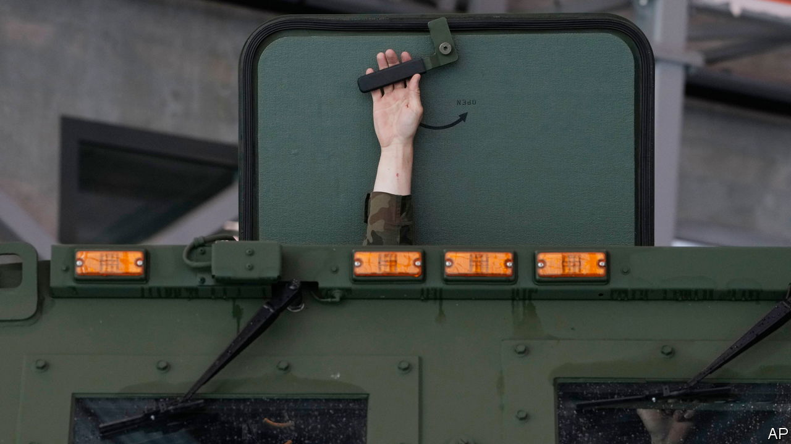

###### The Economist explains

# Why Poland is halting its supply of weapons to Ukraine 

##### A row over duty-free grain has escalated rapidly—but Poland’s government is also posturing 

 

> Sep 21st 2023 

POLAND HAS been among the  of Ukraine since Russia’s invasion in February 2022. But on September 20th its prime minister, Mateusz Morawiecki, said that his country was no longer  to its neighbour, and would focus on rearming itself with modern kit. It is unclear whether Mr Morawiecki’s comments amounted to a change in policy: Poland has already sent Ukraine much of its stock of Soviet-era weaponry, including tanks and jets, and the transit of Western aid and arms to Ukraine, of which around 90% goes through Poland, will continue unobstructed. But Poland’s government has certainly left observers with that impression. On September 21st the government spokesman, Piotr Müller, said that his country would only complete previously agreed deliveries of arms and ammunition to Ukraine, and mentioned its neighbour’s “unacceptable” statements and actions. He was referring to an escalating quarrel with Ukraine over grain exports. 

European Union member states that border Ukraine have long argued that the duty-free import of Ukrainian produce to the bloc has caused havoc in their markets. On May 2nd, to allay their fears, the European Commission agreed to ban the sale or storage of certain Ukrainian produce in Bulgaria, Hungary, Poland, Romania and Slovakia (though transit through these countries was still allowed). These measures expired on September 15th. But Hungary, Poland and Slovakia defied Brussels by unilaterally extending them. On September 18th Ukraine filed a complaint against these countries at the World Trade Organisation. On September 19th Volodymyr Zelensky, Ukraine’s president, accused the trio of making “political theatre”—specifically a “thriller from grain”. Why has this row escalated?

The problem has been over a year in the making. In June 2022, to help Ukraine’s economy and avert a  caused by a Russian blockade of its Black Sea ports, the EU lifted tariffs on a range of Ukrainian exports, including many agricultural products, and negotiated transit corridors through Bulgaria, Poland and Romania. The idea was to ship the goods to the Middle East and Africa. An agreement between Russia and Ukraine to let some produce travel via the Black Sea  in July 2023, leaving river, road and rail routes as crucial corridors for Ukrainian produce. 

But a shortage of trains and lorries slowed shipments to markets beyond eastern Europe, and much of the produce ended up in local ones. Plummeting prices hurt the incomes of farmers, sparking weeks of protests. On April 15th Poland’s government banned the import and transit from Ukraine of dozens of goods, including grains, milk, honey, fruits, vegetables and some meats. Robert Telus, the agriculture minister, said that Poland’s embargo was necessary to “open the eyes of the EU”. Hungary and Slovakia quickly followed suit. The European Commission, which runs the EU’s trade policy, agreed to a compromise: impose temporary import bans, but allow transit to the west. That compromise has now expired, and the EU refuses to extend it, claiming that the “market distortions in the five frontline countries have disappeared”.

Not everyone agrees. Hours after the embargo ended, Hungary, Poland and Slovakia said they would introduce their own restrictions on grain imports (transit through their territories is still exempt). But Ukraine’s economy minister, Yulia Svyrydenko, said their actions chipped away at the EU’s solidarity with Ukraine, and deepened the distress of Ukrainian farmers. “Ukraine sees this as a violation of international obligations,” she said. Her deputy, Taras Kachka, said that Ukraine was considering retaliatory measures on Polish products, such as onions and apples, as well as on Hungarian cars if the bans had not been lifted by September 22nd.

The unilateral moves also put Hungary, Poland and Slovakia on a  with the European Commission, which can launch infringement procedures against countries that do not implement the EU’s trade policy. The EU is normally responsible for representing its members in disputes with the WTO, meaning it could be drawn into Ukraine’s complaint. Germany’s agriculture minister, Cem Özdemir, accused the three countries of “part-time solidarity”. His French counterpart, Marc Fesneau, said that the unilateral actions threatened “collective efforts to preserve global food security”.

On September 21st the Slovakian government struck a deal with Ukraine that will see the resumption of grain imports. But Poland seems less likely to relent. Mr Morawiecki even said that further Ukrainian products could be added to the import ban if Ukraine “escalates”. The motivation is political. Poland’s ruling Law and Justice (PiS) party, which depends on the rural vote, faces a difficult general election on October 15th. But even if the posturing is chiefly aimed at a domestic audience, it will undermine the EU’s attempts to maintain a united front against Russia. And it could set a dangerous precedent for other countries that want to reduce their support for Ukraine. ■

