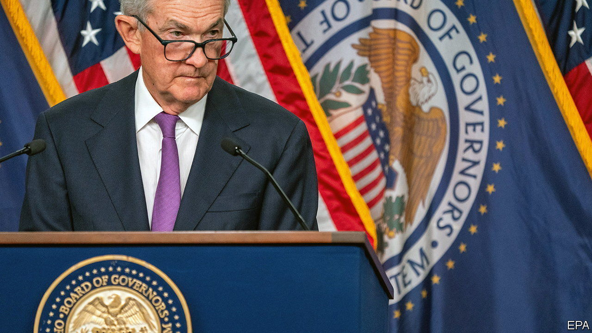
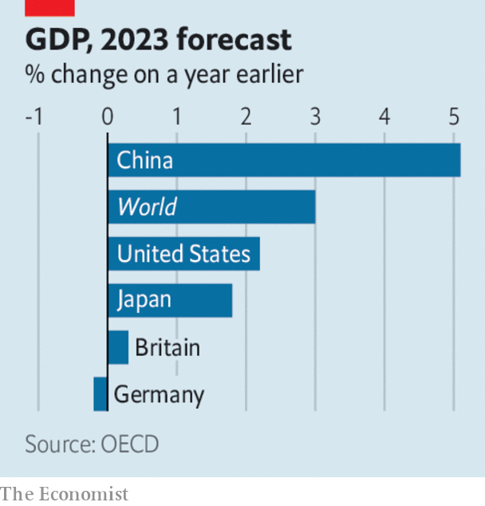

###### The world this week

# Business 

#####  

 

> Sep 21st 2023 

The  left its benchmark interest rate on hold at a range of between 5.25% and 5.5%, but said it remained “highly attentive to inflation risks”. New forecasts from the central bank suggest that the American economy is proving to be more robust than expected, pointing to another rate rise before the end of the year. Markets don’t expect the Fed to start cutting rates until towards the end of next year at the earliest. 

The  also maintained its key interest rate, at 5.25%, ending a run of 14 consecutive rate rises. The bank’s decision came a day after figures showed that Britain’s annual rate of  had unexpectedly slipped to 6.7%. Economists had predicted that the inflation rate would rise because of higher fuel costs, but this was offset by an easing of prices in certain items, including food and hotels. 

 


In its latest projections, the OECD said that the impact of higher interest rates is “becoming increasingly visible”. The organisation upgraded its estimate of    this year to 3%, but pared back its forecast for next year to 2.7%. The OECD said that monetary policy needed “to remain restrictive” until inflation is firmly under control, but it warned that the effects of rate rises “will continue to work their way through economies for some time”. 

 share price rose by 12% on its first day of trading on the Nasdaq exchange. The online-groceries company raised the offer price of its shares to $30, after  successful IPO on September 14th whetted investors’ appetite for more tech offerings. The British chip designer’s stock soared by 25% in its debut on the Nasdaq, raising $5bn to make it the biggest IPO in America in two years. But the share prices of both Arm and Instacart fell back in subsequent trading. 

 abruptly resigned as chief executive of Naspers, an internet company based in South Africa, and as the head of Prosus, which is controlled by Naspers and is one of the world’s biggest technology-investment firms. Mr Van Dijk had led Naspers for nine years, trying to handle the problematic mismatch between the value of its assets and its share price. 

 shareholders approved an offer for the Japanese conglomerate that will take it private. Its management hopes the fresh start will draw a line under years of upheaval. The consortium taking over Toshiba is led by a Japanese private-equity firm, Japan Industrial Partners. 

Elemental

 announced that it is doubling its investment in its theme parks, cruise line and resorts to $60bn. The company’s parks-and-experiences division generates more operating income ($7.6bn for the nine months ending July 1st) than its media and entertainment business ($2.2bn). 

California’s governor, Gavin Newsom, said he would sign a state bill requiring companies to disclose how much  they directly emit, as well as indirect emissions. They are the toughest measures on climate disclosure in America and will affect around 5,000 companies that do business in the state. Meanwhile California’s attorney-general lodged a lawsuit against big  such as BP and ExxonMobil, seeking damages for what it claims is an industry cover-up about the harm that fossil fuels can do. 

 climbed to their highest levels in ten months, as markets fretted that cuts to output by Saudi Arabia and Russia could cause a supply shortfall. Brent crude rose to $95 a barrel for the first time since November. Saudi Arabia’s energy minister defended the decision to lower production. It’s not about “jacking up prices”, he said, and more to do with economic uncertainties, such as demand in China. 

The  union said it would expand its strike to other factories unless there was “serious progress” in talks with Ford, General Motors and Stellantis. The UAW has co-ordinated its action against all three of Detroit’s carmakers for the first time, but limited the strike to one plant for each company. Meanwhile Ford reached a tentative deal with its union in Canada to avert a strike there. 

China’s imports of  fell by 68% in August from the same month last year. China, the world’s biggest market for Japanese fish and shellfish, banned the products when Japan released wastewater from the damaged Fukushima nuclear plant into the sea. 

It’s a family affair

FTX, a bankrupt cryptocurrency exchange, sued the parents of its founder, , to recover “fraudulently transferred and misappropriated funds” that it claims were paid out to the couple before the company collapsed last November. Mr Bankman-Fried goes on trial on October 3rd charged with fraud related to FTX’s implosion. A judge sent him to jail in August, accusing him of tampering with witnesses.

 described reports that Tesla is in talks to build a factory in  as “utterly false”. Mr Musk has a complex relationship with the Saudis, caused in large part by what he perceives to be a Saudi failure to back a plan to take Tesla private. “You are throwing me under the bus,” Mr Musk tweeted to the head of the country’s sovereign-wealth fund in 2018. 

