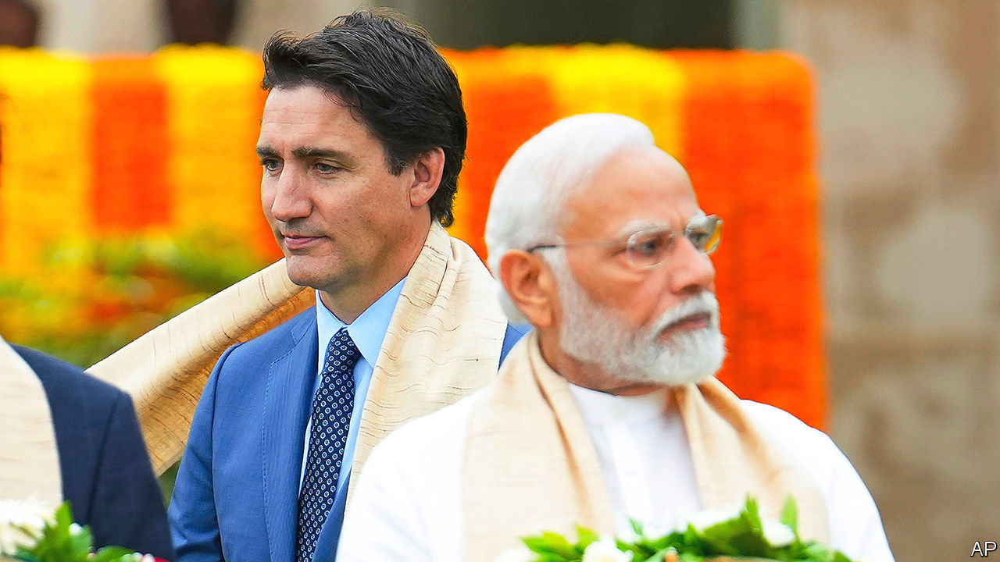
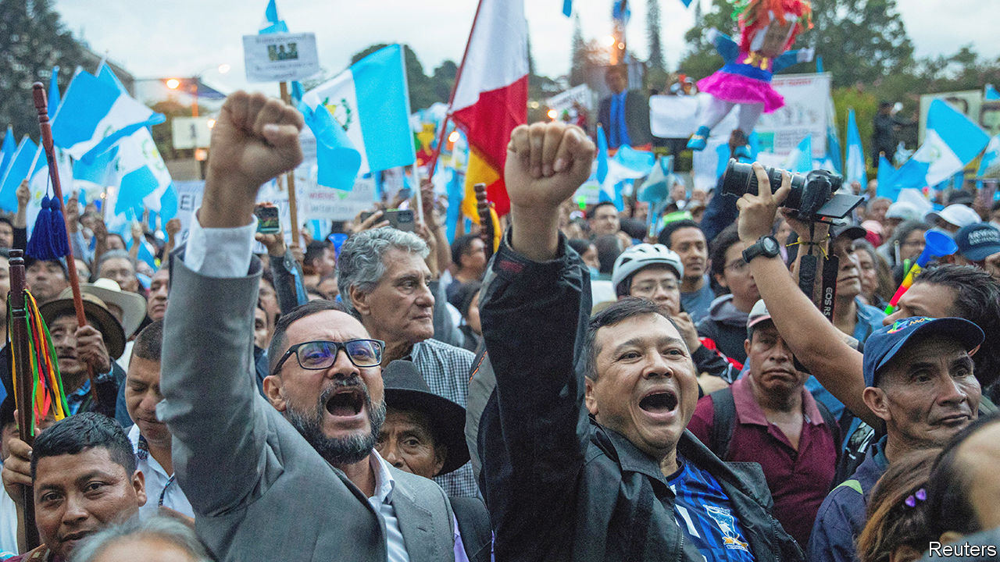

###### The world this week

# Politics 

#####  

 

> Sep 21st 2023 

 prime minister, Justin Trudeau, said that agents were behind the killing of a Sikh leader near Vancouver in June. India denied it. Hardeep Singh Nijjar had pushed for a Sikh homeland in India. India says he was a terrorist, Mr Nijjar’s supporters say he was a peaceful activist. Mr Trudeau’s allegation of a fellow democracy assassinating a Canadian citizen on Canadian soil has ramifications beyond a souring of relations with India. America’s National Security Council has said it is “deeply concerned”, and has urged India to co-operate.

 MPs held their first session in a new Parliament building, which replaces the old one designed by the British in the 1920s. In May opposition parties protested against its inauguration, accusing Narendra Modi, the prime minister, of turning what was supposed to be a show of national unity into a party rally.

Speculation swirled around , General Li Shangfu, who has not been seen in public for weeks. Some reports suggested that he was under investigation for corruption and would be removed. The episode comes just months after purges of China’s foreign minister, Qin Gang, and the leadership of China’s Rocket Force, which controls the country’s conventional and nuclear missiles.

China’s top , Wang Yi, met America’s national-security adviser, Jake Sullivan, in Malta. Among the topics discussed was the war in Ukraine. A day later Mr Wang arrived in Moscow, where he met Russia’s president, Vladimir Putin. China claims to be neutral in the war, but its officials repeat Kremlin talking points. Local media said Mr Wang’s trip would help pave the way for a visit by Mr Putin to China.

Azerbaijan sent its army into , a disputed enclave with a majority Armenian population, in what it described as an “anti-terrorism” operation against “illegal Armenian military formations”. Ethnic Armenians agreed to a ceasefire. Tensions have been running high because of Azerbaijan’s blockade of Karabakh, which has led to medicine and fuel shortages. 

 gave a speech in person to the UN General Assembly in New York, in which he warned that Russia is trying to smash the established international order and push the world to a “final war”. The Ukrainian president also compared Russia’s abduction of Ukrainian children to “genocide”. Mr Zelensky then went to Washington to discuss further help for Ukraine’s war effort. 

Hungary, Poland and Slovakia imposed their own curbs on imports of , after the European Union lifted a partial ban. As a row over the curbs escalated, Poland said it would no longer supply weapons to Ukraine. 

Evika Silina became  new prime minister, after forming another coalition headed by the centre-right New Unity party. One of the first tasks of the new government was to close one of Latvia’s border points with  following an increase in illegal crossings by migrants. 

Greens see red

Rishi Sunak,  prime minister, announced some changes to the government’s plan to reach  by 2050, such as delaying a ban on new petrol cars by five years to 2035. He said this was being done so that the 2050 target could be met in a “better, more proportionate” way. In  the government’s budget contained tax-cutting measures, including on fuel duties. Sweden was the first country to lay out an aim of net-zero, but some think the budget means it now won’t be able to hit that goal in 2045. 

The  cabinet approved a measure that extends the time that some migrants can be detained to 18 months. The government is scrambling to respond to a wave of 8,000 migrants who have landed on the tiny Italian island of Lampedusa, a favourite destination for the people-smugglers who traffic migrants in boats from Tunisia, just 113 kilometres (61 miles) away. 

Protests broke out against the authorities in Derna, a city in eastern  recently devastated by floods. Calls are growing for an international investigation into why the dams in the city burst. 

 forces killed six in the occupied West Bank and Gaza Strip. Four were killed in a raid on Jenin refugee camp, the scene two months ago of Israel’s biggest raid in 20 years. In New York Israel’s prime minister, Binyamin Netanyahu, held a long-awaited meeting with Joe Biden. Mr Biden said the pair had discussed “hard issues”.

One of the leaders of the Free Current coalition in , the main liberal opposition party, was sentenced to six months in prison for slander and verbally assaulting a police officer. His supporters say the charges were politically motivated and the party has said it will not put up a candidate in Egypt’s presidential election due next year. 

 and America each  in a deal in which $6bn-worth of frozen Iranian assets, mostly oil revenues, were also released. Shortly after the deal was announced Ebrahim Raisi, Iran’s president, addressed the UN assembly, accusing America of inflaming violence in Ukraine. Meanwhile Iranian MPs passed a draft law imposing sentences of up to ten years on women who flout the country’s dress code, a year after widespread protests against the killing of Mahsa Amini, a woman who was detained for showing her hair.

The  sealed its border with  after a breakdown in negotiations over using water from the Massacre River. A farmers’ group in Haiti is building a canal to irrigate land dried out by drought, but this will divert water from the Dominican Republic, says the country’s president, Luis Abinader. 

 


Thousands of  demonstrated to demand an end to efforts by officials to hinder the transfer of power to , who was elected as the country’s president in August. Mr Arévalo, a reformist who is due to take office in January, presented a petition asking the Supreme Court to block attempts to overturn his victory. 

America’s merry-go-round

Kevin McCarthy, the speaker of America’s House of Representatives, had another battle on his hands with rebels in his Republican Party, who are once again threatening to shut down the government by refusing to back  legislation. Meanwhile, America’s gross national debt exceeded $33trn for the first time. 

The  Senate acquitted , the state’s attorney-general, at his impeachment trial. In May Mr Paxton, a hardline conservative, was impeached by the Texas House of Representatives, which is Republican controlled, for alleged bribery and abuse of public trust.

Paul Kagame, who has been president of  since 2000 and its de facto leader since toppling a genocidal government in 1994, said he plans to run for a fourth presidential term next year. Mr Kagame pushed through a constitutional change in 2015 that could allow him to stay in power until 2034.

The EU has stopped funding  electoral commission, citing concerns about its independence during elections in August. Although the electoral funding is worth just $5m, cutting it may signal a deeper breach with the EU, which had been hoping to mend relations and unlock financial support for Zimbabwe from the World Bank and IMF.

There are “grave and ongoing” violations of human rights taking place in Tigray and other regions of , almost a year since a formal end to its civil war, the UN’s Human Rights Council said in a report. Many of the ongoing atrocities in Tigray are being committed by soldiers from Eritrea, whose forces were supposed to have withdrawn under the terms of the peace deal.

Burkina Faso, Mali and Niger have signed a mutual-defence pact known as the  (ASS). All three members of the ASS are run by military juntas following a series of coups over the past two years.

