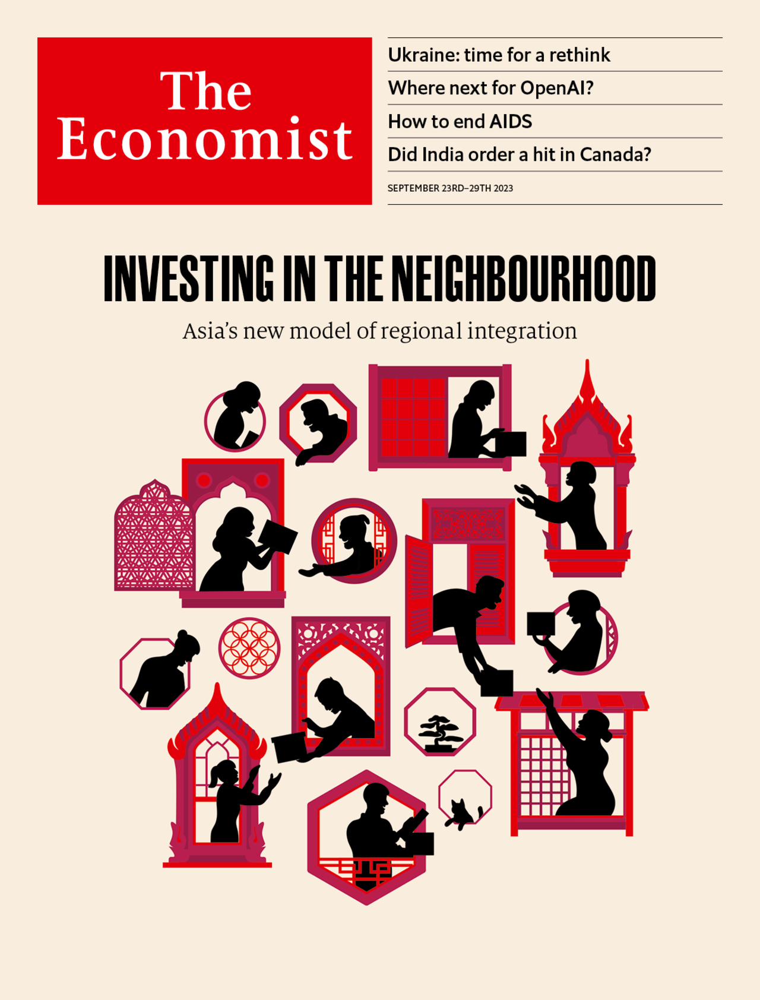

###### The Economist

# This week’s covers 

##### How we saw the world 

> Sep 21st 2023 

Some weeks, including this one, we publish more than one cover. In most of the world, we consider how a change of course could help Ukraine. 

The counter-offensive that began in June was based on the hope that Ukrainian soldiers would recapture enough territory to put their leaders in a strong position at any subsequent negotiations. But despite heroic efforts the front line has barely shifted. Both Ukraine and its Western supporters are coming to realise that this will be a grinding war of attrition. “I have to be ready for the long war,” President Volodymyr Zelensky told . But unfortunately, Ukraine is not yet ready; nor are its Western partners. They need to rethink Ukraine’s military strategy and how its economy is run. Instead of aiming to “win” and then rebuild, the goal should be to ensure that Ukraine has the staying power to wage a long war—and can thrive despite it.

 


 

 

 


In Asia we explain how Asian economies are coming closer together, with profound consequences for the world. 

The phrase “factory Asia” describes one of history’s most impressive economic achievements. Over the past half-century Japan, South Korea, Taiwan and, more recently, China became bustling hubs for manufacturing goods, which they then exported to the rest of the world, especially the well-off West. Millions of Asians escaped poverty by making stuff; many grew prosperous. Now the region’s economic model is shifting again.

 


