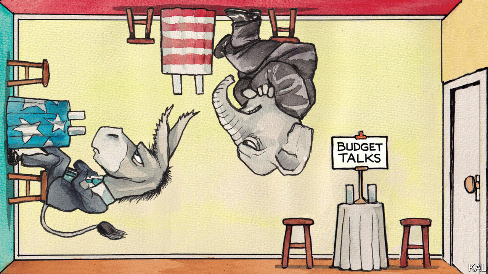

###### Lexington

# America’s dumbest, wildest budget fight yet 

##### Sensible lawmakers should exploit it to make some demands of their own 

 

> Sep 21st 2023 

How strange that some American politicians have persuaded themselves it is patriotic and wise to menace their own country’s credit or shut down its government. Amid such nonsense, one can forget that Washington teems with bureaucrats, non-profiteers and even members of Congress who are devoted students of public policy, brimming with zeal for sensible reform. Upon encountering such would-be do-gooders in this era of legislative hissy fits, should one be filled with relief, or pity? 

Lexington found himself mulling this question as, buffeted by successive waves of each sentiment, he roamed recently among the hundreds of boffins mingling at the annual “Budget Bash” of the Committee for a Responsible Federal Budget, a non-profit group whose name rings more plangently with each passing year. 

It was a muggy September evening at the top of a Washington office building; through the gloaming glimmered the dome of the Capitol, where the speaker of the House, Kevin McCarthy, had just given up persuading fellow Republicans to vote for a defence-spending bill the Republicans themselves had written. With the end of the fiscal year approaching, and Republicans in the House at each other’s throats—let alone in serious talks about the budget with Democrats in the House, let alone the Senate, let alone the White House—the government was careening again towards a shutdown. Small wonder there was talk among the “budget community”, as these beleaguered believers refer to themselves, of rolling boulders up hills. “Obviously, there’s not much to celebrate,” announced one of the evening’s toastmasters. 

As the budget community knew well, the current stand-off was dire, and dumb, even by the dismal standards of impasses past. Though Congress decades ago abandoned the orderly budget process it created in the early 1970s, budget fights in recent years have tended to be over how to allocate a certain amount of money stipulated by law or agreement. That was supposed to be how things would go this year: under pressure last spring from House Republicans, who threatened to force America to default by not raising the statutory limit for its debt, President Joe Biden in June signed the Fiscal Responsibility Act, which set caps for the next two years on “discretionary spending”—that is, money for programmes that are not entitlements, such as Social Security. 

But some House Republicans think those caps are too high. They want to break the deal made just over three months ago. Meanwhile, Senate Republicans have joined Democrats to seek more spending than the caps allow. As a result, even the top-line numbers, this time, are up in the air. 

The budget community also knew well, as it laid siege to the bar at the Budget Bash, that Mr McCarthy had made matters even more fraught in a blundering attempt to appease his most radical colleagues: he had unilaterally started an impeachment inquiry into Mr Biden over his son Hunter’s business dealings, despite lacking any evidence the president has broken a law. Mr McCarthy’s gambit made House Democrats even less inclined to lend him any votes, but it had not mollified his berserkers, members of the so-called Freedom Caucus. They were still threatening to shut down the government and to topple Mr McCarthy.

And yet, in the face of this mounting chaos, the budget community was collectively shrugging. It knows that, though a real rupture is always possible, these dramas tend to follow a certain script. Stopgap funding bills keep the government open (or, should a shutdown occur, eventually reopen it) and negotiators work their way to a deal—one that none of the wonks will recognise as “responsible”. 

That is what preoccupies the budget community: not the pantomime in the foreground, with its gestures at rectitude, but the real crisis building in the medium to long term. As revenue has slipped and the cost of the federal debt has risen with interest rates, the deficit has, in effect, doubled in a year to $2trn, reaching its highest level as a percentage of GDP, 7.4%, in any fiscal year when the country was not facing some national emergency, such as a war or recession. The gross federal debt is above 120% of GDP and climbing. With pensioners multiplying relative to workers, the fund that tops up Social Security benefits is due to be depleted in ten years, which will mean mandated benefit cuts of 23-25%. 

But because Democrats have successfully campaigned on the sanctity of entitlements, even the Freedom Caucus has fled from trimming them. And because Republicans have successfully campaigned on tax cuts, even Mr Biden favours keeping most of Donald Trump’s profligate tax law of 2017, set to expire after 2025, a gimmick meant, at passage, to camouflage its long-term cost.

Just another word for nothing left to choose

That leaves the Freedom Caucus, in its false piety, focused on discretionary programmes, such as education and transport, which account for about a quarter of spending. This is magical budgeting. Since neither party wants to reduce money for defence or veterans either, the Committee for a Responsible Budget estimates that, to reach balance, spending on all other programmes would have to be cut by 85% from current levels over ten years.

If the budget community got its wish, responsible representatives would use their votes in this collision to insist on concessions, too. They would demand a commission of respectables to map all paths back to fiscal stability, with a plan due after the election. Much as the heart might sink at this hoary strategy, it is probably the only way for Washington to confront such hard choices. Lawmakers should also demand passage of a bipartisan Senate bill that, in a shutdown, would force members to stay in session seven days a week until they pass a budget. They owe the country at least that, and it might help them get back in practice. In the lulling era of low rates, austerity fell out of fashion. That is changing gradually, and, one of these days, may change very suddenly indeed.■


