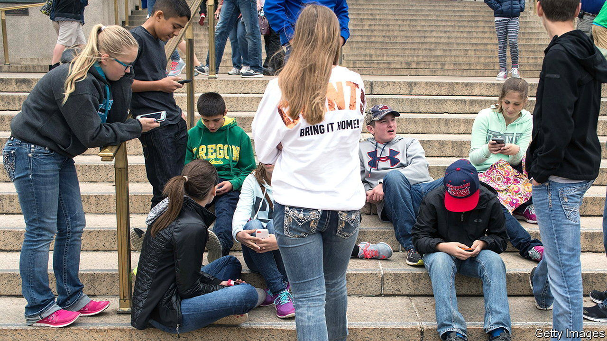

###### Blocking manoeuvres

# America’s states are trying to set rules for the internet 

##### This sets up a clash between protecting children and free speech 

 

> Sep 21st 2023 

The internet has changed a bit since America Online’s discordant tones marked the slow progress towards an even slower online connection. But federal and state legislators have struggled to keep up with policies to regulate it. California’s new online-safety law for children, signed by Governor Gavin Newsom in September 2022, was supposed to correct for this. Child-safety advocates hoped it would be a major step towards regulating the internet. However, a federal judge has intervened, setting up a clash of values between child safety and free speech.

NetChoice, a trade organisation that includes Google and Meta as members, sued California on First Amendment grounds. On September 18th Beth Labson Freeman, a district-court judge, temporarily blocked the law. California’s was supposed to lead the way; instead, it looks like a warning to other states that would like to do the same.

The law, known as the California Age-Appropriate Design Code Act, was supposed to go into effect in July 2024, and would require online platforms to treat children with more sensitivity. Car seats, cots and pyjamas have special regulations for children, says Buffy Wicks, a California legislator and co-author of the law. “Products that kids access online should have similar consumer-protection regulations.”

California modelled its law on Britain’s Age Appropriate Design Code, which came into force in 2020. If California’s law survives the legal challenges, companies would need to be careful about how they collect personal information, such as where a child is. Some firms might choose to disable direct messages between children and adults who are not in their network. Others may choose to turn off autoplay features or turn on bedtime reminders for children.

After California’s bill was signed, other states followed. Florida and Connecticut have drawn up similar bills. Other states are focused less on design and more on giving parents a say in what their children can do online. Utah’s governor signed two laws in March that require children to have parental consent to use social media. The state also prohibits minors from using the sites between 10:30pm and 6:30am, and holds companies liable for harming children. Utah’s laws will go into effect in March 2024. A similar law in Louisiana will start next summer. A different law in Arkansas that would have taken effect in September of this year has also been temporarily blocked by a federal judge.

Much of the legal pushback is on free-speech grounds. “Any law that limits the ability of younger people to access certain material…that sounds alarm bells,” says Megan Crowley of Covington &amp; Burling, a law firm. She has represented tech firms on first amendment cases. “The Supreme Court has made it clear that kids have First Amendment rights,” she says. Ms Wicks is hopeful that the law will survive legal challenges, but Eric Goldman, a professor of law at Santa Clara University, is sceptical. The First Amendment is “pretty foundational stuff for us,” he says. “We were willing to go to war [with Britain] over that.”

Other states attempting to regulate tech have also stirred-up controversy. In July Pornhub, a hub for porn, blocked its website in Virginia after the state passed a law requiring users to verify their age to access pornographic websites. In August a federal judge blocked a similar law in Texas. NetChoice is suing Texas and Florida over laws that prevent social-media companies from regulating content, such as removing extremist political opinions. That case could reach the Supreme Court in its next term. California’s setback may give state legislators pause, but the legal battles over who rules the web have only just begun.■


