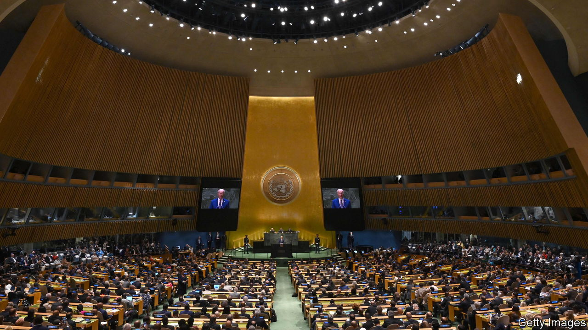

###### Diplomacy in the new cold war

# Biden, alone at the top table as the UN withers 

##### Global power shifts to smaller groups 

 

> Sep 20th 2023 

Come september, come the gridlock to Manhattan as leaders gather for the un General Assembly. This year, though, there was less  to it. President Joe Biden was the only leader of the big five permanent members of the Security Council to show up. This gave him more freedom to show a way through what he calls “an inflection point in world history”. And Ukraine’s president, , took the spotlight, warning that Russia’s invasion threatened all: “Many seats in the General Assembly Hall may become empty if Russia succeeds.”

Granted, Xi Jinping and Vladimir Putin rarely attend the talkfest. The Russian leader is anyhow indicted for war crimes. The surprise was that Rishi Sunak and Emmanuel Macron, the British and French leaders, passed up the un stage. Blame summit fatigue—both European leaders were in Delhi earlier this month for the  hosted by Narendra Modi (who also skipped New York). Or blame concerns at home, as Mr Sunak weakened green pledges and Mr Macron hosted the pope and the British king. 

Yet the no-shows point to deep malaise at the un, paralysed by the war in Ukraine, the rivalry between America and China and the outdated but unreformable Security Council. “Our world is becoming unhinged,” lamented the un secretary-general, António Guterres. “Geopolitical tensions are rising. Global challenges are mounting. And we seem incapable of coming together to respond.” His cry barely caused a stir.

Some think the looser g20, whose economies account for four-fifths of global output, is the better venue to seek global solutions. America regards the smaller g7 group of industrialised countries as “the steering committee of the major democracies”, where its allies can best respond to Russia and China. And though China seeks to  to its liking , Mr Xi is keen to bulk up the brics group of developing countries. 

“The real political value is moving to other places,” says Richard Gowan of the International Crisis Group, a think-tank. “Reform of the un is blocked, so other political clubs inevitably become more important.” America has been creating , notably in Asia. This week Mr Biden hosted a new summit with five Central Asian leaders. Antony Blinken, his secretary of state, launched a new “partnership for Atlantic co-operation” including African and Latin American states. Coalitions of the willing are part of diplomacy but lack “universal endorsement”, notes Mark Malloch-Brown, a former un deputy secretary-general; the un will endure, but will “busy itself with second-tier issues as it did during the cold war”. ■


