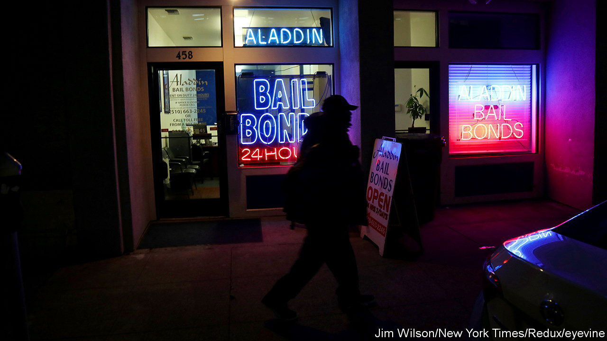

###### Busting out

# Illinois is the first state in America to abandon cash bail 

##### Will it actually keep people out of jail? 

 

> Sep 21st 2023 

At the back of room 100 in the Cook County criminal court, in south-west Chicago, a conversation is taking place before proceedings start. The room is packed, and two young men awaiting a decision on the fate of a friend, arrested the night before, chat with a woman who explains why the place is so busy. As of this morning, she explains, nobody arrested or charged in the state will be asked to put up money to be set free before trial. “You mean you don’t even need to put up property?” asked one of the men in reply, surprised. No, she explains. “Nah,” says the other man, sceptically. “This is a business.” If the judges cannot charge people money, they will lock everybody up, he opines. “It is gonna be back to three men in a cell.”

On September 18th, Illinois became the first state to completely scrap cash bail, when it implemented a law passed more than two-and-a-half years ago. In the 1950s Nelson Algren, a poet, wrote that Chicago was “still the easiest joint in the country in which to get a jump bond”, with “the price commonly being whatever you have in your wallet.” Now, the price will be less even than that. The idea, in the words of Kim Foxx, the chief prosecutor in Cook County, which covers Chicago and its inner suburbs, is that people should not be held in jail “by some arbitrary monetary amount”. Advocates hope it will set a precedent that other states might follow. But the men in the courtroom are not the only sceptics about how it will play out.

The case for the reform is simple. “The money-bond system is fundamentally irrational,” says Sarah Staudt of the Prison Policy Initiative, a criminal-justice-reform charity. Domestic abusers were often freed on bond, whereas homeless shoplifters ended up in jail, she says. And pre-trial imprisonment imposes huge costs on people who are still legally innocent. They can lose jobs, see relationships collapse or become victims of violence themselves inside. Some studies suggest that innocent people are more likely to plead guilty, so as to be released, sentenced to time already served. Against that, however, is the fear that dangerous criminals will be let free. 

Under the new system, judges are meant to balance those risks more deliberately. Whereas bonds used to be decided in as little as a minute, now hearings to set bail conditions take at least five, and hearings to detain somebody longer still. Prosecutors deliver a summary of the arrest and charge, as well as the suspect’s criminal history. The defence offers mitigating factors, such as the suspect’s employment or caring responsibilities. An official from a new “pre-trial” agency delivers two scores: on threat to public safety and likelihood to skip bail. And then the judge decides.

Advocates such as Ms Staudt stress that reducing the number of people in jail is the point. Ms Foxx, a progressive district attorney, says that in fact she hopes more of at least some types of suspects will be locked up. “We have seen far too many people who have been able to access cash bail who have gone on to commit harm, to threaten to terrorise,” she says. Exactly how the balance shifts is yet to be seen. Those your correspondent witnessed freed on September 18th included people charged with offences such as shoplifting. But there was also a woman accused of pepper spraying several police officers; at least a dozen cases of people caught with illegal guns; and one man, released not that long ago from prison for murder, who was accused of threatening to “shoot everybody” in a shop he was stealing from.

In New York, a law that eliminated cash bail in all but a few serious violent offences led to a 40% reduction in pre-trial detention between 2019 and early 2020, according to the Centre for Justice Innovation, a charity. But as crime rose, from the summer of 2020 onwards, the result was a backlash (even though it rose everywhere). The law has been amended three times since. In Chicago, few shootings at least are committed by people on bail, says Jens Ludwig, of the University of Chicago’s crime lab. But judges and prosecutors will probably be cautious. Do not expect three men to a cell; but the Cook County jail may not empty that quickly either. ■


