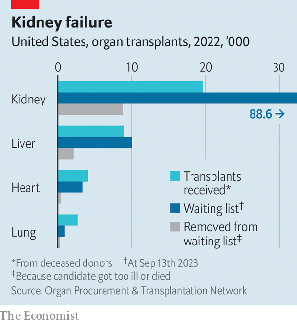

###### Wasted organs

# In America, lots of usable organs go unrecovered or get binned 

##### That is a missed opportunity to save thousands of lives 

 

> Sep 16th 2023 

When the phone rings at LiveOnNY, death turns to opportunity. The organisation fields calls from 100 or so hospitals in and around New York City about every dead or dying person on a ventilator: stroke patients, gunshot victims, car-crash fatalities. Their organs might save sick people’s lives. But most are not registered donors, so staff at LiveOnNY must persuade their families to donate, then rush the organs to transplant centres. Time is precious. A heart can go no more than six hours outside the body. Kidneys last longer, and can fly commercial.

LiveOnNY is one node in a network that gets organs from dead bodies into sick patients. America has more deceased donors, relative to its population, than any other country, but that does not adjust for type of death. Take into account America’s surfeit of , car crashes, suicides and —which tend to be more conducive to donation—and the country probably looks less exceptional. 

 


Last year more than 36,000 organs from deceased donors were transplanted, though the pool of unrecovered, potentially usable organs is estimated to be at least double that. Tapping that supply would help meet a vast demand: 103,000 people are waiting for an organ. Last year about a tenth died while waiting or were delisted because they were too ill. Ignoring the “gap between the donors that we know are out there and the donors that we’re actually finding”, says Seth Karp, director of Vanderbilt University’s transplant centre, is “kind of unconscionable”. Modest increases could eliminate heart, lung and liver waiting-list deaths, and reduce the wait for a kidney, which averages four years.

More than four-fifths of all donated organs and two-thirds of kidneys come from dead people (who must die in hospital); living donors can give only a kidney or parts of a lung or liver. Whereas some countries, such as England, France and Spain, have an opt-out model, in America donors must register or their families must agree. Persuading them will always be hard: Dr Karp’s hospital gets consent from about half of potential donors. Elsewhere rates are much lower because those responsible are not trying hard enough, or at all. The Veterans Health Administration—the country’s largest health-care provider—yielded just 33 deceased donors out of roughly 5,200 donation-consistent deaths between 2010 and 2019.

Responsibility lies partly with some of the 56 nonprofit Organ Procurement Organisations (OPOs), like LiveOnNY, that do the legwork. Brianna Doby, a researcher and consultant, advised Arkansas’s OPO in 2021 and was astounded to learn that most calls about potential donors went unanswered outside the nine-to-five workday and at weekends. Other OPOs, by contrast, sent staff to hospitals within an hour of an alert about a prospective donor.

Each OPO has a monopoly in the region in which it operates: the idea was that they should not jockey with each other at a deathbed. But none has ever lost its contract, even though performance varies hugely. If the bottom three-quarters of OPOs matched the top performers’ recovery rates in 2021, about 6,000 more organs would have been transplanted, or 17% of the total from deceased donors that year. 

Kidney been

This will soon change. Laggards will be decertified in 2026 and taken over by high-performers that bid for them. The group responsible for monitoring the OPOs is also due for a shake-up. In July Congress passed a law to open bidding for parts of that job, which has been done for decades by the United Network for Organ Sharing (UNOS).

Yet unrecovered organs are not the only reason America could do more transplants. A surprising number of organs from deceased donors end up in the rubbish: more than a quarter of kidneys and a tenth of livers last year. In the past few years UNOS have expanded the geographical area in which organs can be allocated, increasing travel times and discard rates. The system is “groaning under this new complexity”, says Peter Reese of the University of Pennsylvania’s medical school.

Hospitals are often risk-averse, too. Discard rates are higher for organs of lower quality. Olivier Aubert at the Necker Hospital in Paris and his colleagues found that between 2004 and 2014 America’s kidney-discard rate was twice that of France, which makes use of older kidneys. During that time three in five kidneys binned in America would have been transplanted in France. Extrapolation from French data yielded more than 132,000 unrealised life-years had they been transplanted.

For elderly recipients, getting older or otherwise risky kidneys generally means better odds of survival than staying on dialysis. But hospitals dislike using them for two reasons. First, they can lead to more complications and thus require more resources, eating into margins. Second, if the recipient dies soon after the transplant, hospitals suffer—a key measure used to evaluate them is the survival rate of recipients a year after transplant. According to Robert Cannon, a liver-transplant surgeon at the University of Alabama at Birmingham, hospitals succeed by being excessively cautious and keeping patients with worse prospects off waiting lists.

Meanwhile, usable organs are going to waste. Sumit Mohan of Columbia University found that kidneys of the same quality were 25% more likely to end up in the rubbish if procured on Friday or Saturday. That would mean operating at weekends. ■


