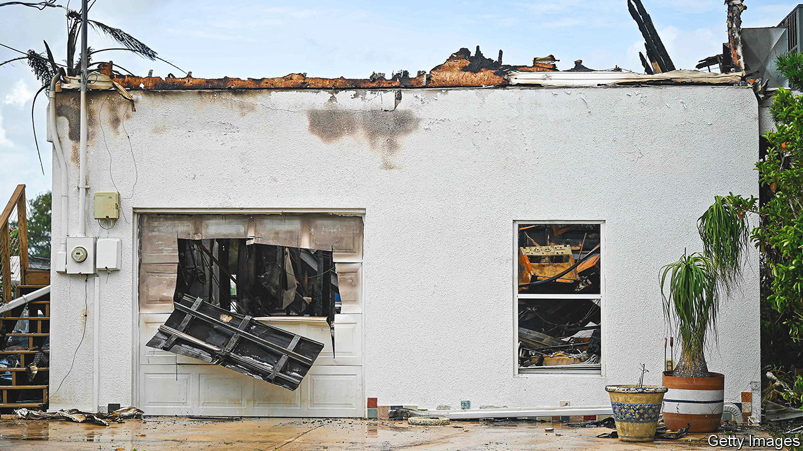
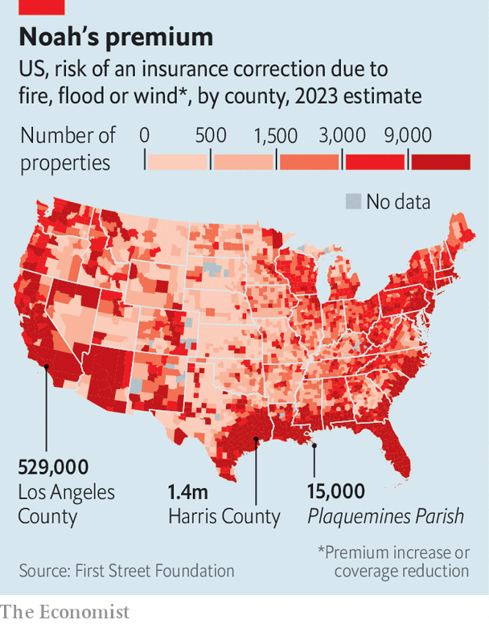

###### Uninsurable America

# Parts of America are becoming uninsurable 

##### Blame growth in hazardous areas, climate change and bad policy 

 

> Sep 21st 2023 

ELLIE LAKS remembers watching the wildfire crest the desiccated hills in front of her property. “We’re talking about a wall of fire coming towards you and eating everything in its sight,” she recalls. Ms Laks runs the Gentle Barn, an animal sanctuary nestled in the mountainous scrublands of Santa Clarita, in Los Angeles County. On most days the farm is a soothing place. But on October 24th 2019, fear was the dominant emotion. “You can’t see, you can’t hear…your throat hurts, you’re coughing, you can hardly breathe,” she says. The Gentle Barn survived the blaze. But this year, Ms Laks lost her property insurance when her insurer decided to limit its business in California. She is not alone. According to state data, 85% of properties in one Santa Clarita zip code were dropped by their insurers between 2015 and 2021.

In theory, insurance sends a risk signal. Homeowners could expect their policy to be expensive if they live in a floodplain or in a forest. It would be cheaper in places less prone to storms, wind or fire. Yet for decades distortions in federal and state insurance markets have suppressed rates, enabling a mass migration to hazardous areas. The population of Florida, which suffers more hurricanes than any other state, grew more than twice as fast as the country did between 2000 and 2020. Texas, which is vulnerable to storms that form in the Gulf of Mexico, grew even faster. By 2015, the value of insured property along the Gulf and Atlantic coasts had passed $13trn. A recent study from researchers at Stanford, the University of California in Los Angeles and the Australian National University suggests the population living in the “wildland-urban interface”, where nature meets development, doubled between 1990 and 2010, to nearly 21m people. Even more striking, the population in areas most prone to wildfires grew by 160%. 

While Americans were moving to risky places, climate change was making them riskier. Now private insurers are sounding alarm bells. Firms are writing fewer policies in vulnerable areas, and are pulling out of some states altogether. A new report from the First Street Foundation, a non-profit research group, suggests 6.8m people have seen increased rates—or, like Ms Laks, cancelled policies—due to rising flood, wind or wildfire risk. Another 39m, or about a quarter of all properties in the continental United States, have climate risks yet to be reflected in their premiums. “We are marching steadily towards an uninsurable future in a number of places across the United States,” warns Dave Jones, a former insurance commissioner in California and director of the Climate Risk Initiative at the University of California in Berkeley.

To understand the challenges facing homeowners, insurers and regulators, it is worth examining three different markets: Florida, California and the National Flood Insurance Programme (NFIP). 

 


In Florida the average home-insurance premium in 2023 is around $6,000, more than three times the national average and up 42% year-on-year. Yet rather than drooling over juicy profits, insurers are fleeing. At least 15 firms have recently limited their business in the state, according to the Insurance Information Institute; seven others were declared insolvent. With 1.3m policies, the state-backed insurer of last resort now has the highest market share in Florida and is insuring assets worth $608bn. When it can’t afford to pay claims, policyholders foot the bill. 

Extreme weather is not all to blame. In 2021 Florida accounted for nearly 7% of American property claims but 76% of lawsuits. Last year state lawmakers eliminated a fee system that incentivised lawyers to sue insurers, in the hope that it would decrease litigation and prevent more costs from being passed on to homeowners. 

The Golden State is following the Sunshine State into market failure, but for different reasons. Though California is a pricey place to live, property insurance is relatively cheap thanks to strict consumer-protection laws. Regulations prevent insurers from raising premiums high enough to cover inflation, increasing wildfire risk and rising reinsurance rates. State Farm, the biggest insurer in California, Allstate and Farmers Insurance have recently limited new policies. As in Florida, the state’s insurer of last resort is stepping in. California’s FAIR plan nearly doubled its policy count between 2018 and 2021. 

Broker breakers

At the tail-end of the legislative session state lawmakers tried to craft a deal which, it is said, would have allowed insurers to raise rates and use forward-looking climate models to set premiums, in exchange for staying in the market. But time ran out. Rule changes that do not require legislation, such as allowing the use of catastrophe modelling, may still emerge.

The federal government is the champion of enabling development in risky areas, though. The flood-insurance programme was created in 1968 to provide cover which was hard to come by on the private market, and to help manage risk in flood plains. Yet because the NFIP was heavily subsidised, it had the perverse effect of enabling, rather than discouraging, development in such places. The subsidies, combined with increasing risk as development soared, have left the NFIP in a financial mess. Congress forgave $16bn of its debt in 2017 so that the programme could pay claims for hurricanes Harvey, Irma and Maria. The NFIP’s insolvency is not a recent problem, nor one created by climate change. The Government Accountability Office, a watchdog, has pointed out for 40 years that the NFIP’s rates have not been actuarially sound. 

Both in the states and in Congress, there is a bipartisan desire to keep rates low and constituents happy. In 2021 the Federal Emergency Management Agency (FEMA), which runs the NFIP, began implementing a new pricing scheme, called Risk Rating 2.0, to raise rates to a level that accurately reflects risk. Two-thirds of policyholders will see their premiums rise, some by astronomical amounts. Price rises are capped at 18% per year, but Plaquemines Parish, the toe of Louisiana’s boot, will eventually see rates quintuple above 2022 levels. The backlash has been swift. More than 200,000 people have cancelled their federal flood-insurance policies. Ten states and dozens of parishes in Louisiana are suing FEMA to scrap the initiative. 

If the NFIP is not reauthorised by Congress before September 30th, it will have to stop writing new policies. Over the past six years Congress has granted the NFIP 25 short-term reauthorisations, punting any attempt at reform down the road. That seems likely to happen again. Yet Sean Becketti, a former chief economist at Freddie Mac, argues that taxpayers in safer places may soon wake up to the fact that they are subsidising insurance for homeowners in risky ones. ”People in Montana are going to say: ‘Why am I paying for someone to live in south-east Florida?’”

Some reforms reduce risk for insurers and lower costs for some homeowners. This year insurers in California must begin offering discounts for homeowners who protect their properties from wildfires. During a recent demonstration in Orange County, firemen set the grounds of two sheds on fire. One had all the hallmarks of a fire-safe home—such as a lack of plants and fencing up against the house. The other boasted shrubs, mulch and a wooden fence. After a few minutes, this house was engulfed in flames. The fire-safe one escaped the experiment unscathed.

Such tweaks cannot erase risk. As premiums rise and homeowners have trouble finding coverage, local economies may suffer. Some people will be priced out. Mr Becketti recently warned the Senate that overvalued homes will depreciate as their true risk is realised and, unlike after America’s subprime housing bubble burst in 2007, they will not recover their value. Insurance is “the canary in the coal mine”, for how climate change will affect property markets, he tells . 

In time, the people who can afford to stay in coastal Florida or in the foothills of the Sierras will be those who can pay the exorbitant cost of insurance that comes with an ocean view or woodland retreat. Or, if there is no coverage to be found, those who can afford not to be insured at all. What about the people who can’t afford to stay, and can’t afford to abandon their homes? Jesse Keenan, a professor of sustainable property at Tulane University in New Orleans, argues local governments need to start thinking seriously about managed retreat. “At the end of the day, people who live in super-high-risk zones are going to have to move,” he says. “And there’s going to be a lot of political bloodshed along the way.”■


