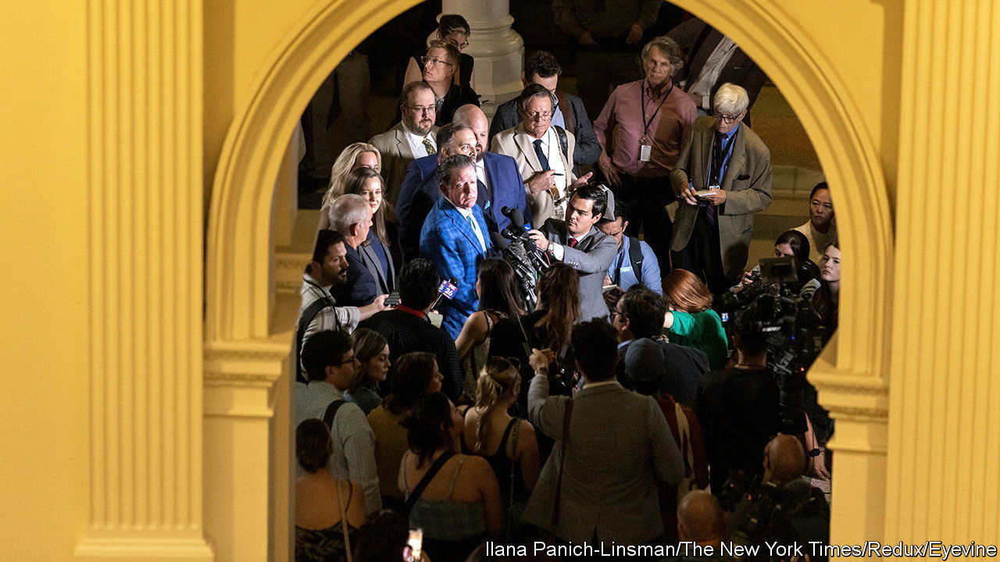

###### Pax Texana

# What Ken Paxton’s acquittal means for Texas Republicans 

##### Threats from the MAGA phalanx cowed lawmakers 

 

> Sep 21st 2023 

Though the Texas House of Representatives overwhelmingly impeached Ken Paxton in May, in a trial that concluded on September 16th a star-studded prosecution team failed to persuade the Senate that the attorney-general had illegally used his office to benefit his buddy Nate Paul, an Austin-based property developer. Only two of the 18 Republicans voted to convict on the articles handed to them by their sister chamber, falling seven votes short of ejecting him. The acquittal comes after two weeks of testimony from the office’s former top brass, who were sacked or resigned after reporting to the FBI that their boss was taking bribes. It also promptly sends the conservative demagogue back to work.

After the senators set Texas’s top cop free, Dan Patrick, the lieutenant governor who presided as a non-partisan trial judge, blasted the House for wasting taxpayer dollars on a sham probe. His change in disposition, though stark, is unsurprising. In July, one day after he issued a gag order that forbade lawmakers from talking about the case, it came out that he had received $3m from Defend Texas Liberty PAC, a pro-Paxton outfit. Mr Patrick may not have been the only one who accepted donations while the House was deciding whether to impeach Mr Paxton. Because of Texas’s lax campaign-finance rules, the senators were free to accept cash from interest groups. That is unusual, considering they were meant to be acting as jurors. 

Pundits correctly predicted that whether Mr Paxton was ousted or reinstated, it would be by a wide margin. Defend Texas Liberty vowed to lead the campaign to crush Republicans who betrayed the attorney-general. Before the trial San Jacinto 2023, a corporation newly registered in Virginia, spent at least $30,000 on ads targeting swing senators; on his talk-show the War Room, Steve Bannon had them called out by name. The calculus became clear: if acquittal seemed likely, it could be political suicide for lone Republican senators to stick their neck out to convict. Neither Kelly Hancock nor Robert Nichols, the two who dared to, is up for re-election in 2024. 

Mr Paxton applauded the senators for restoring the will of the people who voted him in. Yet according to the Texas Politics Project at the University of Texas at Austin, ahead of the trial 47% of registered voters thought the attorney-general ought to be removed and 18% did not (the others weren’t sure). Dedicated partisans, however, closed ranks around him.

Because Texas is a one-party state—the Democrats have not held statewide office since 1994—fringe right-wingers have outsize influence. Republican primaries are the only contest in town and even though members of either party are eligible to vote in them, just 2m of the state’s 30m residents typically do. Polls show that those who cast ballots prize far-right policies and have little interest in moderates.

Texas’s now-reinstated attorney-general could yet be toppled by the feds. In February the Justice Department took over the FBI’s investigation of the whistleblowers’ claims. Though fellow Republicans led the impeachment inquiry, Mr Paxton contends that Joe Biden was ultimately behind it. Being dethroned by Washington officials after Texas lawmakers voted him back in would electrify animosity. 

That case, which has been under way for three years, is unlikely to be settled soon. In the meantime, the nearly martyred Mr Paxton may jockey for higher office. His election-denying heroics make him a prime candidate for a gig in a second Trump administration. On Tuesday he was interviewed by Tucker Carlson. Following the playbook of the former commander-in-chief, who congratulated Mr Paxton on a “Texas sized VICTORY”, he aims to turn his legal liabilities into badges of honour. ■


