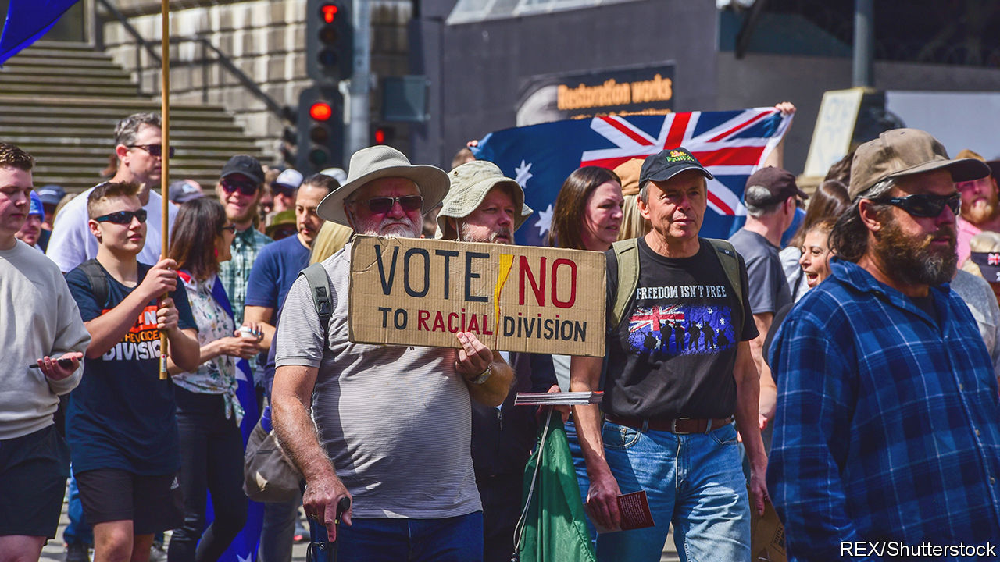

###### Losing the Voice

# Australians looks set to reject new provisions for Aboriginal people 

##### Advocates of a constitutional “Voice” for Aboriginal people are facing defeat 

 

> Sep 28th 2023 

AUSTRALIANS WERE united when they last voted in a referendum on indigenous rights in 1967. Over 90% agreed to remove a clause in their constitution that had long excluded Aboriginal people from national population counts, sending a message “that we would be recognised and that we would be able to enjoy equality”, recalls Tom Calma, a Kungarakan elder from Darwin. Another referendum concerning Australia’s relationship with its first people will be held on October 14th. This one poses a more complicated question—and Australians seem unlikely to support it.

Almost 18m, about 70% of Australia’s population, are due to take part in a mandatory vote on whether to enshrine an indigenous advisory group, or “Voice to Parliament”, in the constitution. Doing so would recognise Aboriginal people as Australia’s original inhabitants—killing the old claim that Australia was , nobody’s land, when Captain James Cook found it in 1770. Every government this century has supported some form of constitutional recognition, but the centre-left prime minister Anthony Albanese is ambitious. His Labor government wants to establish a Voice that would guarantee Aboriginal people more sway in policymaking, in order to improve the dire conditions of many. Australians initially seemed supportive. Polls last December found 66% backed the Voice; now around 36% do.

Voice proponents are aghast. Mr Albanaese billed the referendum as a “a once-in-a-generation chance to bring our country together”. Unlike Canada, America and New Zealand, Australia never struck treaties with its original inhabitants. The idea for the Voice emerged from months of consultation with indigenous people to address that failure. The process culminated, in 2017, with a statement from Aboriginal elders blaming their community’s poverty on “the torment of our powerlessness”. They called for a treaty and truth-telling process, as well as an advisory body.

What explains the collapse in support for such measures? Most obviously, an aggressive and well-co-ordinated No campaign. Led by most members of the opposition, a centre-right coalition of the Liberal and National parties, these antis say the Voice would weaken Australia. It “will permanently divide us by race”, claims Peter Dutton, leader of the Liberal Party. The antis are against special constitutional rights for any group. In a country where over half the population are first- or second-generation immigrants, some fear that giving a special dispensation to Aboriginal people could invite calls from other communities for similar treatment. 

A debate in which race and citizenship are embroiled has raised “very sensitive issues about Australia’s past and its heritage”, says Ian McAllister of the Australian National University. The antis are appealing to “racism and stupidity”, says Marcia Langton, an indigenous academic. Voting Yes would “demonise colonial settlement in its entirety and nurture a national self-loathing”, claims Jacinta Nampijinpa Price, a conservative indigenous senator.

A lack of clarity over how Voice members would be elected or held accountable has aided the No campaign. “The absence of details raises the question: what comes next?” reads its pamphlet. Anti-Voice disinformation is rife. Predictions of voter fraud and claims that Aboriginal people will “take your land rights” have spread online and at No-vote rallies. Tom Rogers, boss of the Australian Electoral Commission, calls such claims “tinfoil-hat-wearing bonkers-mad conspiracy theories”. Pauline Hanson, a hard-right senator, has added to them, suggesting the Voice could lead to the Northern Territory seceding to become “an Aboriginal Black state”.

Lack of bipartisan support alone could nix the proposal; no referendum in Australia has passed without it. And the Voice has relatively few staunch advocates. Even Labor voters consider it a low priority. The government’s efforts to enlist support from celebrities and big business have not persuaded them otherwise. According to Mr McAllister, they have inspired a “populist reaction against the elites telling ordinary people what they should do”.

The Yes campaign needs majorities in the national vote and in four of the six states. Compulsory voting will make this change even harder, says Malcolm Turnbull, a former conservative prime minister, because semi-engaged voters tend to be more risk-averse. A Yes vote, he suggests, would signal that “Australians have overcome concerns about the risks of change and taken a leap of optimism and faith”. They appear much likelier to stick with the status quo. ■

