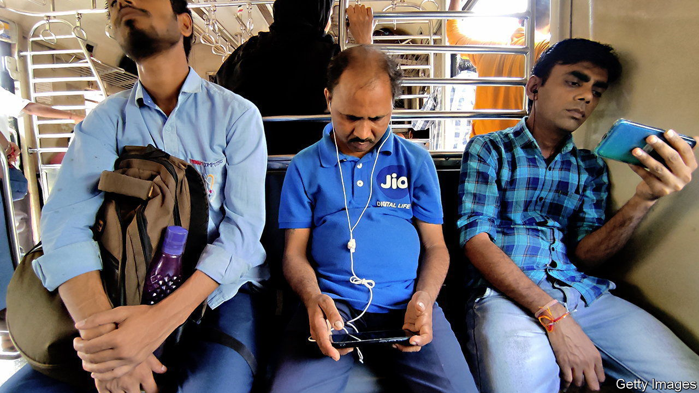

###### Digital Jio-graphy

# Can a $12 phone get 300m illiterate Indians online? 

##### India’s biggest mobile network is aiming to bridge an America-sized gap in internet access 

 

> Sep 28th 2023 

WHEN MUKESH Ambani, India’s richest man, launched a mobile network in 2016, he offered subscribers free data for the first few months. Tens of millions flocked to the network, named Jio, sparking a fierce price war and expanding India’s online population. But keeping those customers once the offer lapsed required a different strategy. Mr Ambani realised that people want to keep in touch with friends and family and be entertained. So Jio phones came bundled with services such as social networks and chat apps as well as music, film and sport streaming. The plan worked: Jio is today India’s dominant network, with more than half the country’s 825m mobile-data subscribers. Indians’ data consumption has exploded. 

Yet there are another 322m—about the population of America—voice-only mobile subscribers, most of whom use other networks. The persistence of this multitude is worrying for the government, which is pushing “digital India” as a way to improve access to public services and boost economic growth. It also represents a business opportunity for Jio, whose share of the overall mobile subscriber base of 1.15bn is an improvable 38%. The company boasts that it will free India from the tyranny of 2G, as the old generation of voice-only networks is known. 

In July Jio launched a device designed to entice this voice-only cohort to get online. Priced at just 999 rupees ($12), “Jio Bharat” phones resemble pre-smartphone handsets, with a keypad and small screen. They come bundled with apps to watch movies and sport, stream music and make digital transactions using India’s widespread Unified Payments Interface (UPI) system. Jio is targeting those who “remain ‘trapped’ in the 2G era, unable to tap into basic features of the internet”, said Akash Ambani, Jio’s chairman (and Mukesh’s son). Subscriptions cost 123 rupees a month for unlimited calls and 14GB of data. To ensure that the devices and plans reach the intended customers, Jio started by selling them in relatively remote areas before expanding availability nationwide. 

The strategy draws on the success of 2016, with one big difference: the new devices come without Facebook and Whatsapp pre-installed or any way to install them. The social-network and messaging apps are generally considered essential to appeal to Indians, who outnumber all other nationalities on both services. It is, at first glance, an odd omission. Yet it reflects the diversity of Indian society and the difficulty of reaching into its deepest corners. 

“There is a large population, equal to some countries, who don’t know what to do with a smartphone,” notes Navkendar Singh, an analyst with IDC, a market researcher. One in four Indians above the age of 15 are illiterate. Text-based social networks and chat apps are useless to them. Yet they know how to use basic phones to make voice calls, are as keen on entertainment as any Indian—and getting access to UPI is a major attraction for everyone looking to upgrade their phones.

The high cost of a smartphone has kept access out of reach to poor users. Jio is betting the digital-payments option on its ultra-cheap device, even more than the entertainment options, will coax them to sign up. The tiny screen may prove unsatisfying for consuming content, says Shilpi Jain of Counterpoint, another market-research firm, “but everyone needs UPI.” 

The government is especially keen on bringing the last few hundred million holdouts into the digital ecosystem, which it increasingly uses to deliver public services, especially to the neediest. India’s central bank recently said Indians would soon be able to make UPI payments using voice commands, and that it was working on ways to enable payments without internet access, with communication technology used by contactless cards. Jio’s phone, too, offers voice assistance. 

UPI, like Jio, was launched in 2016. Both are integral to India’s digital transformation. Yet India’s rural poor have largely missed out on the country’s technological progress. That may be about to change. ■

