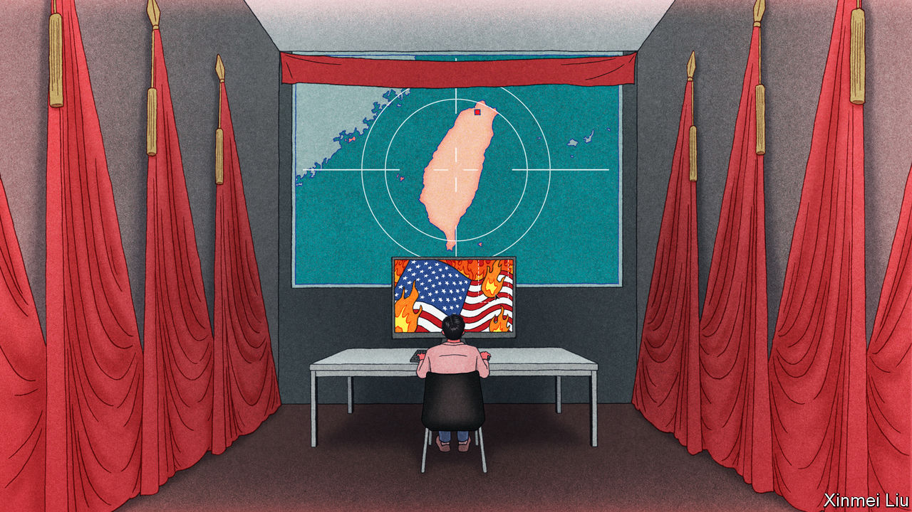

###### Strait up lies

# China is flooding Taiwan with disinformation 

##### With elections looming, China wants Taiwanese voters to think America is their greatest threat 

 

> Sep 26th 2023 

In July one of Taiwan’s top newspapers, , published a story based on supposedly leaked minutes from a secret government meeting. America had asked  to make biological weapons at a lab run by the island’s defence ministry, the report claimed. Taiwanese and American officials denied it. The allegedly leaked minutes, it transpired, were not written in the usual style of Taiwanese government records. They were filled with official-sounding phrases that are used in mainland China, but not in Taiwan.

This was probably Chinese disinformation, Taiwanese officials said. Yet the story spread to Taiwanese talk shows and influencers. It soon evolved into a wilder claim: Taiwan was going to collect 150,000 samples of Taiwanese blood and hand them to the Americans, so they could develop a virus to kill Chinese people.

This sort of disinformation is so widespread in Taiwan that analysts have given it a moniker: , or the “US scepticism” narrative. Its spread is becoming a major worry for Taiwan’s government and civil society in the run-up to a hugely important presidential election next January. Taiwanese voters will in effect be asked to decide whether Taiwan should remain aligned with America in strengthening deterrence against a possible Chinese invasion, or should move towards building ties with China. The opposition Kuomintang has called the vote a choice between “war and peace”, implying that the ruling Democratic Progressive Party’s hostility towards China will provoke it to attack. Chinese state actors have backed that framing, spreading narratives that portray , not China, as the island’s biggest threat. Much of the disinformation is intended to reinforce that false message. 

Lo Ping-chen, a cabinet minister who since 2018 has been leading a government task force against disinformation, says it has “severely infiltrated” Taiwan’s society. “We used to think there was more during election season. But it’s now become normalised. It happens every day.” Most Taiwanese voters have little idea of this. A recent survey by Doublethink Lab, a Taiwanese group that studies disinformation, found that less than 20% of respondents believed the false information spread in Taiwan during elections came from abroad. Puma Shen, who heads Doublethink Lab, worries about the one-fifth of voters who are not aligned with any party and could be a decisive bloc. “Even if only 15% of voters are truly affected by Chinese disinformation, it takes only 7% of voters to change the election results,” he says.

A recent study of US-scepticism narratives by the Information Environment Research Centre, a Taiwanese research group, found Chinese actors were helping to spread most of them. But more than half appeared to have Taiwanese origins. That suggests China is “piggybacking” on fears in Taiwanese society, says Chihhao Yu, the report’s author. He notes that many Taiwanese have an “orphan mentality”: they fear abandonment by outsiders because of Taiwan’s experience of losing American diplomatic recognition in the 1970s. 

Chinese actors are exploiting those worries, just as Russian disinformation exploited America’s racial and cultural cracks to help Donald Trump in 2016. Chinese disinformation also echoes Russian propaganda about the war in Ukraine, which claims America is behind the conflict (and is creating bioweapons in Ukrainian labs).

China has developed systematic means to make falsehoods trend in Taiwan, says Chien Yu-yen, a former journalist and author of a book about Chinese influence on Taiwan’s media. She points to a spurious claim that America “wants to blow up” TSMC, a Taiwanese chipmaker. It originated with a misleading video posted on Douyin, the Chinese version of TikTok, which featured an American lawmaker appearing to discuss the possibility. The following morning, a Taiwanese newspaper published a story about the video. Opposition lawmakers and talk-show hosts whipped up outrage. “The journey from China’s Douyin to Taiwan’s mass media, videos, newspapers and television took less than half a day,” says Ms Chien. Chinese state media amplified the narrative, as if merely commenting from the outside on a Taiwanese debate.

Taiwanese officials believe that many of the Taiwanese launching US-scepticism untruths are “local collaborators” taking orders and payments from China. But that is hard to prove, because the suspected Chinese funding is probably funnelled through Taiwanese businesspeople or public-relations firms. Wang Kun-yi, a local commentator who frequently writes US-scepticism narratives for Chinese media and pro-China Taiwanese media, defends his work as a commercial enterprise. All journalists in Taiwan serve the bias of their newspapers’ bosses, says Mr Wang, who has worked for both pro-independence and pro-unification newspapers. “Everyone just treats it as a job,” he says. “It’s a tool to feed yourself.”

Taiwan has laws against foreign infiltration and election influence, but they are limited to cases of proven state-sponsored activity. It has additional laws against spreading wilful falsehood in broadcast media, but they do not cover print or digital outlets. In 2020 the government revoked the licence of CTI News, a pro-China channel, citing repeated failures to verify information. CTI simply moved online. 

The case sparked accusations of censorship, which Taiwan wants to avoid. So the government has resorted to more liberal methods of fighting disinformation. It has tried to improve media literacy, provide faster official clarifications and promote fact-checking organisations. But such means cannot match the speed of Chinese propaganda. In August Meta, which owns Facebook, removed a network of more than 7,000 accounts, pages and groups that were spreading Chinese disinformation. But new accounts are easy to set up, a problem that will only accelerate with artificial intelligence, says Mr Lo. 

Chinese disinformation has already distorted Taiwan’s public conversation. Will it move votes? Meta has noted that the Chinese disinformation network it removed was “high volume, low reach”, despite having a veneer of engagement designed to make the accounts look more popular than they were. Studies of Russian disinformation in America have found that it has little impact on voter preferences. Despite all the messaging in Chinese and Taiwanese media against the Democratic Progressive Party, its candidate, William Lai, is leading in the polls. And for all the scepticism about America, Taiwanese are even warier of China. A 2022 survey by Academia Sinica, a Taiwanese research institution, found 34% of respondents agreeing that America is a “credible” country. Only 9% said the same of China.

China is to blame. It recently surrounded Taiwan with warplanes and warships even as its ruling Communist Party unveiled an integration plan promising benefits to Taiwanese people living in Fujian, a southern province near the island. Most Taiwanese know where their real threat comes from. But China’s insidious efforts to mislead them are increasing. ■

