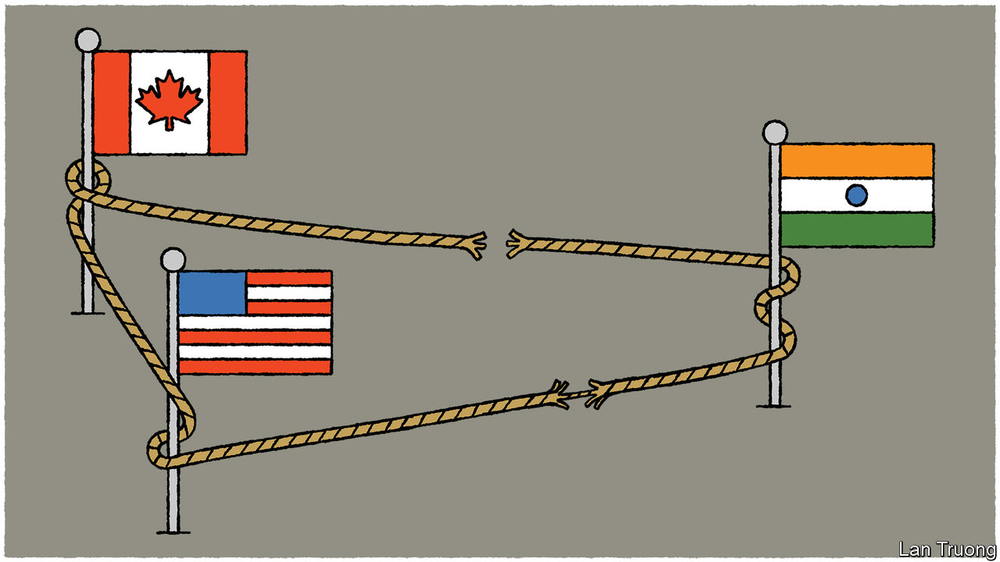

###### After the assassination

# India is testing America’s friendship 

##### Its partnership with the West is strong but not unbreakable 

 

> Sep 25th 2023 

A WEEK HAS passed since Canada’s prime minister, Justin Trudeau,  of “credible intelligence” linking India to the killing in June of a Canadian Sikh activist, Hardeep Singh Nijjar. In those few days, relations between Canada and India have gone from bad to worse. That is serious enough. But the bigger question is what might happen to America’s until-now rapidly  with the South Asian giant.

Many in India believe the Americans have hung Mr Trudeau out to dry. They note what appeared to be a fairly non-committal response to his allegation by the administration of President Joe Biden. Instead of fulsomely sounding the alarm, it merely expressed concern and called for India to co-operate with the Canadian investigation into the killing.

That perhaps stiffened the resolve of Narendra Modi’s government to brazen out the allegations. India angrily denies them, even as it hints that, whoever did for Mr Nijjar, he had it coming. In this, many Indians cheer their government on. It had long branded the dead Canadian a terrorist for advocating a separate  in Punjab and associating with violent groups dedicated to that cause. Indians grimly recall—as those in the West generally do not—the bloody insurgency and fierce repression this inspired, from the late 1970s to the early 1990s. It led to tens of thousands of deaths in Punjab and to the assassination in 1984 of Indira Gandhi, India’s then prime minister, by her Sikh bodyguards.

But Canada is now starting to look rather less isolated than Mr Trudeau’s Indian critics assumed it was. It turns out that some of the intelligence pointing to Indian involvement in the killing was collected—and provided to the Canadians—by America. Both countries are part of the “Five Eyes” intelligence-sharing club that also includes Australia, Britain and New Zealand. Mr Biden and other Five Eyes leaders duly raised the killing in private with Mr Modi, earlier in September at the G20 summit in Delhi. Mr Modi saw that confab as the latest great coming-out party for India. The Nijjar row has put a dampener on it.

India seems to have underestimated the strength of Western solidarity. It viewed Canada as a second-order power in which, if the allegation is true, it felt able to meddle egregiously. If the allegation is untrue, it nonetheless felt able to dismiss Canada’s concerns out of hand. Either way, as Tanvi Madan of the Brookings Institution in Washington has noted, this was to underestimate the ties that bind America to Canada. The two countries are hand-in-glove security and intelligence allies as well as neighbours. The assassination also has potential implications for America’s security. The superpower cannot accept foreign-backed hitmen operating in North America. For that matter, there are Sikh communities in America, too.

India is not the only country guilty of miscalculation. Canada has, as the Indians claim, long been too unconcerned about Sikh separatist firebrands operating on its soil. Their movement has few adherents in India these days; but Western countries underestimate the risk of the violence resuming. This blind spot survived even the blowing up of an Air India flight from Montreal to London in 1985. Yet if India thought this Canadian misjudgment justified it in unleashing its assassins, it was woefully naive. 

It now seems determined to defy its accusers over the assassination, even if any incriminating evidence is made public. In this it appears to assume that America will not rupture its strategic . That is probably correct. The bilateral partnership, in India’s defence, has little to do with the “shared democratic values” Mr Biden and other American politicians proclaim. America hardly criticises Mr Modi for the democratic backsliding he and his party have brought to India. The partnership is based on mutual concern over China.

Still, the row over Mr Nijjar’s murder casts the relationship into sharper relief by highlighting what an awkward American partner India is. It is at once pro-Western and resentful of the West. It is eager to deepen security ties with America, yet profoundly reluctant to cede any aspect of its security to another power. If India started throwing its weight about in ways reminiscent of China itself, it would quickly lose some of the bipartisan support that it currently enjoys in Washington. Mr Nijjar’s assassination may in this respect come to look like a clarifying moment. If indeed India was responsible for it, as it seems that America as well as Canada believes, Mr Modi should temper his defiance.■

