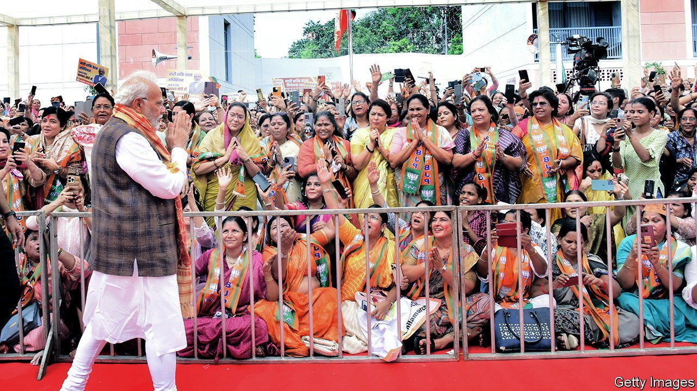

###### Gender politics

# Narendra Modi wants a lot more women in Indian politics 

##### India’s female political representation is worse than Pakistan’s 

 

> Sep 28th 2023 


On September 21st India’s parliament passed a bill reserving a third of the seats in its lower house and in state assemblies for women. Though female political representation has improved in India in recent years, it is still miserably low. Only 15% of the members of the lower house, the Lok Sabha, are women, a smaller share than in Nepal and Pakistan (where gender quotas are already in place). The situation is even worse at state level, where women make up just 9% of elected representatives. Implementing the quota could take years, however. Constituencies must be redrawn, for which a long-delayed census must first be completed. ■

