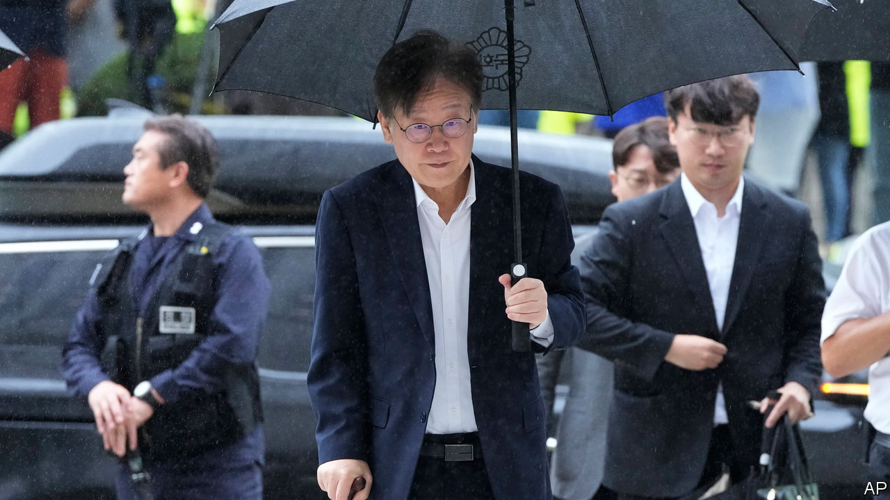

###### Politics and the law

# South Korea’s opposition leader narrowly avoids arrest 

##### Lee Jae-myung claims the charges against him are trumped up 

 

> Sep 28th 2023 

Weakened by more than three weeks of subsisting on salt and water, Lee Jae-myung (pictured) hobbled into the courtroom in Seoul on a cane on September 26th. The leader of South Korea’s opposition Democratic Party (DP) had been on a hunger strike to protest against the country’s president, Yoon Suk-yeol, whom he charged with the “destruction of democracy”. Not coincidentally, he was summoned to court while a judge considered whether he could be arrested on corruption charges. After a nine-hour hearing, followed by several hours in a detention centre, Mr Lee was told he would not be arrested. Yet the damage this episode has done to his standing and his party’s could be profound. 

Opposition leaders were often jailed during South Korea’s military dictatorship, but none has come as close to arrest as Mr Lee since democracy was restored in 1987 (though four former presidents have been jailed in that time). He claims to be the victim of a witch hunt by Mr Yoon. But it was not the president who put him before a judge, but rather Mr Lee’s own party. He remains under investigation. His travails seem likely to cloud the DP’s prospects in the general election due in April.

He stands accused of abuse of power and graft, as well as asking a businessman to illegally transfer $8m to North Korea at the height of the inter-Korean rapprochement in 2019-20. The alleged aim was to facilitate a visit for Mr Lee to the North in order to discuss a potential joint venture with Gyeonggi, the province that surrounds Seoul, which governed at the time. He denies all the charges—claiming that Mr Yoon “can abuse the political prosecution and fabricate and manoeuvre and distort, but he can never hide the truth”. The judge ruled that there was insufficient risk of Mr Lee fleeing or destroying evidence to justify his immediate arrest.

Notwithstanding the seriousness of the charges against him, the fact that Mr Lee came so close to being detained was remarkable. South Korean lawmakers cannot be arrested without parliamentary approval—and Mr Lee’s party has a majority. Its members denied a request for his arrest in February. Yet on September 21st parliament was again asked to vote on the matter, and this time approved the request.

The ballot was secret, so it is unclear how many DP legislators voted against their leader. But at least 29 out of 167 must have done so—a devastating blow to his authority. Mr Lee’s supporters declared war on those “bastards who sold out the country”. A list of suspected traitors circulated online, as did threats of revenge.

At least some of the dissidents want to get rid of Mr Lee because they fear he is leading them to electoral defeat. He has already lost one election against Mr Yoon, having been beaten in a presidential poll last year by 0.7% of the vote. He has since failed to capitalise on the president’s unpopularity. Mr Yoon’s and Mr Lee’s approval ratings are both in the low 30s. According to polling by Gallup Korea, support for the DP and the president’s People Power Party (PPP) is also steady, with both parties favoured by a third of those polled.

Given that the dp is currently preventing Mr Yoon from passing legislation, the stakes are high. If the opposition party can hang on to its majority next year, it will continue to scupper the president’s domestic agenda, perhaps setting itself up well for the next presidential election, due in 2027. But the furore over Mr Lee makes that hard to predict. He may now try to punish the rebels by identifying them and denying them the whip. Yet such a purge risks splitting and weakening his party.

For Mr Yoon and his People Power Party (PPP), the judge’s forbearance may turn out to be even more advantageous than Mr Lee’s arrest would have been. His removal from politics would at least have given the dp time to rally around a new leader before the election. Instead, it seems likely to limp along under his weak leadership, trying unconvincingly to paint Mr Lee as a martyr to the president’s dictatorial tendencies. The PPP will meanwhile egg on the investigations into Mr Lee and insinuate that the DP is a North Korean stooge. Most South Koreans would prefer both parties to address the country’s flagging economy and rising cost of living, issues that actually matter to them. ■

