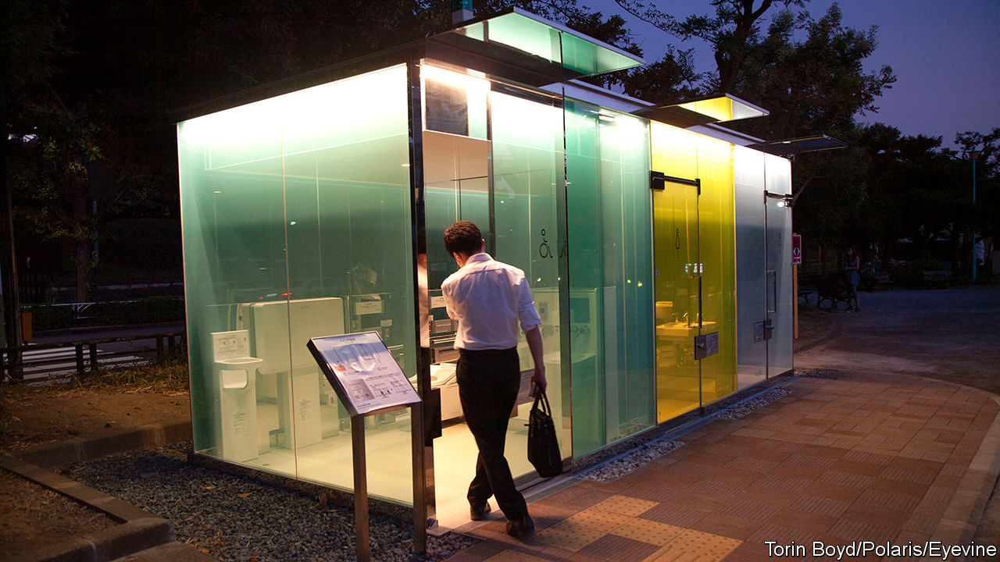
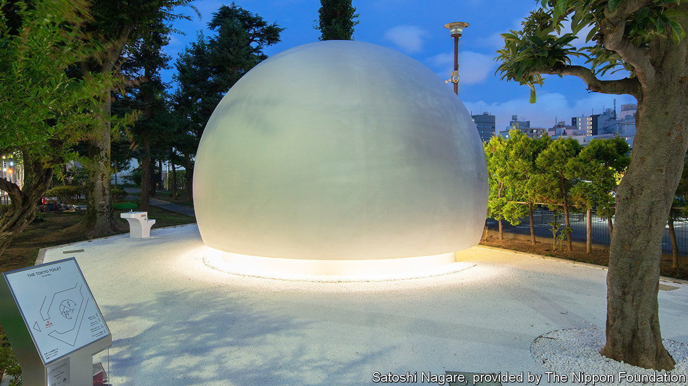
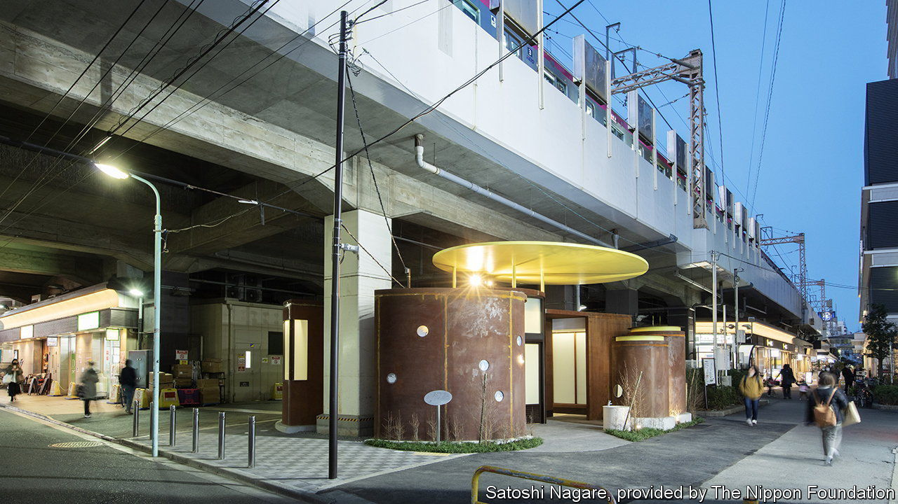

###### Japanese loos

# The world’s greatest toilet culture 

##### A fine German film director puts Japan’s spotless facilities in the spotlight 

 

> Sep 28th 2023 

The protagonist of “Perfect Days”, a new film by Wim Wenders, a German director, is a Japanese sanitary worker. Each day he rises before dawn to clean public toilets in Tokyo. His job of scrubbing urinals and mopping floors is unalluring—yet the toilets are architectural wonders. One has transparent walls which turn opaque when its door is locked. Another is beautifully clad with wood planks. The domed white structure of one resembles a spaceship. 

 


Japan’s toilet culture is worthy of homage. The film features a real-life project by leading architects, such as Ando Tadao and Kuma Kengo, to renovate 17 public toilets in Tokyo’s Shibuya ward. Whereas toilets are often considered “dark, dirty and smelly”, says Yamada Akiko of the Nippon Foundation, which launched the project in 2018, “we wanted to transform that image.” The ubiquity of Tokyo’s loos is also impressive. London has 14 public toilets per 100,000 residents; Tokyo has 53. Their high-tech features are remarkable. Beyond heated seats and “washlets”, which spray water and blow air onto users, they include the  or “sound princess”, which makes flushing sounds to mask embarrassing noises. Maritomo, a commentator on Japanese toilets (who only uses one name), considers them symbolic of Japanese hospitality. 

 


Japanese and foreigners have long considered this lavatorial culture unique. Early European visitors marvelled at Japan’s proficiency in repurposing excrement as “night soil” fertiliser. In “In Praise of Shadows”, a 1933 essay on Japanese aesthetics, Tanizaki Junichiro declared the loo a “place for spiritual repose”. The greatest haiku poets got their best ideas there, he wrote.

Yet, in toilets as otherwise, Japan has also welcomed Western innovations. After the Meiji restoration of 1868, it promoted greater hygiene as a proxy for modernisation. Japanese ceramics firms branched into producing elaborate loos. After the second world war, American occupiers introduced mechanised waste disposal to what remained of the night-soil industry. With Japan’s economic recovery came a new wave of high-tech toilets based on Western models, raising the country’s toilet culture to its current heights. “I was amazed at how much toilets can be part of everyday culture,” said Mr Wenders in an interview.

