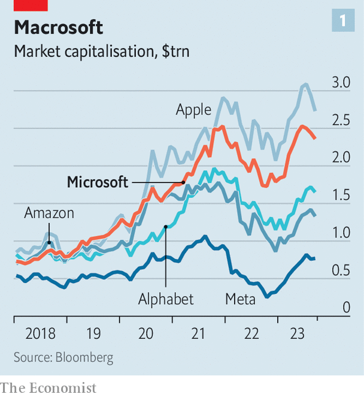
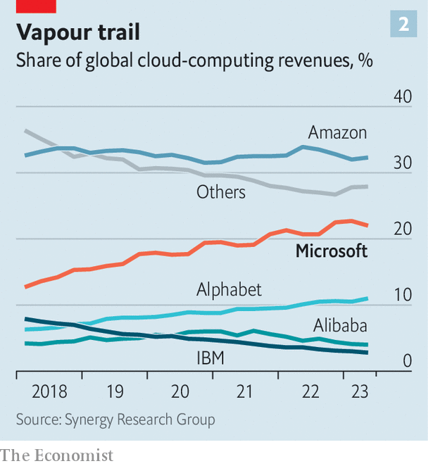
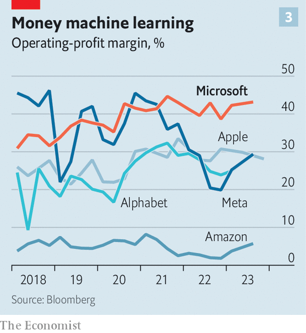

###### A second flight

# How Microsoft could supplant Apple as the world’s most valuable firm 

##### It hopes to seize on AI to transform the future of work 

 

> Sep 27th 2023 

For years Microsoft has been trying to coax office workers to write reports, populate spreadsheets and create slide shows using its office software. No longer: now it wants to do the writing and populating for them. At its headquarters in Redmond, a leafy suburb of Seattle, the firm demonstrates its latest wizardry. Beyond the plate-glass windows, snow-capped mountains glisten and pine trees sway. Inside, a small grey rectangle sits at the top of a blank Word document. With a few words of instruction, a chatbot powered by artificial intelligence (AI)—or “Copilot”, as Microsoft calls it—finds a vast file in a computer folder and summarises its contents. Later, it edits its own work and succinctly answers questions about the material. It can perform plenty of other tricks, too: digging out emails on certain topics, drawing up a to-do list based on a meeting and even whipping up a passable PowerPoint presentation about your correspondent. 

This is a glimpse into the future of work. The mind-boggling capabilities of “generative” AI look set to transform many desk jobs. It is also a glimpse into the future of Microsoft, which was once the world’s most valuable public company and hopes to reclaim the title by selling the technology that will power the transformation. Through the firm’s investment in OpenAI, the startup behind ChatGPT, a popular AI chatbot, it is able to inject cutting-edge AI into its products.

Pilot whale

That does not just mean adding the Copilot to its office-work software (previously called “Office”, but recently rebranded as “Microsoft 365”), which will be rolled out in November. This week the firm will launch a Copilot for Windows, its operating system, which will be able to change your computer’s settings, generate images and summarise web pages. Copilots for its sales software and human-resources offerings are already available. One for its security software is in the works. In February Microsoft added ChatGPT-like functions to Bing, its search engine, in effect another Copilot. With its squadron of Copilots, Microsoft is inserting generative AI into almost every aspect of its business.

 


This is perhaps the biggest bet any company is taking on AI. The prize is potentially huge. Copilots could transform the world of work for the 1.2bn people who use Microsoft 365 and the 1.4bn who use Windows. This would allow Microsoft to bring in new customers and charge them more. That, in turn, could drive business to Azure, Microsoft’s high-margin cloud business, possibly helping it overtake Amazon Web Services (AWS) to become the world’s biggest cloud firm. It could even help Microsoft’s valuation above the current $2.3trn, potentially closing the gap with Apple, currently the world’s most valuable firm (see chart 1). 

In effect AI offers Microsoft a tantalising chance to do something that has eluded it until now, and bring together all that it offers, argues Mark Moerdler of Bernstein, a broker. Teams, Microsoft’s video-conference service, might be more attractive to IT managers than Zoom, a rival, if it features a Copilot that can sort through employees’ emails in Outlook and summon up information from their Word documents and PowerPoints. All this wizardry can also be channelled through Azure, further boosting Microsoft’s business.

Nonetheless Microsoft is also taking a big gamble. Next year its capital spending is expected to jump by almost two-fifths, to about $40bn. That is a near-record 16% of the firm’s revenue and a higher share than any other tech giant save Meta, the parent of Facebook. Much of this will be spent on new AI chips and high-performance networking to go into the 120-odd extra data centres it plans to bring online. Whether such an investment will pay off is an open question. For all their promise, Copilots still have plenty of problems. At the demonstration in Redmond the AI-generated slide show described your correspondent as “CEO of ABC Inc”, which he definitely is not. Competitors, in particular Alphabet (the parent of Google), are eyeing up all the same markets. As the battle over the future of work heats up, Microsoft’s position is enviable but not unassailable.

Putting itself in that position has been a long endeavour. Microsoft’s heyday was in the 1990s. The dominance of Windows as an operating system combined with a cut-throat business mentality made the firm mighty but roundly despised. A period of stagnation followed, as it lived off the revenue from Windows. When Satya Nadella took over in 2014, he shook things up. Windows would no longer be the firm’s main focus. Instead the company was reorganised around Azure, with blockbuster programmes, such as Office, shifting to the cloud. This involved an enormous build-out of data centres. Microsoft’s capital spending went from 6% of revenue in 2014 to 11% five years later. Crucially, the firm moved away from a walled-garden approach. Mr Nadella allowed Microsoft’s software to run on other operating systems, such as Google’s, Apple’s and Linux, an open-source rival to Windows.

All the while Microsoft was also investing in AI. It first announced it was working with OpenAI in 2016; it has since invested $13bn, for what is reported to be a 49% stake. The deal not only allows Microsoft to use OpenAI’s technology, but also stipulates that OpenAI’s models and tools run on Azure, in effect making OpenAI’s customers into indirect clients of Microsoft. And it isn’t just OpenAI. Microsoft has bought 15 AI-related firms since Mr Nadella took over. That includes paying $20bn for Nuance, a health-care firm with cutting-edge speech-to-text technology, in 2022. 

 


Today Microsoft’s business relies on three divisions for growth. The first is Azure. For the past five years it has been closing in on AWS (see chart 2). Cloud spending is slowing as IT managers tighten purse strings. Despite this, in the most recent quarter the business grew by 27% year on year. Microsoft does not reveal Azure’s sales, but analysts think that it accounts for about a quarter of the firm’s revenue, which hit $212bn last year. Gross margins for its cloud business are also secret, but Bernstein puts them at a lofty 60% or so.

Second is Microsoft 365, which also accounts for about a quarter of revenue. That has been growing by about 10% a year of late, thanks to take-up among smaller businesses, especially in service industries such as restaurants. The third source of growth is cybersecurity. In earnings calls Microsoft executives have said it accounts for roughly $20bn in revenue (about a tenth of the total). That is more than the combined revenues of the five biggest firms that provide only cybersecurity. What is more, revenues are growing by around 30% each year. (Microsoft’s video-game arm, which brings in $15bn a year, is also set to grow substantially now that British antitrust regulators have signalled they will approve the long-delayed acquisition of Activision Blizzard, another gamemaker, for $69bn.)

Blue fine-tuner

Using Azure as the underlying infrastructure for Microsoft’s other businesses has helped spread costs, streamline operations and boost profits. Since 2014 operating margins have risen from 29% to 43%—higher than other titans of tech (see chart 3). That has excited investors. During Mr Nadella’s tenure Microsoft’s market value has risen by about $2trn. Microsoft’s price-to-earnings ratio, an indication of investors’ expectations of future profits, has more than doubled during Mr Nadella’s reign, to 32. That is higher than the S&amp;P 500 average, and more than all tech titans bar Amazon, whose figure is skewed by its paltry earnings.

 


Cheerleaders say Microsoft has two big advantages when it comes to generative AI. The first is the range of software it sells. Asking a single chatbot to peruse emails and spreadsheets to pull together a slide show is much easier than dealing with different AI helpers for each programme.

Second, Microsoft has a first-mover advantage. It has been quicker to deploy AI than rivals, thanks to its tie-up with ChatGPT and possibly also because Mr Nadella feels that it was slow to react to smartphones and the cloud. Whatever the reason, Microsoft’s speed has made OpenAI the default for big firms trying out the technology. A recent survey of IT managers by JPMorgan Chase, a bank, found that over the next three years they expected 56% of their spending on generative AI to go to Microsoft compared with 13% for AWS and 12% for Google Cloud Platform (GCP).

Another survey by Sequoia, a venture-capital firm, of 33 startups that it invests in, found that 90% of them used OpenAI. Keith Weiss of Morgan Stanley, a bank, argues that an ecosystem is beginning to form around OpenAI’s GPT-4 model. That includes consultants who specialise in its tools and recommend that clients use them, as well as software sellers, such as HubSpot, which build bespoke programmes that use OpenAI’s models.

There is some evidence for the idea that Copilots could help cement Microsoft’s lead. In June 2022 it launched a code-generating Copilot on GitHub, a repository for code which Microsoft had bought in 2018 for $7.5bn. The model was trained using the reams of code stored on GitHub. It has quickly become an essential tool for software developers. In a survey, 90% of users told GitHub that the Copilot improved their productivity. The firm also conducted a small study that found that coders completed tasks 55% more quickly when using the tool. Some 27,000 businesses have a subscription, twice the number of three months ago. It is so popular in tech circles that the term “copilot” has become shorthand for an AI assistant, whether provided by Microsoft or not.

Microsoft says firms testing a Copilot for its “productivity” software (meaning, for email, spreadsheets, word-processing and the like) report similar benefits. Kate Johnson, the boss of Lumen, a telecoms firm, describes it as a “step function change” in the way her staff work. She uses it to look back at Teams meetings and see whether quieter employees are being given a chance to speak. It also takes instant minutes and draws up to-do lists for attendees. That helps with accountability, adds Ms Johnson: the tasks staff were meant to complete after the last meeting are “right there for everyone to see”.

Copilots can also act as software coaches, teaching workers how to insert charts in spreadsheets, for example. The goal is that they will eventually be able to learn users’ preferences and even their writing style. “We hope one day to deliver a highly effective alter ego—an agent that knows you deeply,” Mr Nadella wrote in his book “Hit Refresh”, published in 2017.

All this does not come cheap. At $30 per user per month, Copilots may mean a 52-83% mark-up, depending on the software package a firm uses. Jason Wong of Gartner, a research firm, says, “That is expensive compared to the licences but cheap if it is going to save you hours a week.”

The other way Microsoft will make money from Copilots is from the underlying infrastructure. In May it announced its “Copilot Stack” on Azure. This makes it easy for developers to build Copilots in their own applications or to create “plugins” for Microsoft’s Copilots. The hope is that lots of firms use this infrastructure, sending much more business to Azure. Another advantage of this “platform” approach is that Microsoft may be able to strike deals to use the data of Azure’s clients to bring, say, legal expertise into a Word document or email. That creates an advantage that “competitors are going to find very difficult or impossible to replicate”, a research note from Bernstein argues.

Hammerhead

In the second quarter of the year AI added roughly $120m to Microsoft’s cloud revenues. That is expected to double in this quarter. In 2025, Mr Weiss estimates, ai could boost revenue by $40bn, largely through Azure’s AI tools and 365’s Copilots.

Such growth would not be cheap. New Street Research, a firm of stockmarket analysts, reckons that Microsoft is the biggest customer of Nvidia, the world’s largest seller of AI chips. Its research suggests that Microsoft spent roughly $3bn on Nvidia’s AI chips in the second quarter of 2023, up from about $1bn in the first quarter. In a call with investors in July, Amy Hood, the chief financial officer, noted that the AI build-out is putting pressure on Microsoft’s puffy margins in the cloud. That is being offset, she says, by more efficient data-crunching. Scott Guthrie, Microsoft’s head of cloud and AI, says, “We are seeing inference costs [those related to asking an AI model a question] going down and expect to see that continue and models get more accurate and more efficient.”

Even if spiralling costs are contained, there are plenty of other risks. Competition is white-hot. One battle is for the $340bn market for business software. In May Google announced Duet for Workspace, its version of Copilots. Last week it released features allowing Bard, its chatbot, to access user’s Gmail inboxes and Google Docs. Salesforce, a software giant, has Einstein. Slack, a messaging app and one of Salesforce’s subsidiaries, has Slack GPT. ServiceNow, whose software helps firms manage their workflow, has Now Assist. Zoom offers Zoom Companion. Intuit is selling Intuit Assist. Startups such as Adept and Cohere offer ai assistants, too. OpenAI launched its enterprise-focused ChatGPT in August.

Supplying the infrastructure to underpin such ai offerings will be another battlefield. AWS and GCP both offer access to AI models similar to those of OpenAI. Analysts suspect these rivals have more experience deploying specialist AI chips than Microsoft. In August Google unveiled a new AI chip for training large models.

 


All generative AI tools, including Copilots, must also be made “enterprise ready”, says Ken Allen of T. Rowe Price, a big investor in Microsoft. One issue is legal. Most AI models are trained on copyrighted materials, which users may inadvertently reproduce. The head of IT at a big oil-and-gas-services firm says he stopped employees from using GitHub’s Copilot after his firm was sued in November for breach of copyright. Microsoft, for its part, has agreed to cover customers’ legal fees related to its Copilots, provided they use Microsoft’s safety features, such as content filters. 

Models can also get things wrong. Microsoft has reduced such problems by training them on accurate, up-to-date information and including more citations. But that did not prevent your correspondent’s promotion to ceo. Jared Spataro, who is in charge of Microsoft’s productivity software, says that Copilots entail an “entirely new way of working”, in which the machine helps you produce more “but it isn’t always right”. Humans must be alert to this and, if necessary, make corrections.

A third concern is data governance—making sure that only the right employees get access to the right information. An analyst notes that some early users of Copilots are discovering “really scary” results. Imagine personnel files or confidential emails coming up in a search, say.

There is also the near-certainty that Microsoft will be accused of abusing its market power. (Endless competition headaches plagued its previous period of ascendancy, in the late 1990s.) The firm is already fighting on many fronts. In August it announced that it would “unbundle” Teams from its software packages, after complaints from Slack triggered an EU investigation. Customers have also complained about the way Microsoft’s software licences nudge companies to use Azure, rather than AWS and GCP. Brad Smith, Microsoft’s president, has called this a “valid concern” and the firm says it has made changes. But in June Google submitted comments to a probe by America’s Federal Trade Commission, claiming that Microsoft uses unfair licensing terms to “lock in clients”. 

These types of disputes will no doubt intensify as AI-powered software becomes prevalent. If a Windows Copilot steers users to Outlook rather than Gmail, say, trustbusters may cry foul. The upshot of this could be to weaken Microsoft’s ability to use a breadth of software offerings to make Copilots more useful, one of its big competitive advantages.

Even so, Microsoft is in a strong position. It failed to seize on the advent of smartphones and was slow to grasp the potential of the cloud. Today it finds itself poised to exploit a technology that could transform the world of work. It must maintain a delicate balance, moving faster than competitors while ensuring that its advance into ai does not upset regulators, sap profits or ruffle clients. If it slips, plenty of rivals are ready to take its place. But if it succeeds, the reward will be huge. The Copilot will be the captain of its fortunes. ■

