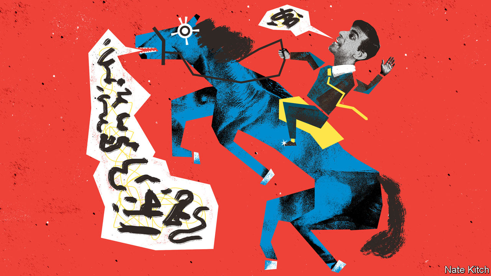

###### Bagehot

# Blind optimism is the only bet for Britain’s Tories 

##### How magical thinking conquered the Conservative Party 

 

> Sep 28th 2023 

In an old joke, a condemned man is begging for clemency from a king. The prisoner makes a rash promise: let me live and I will teach your horse to talk. The king agrees, giving him one year to complete the challenge. An elated inmate returns to his cell. His cellmate asks why he is so happy. “A lot can happen in a year,” he replies. “The king might die. The horse might die. I might die. And maybe the horse will talk.”

Equine eloquence is in vogue in the Conservative Party. The government is in a dire situation. At the nadir of Liz Truss’s 49-day tenure as prime minister, the Conservatives bottomed out at an average of 22% in the polls, which would be a historic hammering were it repeated in a general election. Now, under Rishi Sunak, the party averages 27%, which would be a historic hammering were it repeated in a general election. The Conservatives fell into a hole a year ago. They are still in it. A combination of desperate optimism and magical thinking is the order of the day. 

The first strange belief is that Mr Sunak, the prime minister, is popular. In 2020 he emerged as a fresh-faced chancellor, who sprayed about £400bn ($485bn) at voters at the start of the pandemic, becoming the most liked politician in the country. Voters prefer Mr Sunak to the party he leads. A presidential campaign, in which Mr Sunak is front and centre, would see off Sir Keir Starmer, who is either unknown or unliked by voters, runs the logic. 

It has a flaw. Last week Mr Sunak’s net approval rating hit minus 45. For context, these are the numbers Boris Johnson posted after it emerged officials in Downing Street had enjoyed wine-soaked parties during lockdown. Sir Tony Blair had to invade Iraq before voters turned against him to anywhere near the same degree. Gordon Brown was in the middle of the Great Recession before voters got as fed up. Mr Sunak still has some way to go to beat Ms Truss’s score of minus 70, but is still less popular than Sir Keir (minus 25), whose own unpopularity is at the root of Tory strategy. 

When it comes to policy some Conservatives swear they can hear the horse mumbling. A controversial blitz has gone down well. hs2, a high-speed rail link between London and Birmingham and Manchester, is wildly popular among transport nerds but its likely curtailment will be welcomed by voters who never loved it. Mr Sunak scrapped a host of green measures in a high-profile speech, painting himself as a defender of petrol-chugging motors and the only thing standing between voters and Sir Keir forcing them to spend £10,000 on getting a heat pump.

Expecting the popularity of individual policies to provide a path to power is a common error. Jeremy Corbyn, Labour’s former leftie leader, offered a slew of policies that the general public liked individually, whether it be rail nationalisation or higher taxes on the rich. And yet Mr Corbyn led Labour to their worst performance since 1935. Likewise, the problems Mr Sunak is trying to solve emerged on his party’s watch. HS2 sprawled into a £100bn mess under the Tories. If green measures need repealing or a railway needs scrapping, it is due to previous decisions by Conservative governments. Incompetence is a worse vice than unpopularity. 

Many Tories are relying on Labour’s incompetence rather than horse hypnosis. Labour is much less popular than it was in the run up to 1997, when Sir Tony posted approval ratings that would make an Uzbek autocrat blush. Labour has won a majority from opposition only three other times, under Clement Attlee after the second world war and twice under Harold Wilson in the 1960s and 1970s. Rigorous statistical analysis based on a sample size one can count on a single hand (n=4) can lead to madness. Assuming Labour needs a stonkingly popular leader to win power is as wrong-headed as assuming it can only do so after helping defeat Hitler. 

Rash gambles are discussed in Tory circles as if they were rational. Some think a spring election is likely. Calling an election while up to 20 points behind is as bold a strategy as entertaining a despot with a performing pony. Conservatives point to the general election in 1992, when the party enjoyed a surprise win. Going into the election, the parties had been roughly level in the polls for a year; this time the Conservatives have a big deficit. Sir John Major proved a canny campaigner; Mr Sunak is untested. When challenged, Mr Sunak sometimes has the indignation of a man who could be literally anywhere else on earth doing anything else. Given that he is married to a billionaire, he probably could, but voters see being prime minister as a privilege, not a sacrifice.

From stalking horse to talking horse

Cheerleaders encourage blind optimism. The  and the  hurrahed as Mr Sunak veered from green targets, much as those papers cheered on Ms Truss’s foolhardy budget, which still weighs on the Tory vote. Minor victories are trumpeted while fundamental flaws are ignored. Thus the unlikely path to a recovery is painted as plausible, while the equally probable outcome of a once-in-a-century wipeout is cast as impossible. 

It is not just newspapers. Politicos struggle to imagine governments losing until they do. “Tory Nation”, a book published this year, argued Britain is an innately Conservative country. Such tomes usually indicate the top of the market. In 1994 academics published “Turning Japanese?”, wondering if Britain was becoming a one-party state after a fourth Conservative victory. Three years later, the Conservatives suffered the first of three catastrophic defeats. In the run-up to the third, in 2005, Geoffrey Wheatcroft published “The Strange Death of Tory England”. Naturally, the Tories went on to come first in the next four elections.

Wiser Tories appreciate that their time is probably up. Banking on dumb luck is their best bet. Things happen and so mindless optimism becomes the only option. Maybe the public will change their mind on “Rishi”. Maybe the economy will go on a tear. Maybe Sir Keir will be arrested after a five-a-side football punch-up. And maybe the horse will talk. ■


