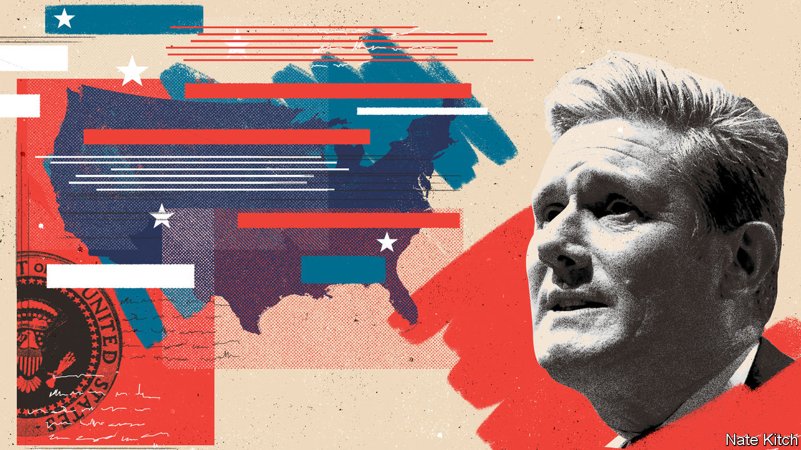
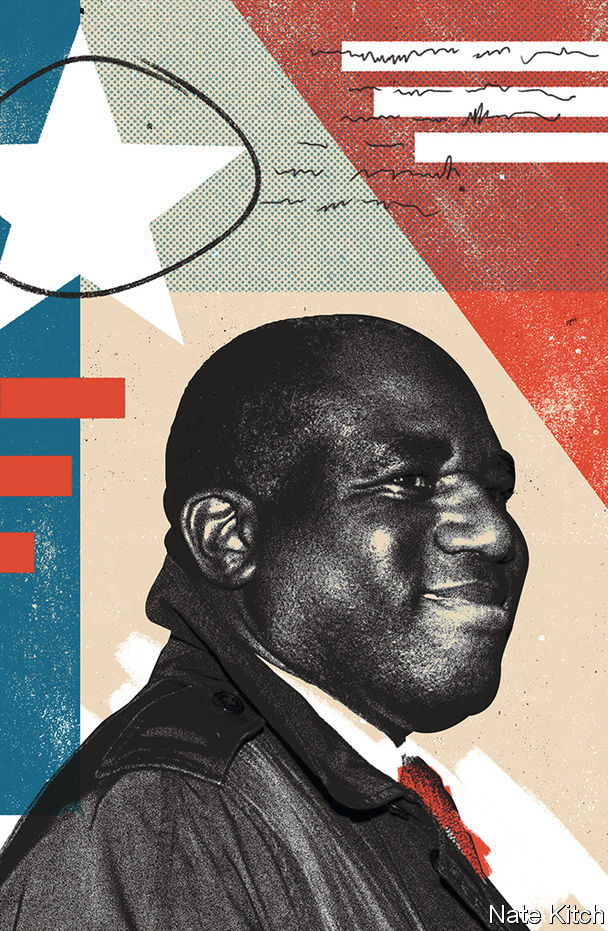

###### Biden’s Britain

# Britain’s Labour Party takes lessons from Joe Biden 

##### Under Sir Keir Starmer Labour, once again, is infatuated with the Democrats 

 

> Sep 28th 2023 

VISITING WASHINGTON this month, David Lammy, the shadow foreign secretary, and John Healey, his colleague covering defence, paused for a photo by a bronze memorial to President Franklin Roosevelt. It was a nod to another photo taken at the same spot of Tony Blair, then the new prime minister, Bill Clinton, then the president, and their wives. That was in 1998, a time of “third way” politics, when the leaders of the Labour and the Democratic parties hoped to fuse a belief in free markets with social progress. 

It is a bond that Labour hopes to revive. The party has long drawn from Democratic waters: even Jeremy Corbyn, the previous leader who loathed American power, found a soulmate in Bernie Sanders. But rarely has it drunk as deeply as today. Polls suggest Sir Keir Starmer is on course to become prime minister in an election that is almost certain next year. Joe Biden’s administration is providing the party with inspiration for its electoral strategy, an economic agenda, and an approach to geopolitics. Its MPs and advisers make pilgrimages to Washington; speeches by Mr Biden’s aides are pored over. 

But the world has changed since 1998. Britain remains a vital American security partner—underscored by the war in Ukraine—and an important trade partner. Rishi Sunak, the prime minister, has proved to be a more reliable interlocutor than Boris Johnson, a predecessor. But the country’s influence in Washington has perceptibly declined. “The whole relationship has weakened steadily over the last 20 years,” says Bronwen Maddox of Chatham House, a think-tank. Wars in Iraq and Afghanistan exposed the limits of Britain’s armed forces.

Then came the EU referendum. “I don’t think it’s been quite appreciated in Britain the cost that Brexit and the political turmoil of the past seven years have had in taking the shine off the ‘special relationship’,” says Max Bergmann of the Centre for Strategic and International Studies, a think-tank. Britain surrendered its role as the “eyes and ears” of America in Brussels, just as the workload shifted from humdrum issues of bilateral trade to strategic competition with China, he says.

Washington, therefore, does not pay much heed to Westminster. But for Labour strategists worrying if stolid Sir Keir could win back industrial heartlands lost to Mr Johnson in 2019, there is much to absorb. The narrow victory of Mr Biden over Donald Trump in much of the American rustbelt the following year brought a shot of hope. Centre-left parties everywhere are engaged in “high-level brainstorming among people wrestling with the same challenge,” says Will Marshall of the Progressive Policy Institute, a think-tank that was the centre of “third way” ferment. At heart, he says, that means addressing “the disconnection between progressive parties and the working class.” 

Labour staff have taken lessons from the Biden campaign in how it used data, framed economic policy in terms of job creation, and avoided culture-war fights. “The design of the machine came from the principles we were learning from people like the Democrats,” says a party official. “It gives us a template, because like us they had drifted off to being just a primarily university-educated electoral coalition.”

Mr Lammy sees a chance for Britain to benefit from a “progressive moment”, if a Labour victory were to coincide with the re-election of Mr Biden and, perhaps fleetingly, centre-left and liberal governments in Australia, Canada, France and Germany. He acknowledges overlaps with Bidenism. His refrain that diplomats should have hard-pressed Britons at the forefront of their minds echoes the administration’s “foreign policy for the middle class,” which holds that those setting policy should discard stale theory and focus on the needs of industrial workers. 

Touring Washington’s think-tanks, Mr Lammy’s pitch was that Mr Corbyn’s tenure was history and Labour would uphold Britain’s defence obligations. Military aid to Ukraine, support for NATO, the AUKUS submarine deal with Australia and a fighter-jet deal with Italy and Japan—all will stay. He also proposed a transatlantic anti-kleptocracy push, which was an early priority of the Biden administration. (Given London’s reputation as a laundromat for loot, it is an area where Britain’s government could make a mark). The Biden administration’s agenda for the “health of democracies”—free elections, human rights and so on—may find a more natural partner in Labour, because some Democrats see the Tories “swimming in the same ocean of nationalism” as the Trump movement, argues Ben Rhodes, a former adviser to Barack Obama.

Starmernomics for the people

The biggest change would come in economic policy. Mr Sunak’s government sees aspects of Bidenomics—a mixture of vast subsidies and trade restrictions with the aims of boosting domestic manufacturing, reducing dependency on China and tackling climate change—as dangerous protectionism. Under Labour, Britain would be its loudest cheerleader. In May Rachel Reeves, the shadow chancellor, met Lael Brainard, the director of the National Economic Council, and Janet Yellen, the US treasury secretary. She told Ms Yellen they “are on the same page on economic policy”.

 


In an address to the Peterson Institute for International Economics, she drew heavily on a speech given by Jake Sullivan, Mr Biden’s national security adviser, a month earlier. “Globalisation, as we once knew it, is dead,” she declared. An “active, strategic, state” should “rebuild our industrial strength”. She is also increasingly sceptical of Britain’s reliance on China. “We must care about where things are made and who owns them,” she said. America and Britain could forge a “green special relationship”, she said, noting that Mr Sullivan had cited a long list of America’s allies, but omitted Britain. 

The centrepiece of this is a plan to decarbonise Britain’s electricity supply by 2030, inspired by the Inflation Reduction Act, a programme of direct subsidies and tax credits that is likely to surpass $1trn. Labour’s version as a share of GDP would be multiple times larger, eventually reaching £28bn ($34bn; 1.1% of GDP) a year. It would feature national stakes in new industries, handouts to firms that create jobs in poor towns, and regulatory reform. 

Visions for green industrial policies have circulated in the British Left for years, but America has rendered them real in steel and concrete. Ed Miliband, the shadow climate secretary, has drawn on work from think-tanks close to the Biden administration, including the Centre for American Progress and the Roosevelt Institute. (Another, Third Way, is setting up in London to help the effort.) Appearing alongside Heather Boushey, a White House economist, in London on September 14th, Mr Miliband derided those who regard the agenda as protectionist. “It’s a very old-fashioned neoliberal view of economic policy, honestly,” he said.

Others in the shadow cabinet see more clearly how hard it will be to replicate Bidenomics in a midsized country with weak public finances. They know Britain would need to focus on sectors of comparative advantage. In June Ms Reeves delayed the £28bn target to 2027, and stressed it will be subject to her fiscal rules, that require debt to fall as a share of GDP. Less than a third of the money has been publicly earmarked for projects, and there is a moratorium on announcing more until Labour’s fiscal inheritance becomes clear. In Washington, Mr Lammy told Democrats that allies must co-ordinate industrial strategies to avoid them undermining each other. 

“The problem with Bidenomics is there is a tension between the Biden administration’s vision of an alliance of democracies getting together, and the economic nationalism of the president saying we want to build stuff here and sell stuff here,” says Adam Posen, the president of the Peterson Institute. The hope of creating thousands of non-graduate industrial jobs via subsidies “defies any sort of realism”, he argues, given Britain’s borrowing capacity, labour-market limitations and small market size. Britain can align with other allies “to try and convince the US and China not to divvy up the world in this way,” he says. “But it sure as heck cannot compete directly in this game.” Some in Labour worry it is rushed. “It is driven by political necessity, not intellectual ferment,” says one figure.

As for Brexit, the largest hit to Britain’s influence in Washington, Labour has ruled out rejoining the bloc, or its single market. But it is growing more ambitious in seeking a diplomatic role. Emmanuel Macron, France’s president, hosted Sir Keir in Paris on September 19th. The prospect of Ukraine joining the EU could mean redrawing the architecture of Europe, and Mr Lammy wants to explore an idea long promoted in France of a continent of concentric circles, with Britain as an active player on its outer rim. The party proposes new and rebooted defence agreements with the EU, Germany and France, and “structured dialogue” to chew over strategic challenges. “We want to be inside of the room when big decisions are being made around nearshoring, supply chains and rare-earth minerals,” Mr Lammy says. Many EU governments are keen on some sort of formal dialogue, although the bloc will guard its autonomy of decision-making. 

The new world

The case for leaning into Europe would strengthen were Donald Trump to return as president next year. His anglophilia is shallow: in his first term, he repeatedly humiliated Theresa May, then prime minister, who stuck tight with France and Germany on climate and Iran policy. For Sir Keir, the “progressive moment” would be dust. A champion of NATO, Ukraine and European co-operation would find a White House indifferent or hostile to all three. Labour figures hope that Mr Trump’s campaign rhetoric remains just that. If need be they will stress their shared security interests, and place their faith in America’s institutional checks. Those are not convincing answers. But on that, at least, they are not alone.■


