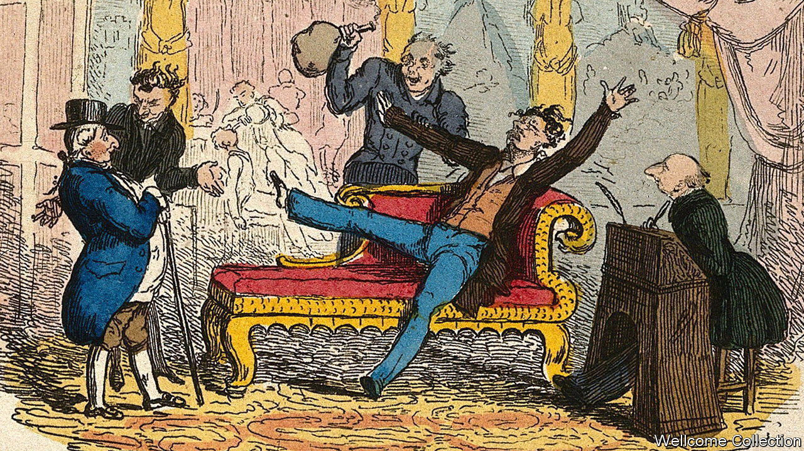

###### No laughing matter

# Britons take laughing gas merrily. Tories take it more seriously 

##### Using the drug will soon be punishable by two years in jail 

 

> Sep 27th 2023 

The bee seemed to be enjoying itself immensely. First, it was “unable to fly in a straight line”; then it flew in circles; then finally it “fell to the ground as if giddy.” When Humphry Davy gave laughing gas to other animals they reacted similarly: a lizard staggered; a flounder floundered; a butterfly “wrapt [his wings] round his body” before falling senseless. Humans were thrilled. Samuel Taylor Coleridge found laughing gas “highly pleasurable”; another user “felt like the sound of a harp”; a third concluded that “the atmosphere of [the] highest of all possible heavens must be composed of this gas.” 

Nitrous oxide has suffered a spectacular fall from grace since those heady early days. The gas that once breathed life into Romantic poets, transformed anaesthetics and let mortal man touch the face of heaven is now condemned by its critics as “hippy crack”, while its canisters are a “plague” and its use is a “terrifying epidemic”. By the end of the year, its recreational use will be illegal, punishable by two years in prison. Dealing it will be punishable by 14. This, says David Nutt, professor of neuropsychopharmacology at Imperial College London, is “completely fatuous.” 

The furore over the gas would have surprised its early advocates. It was discovered in the 18th century, when scientists were starting to realise that the apparently insubstantial air in fact contained multitudes. They found a dangerously fiery gas that, when piped into a jar, made candles burn more brightly; a colourless gas that, when bubbled through water, made it fizz pleasingly and, oddest of all, a gas that, when piped into researchers, made them feel that they had seen the secrets of the universe—and made them talk what the psychologist William James would later call “meaningless drivel”. 

It was a fair diagnosis. Davy, after inhaling gallons, declared that “Nothing exists but thoughts!” James, after taking rather less, said: “There are no differences but differences of degree between different degrees of difference and no difference.” A third user gnomically explained that he “felt a thrill in my teeth.” The words might be rubbish but the realisation it inspired—that mere chemistry might manipulate a mind—was profound. Or as James put it: something might “sound…like nonsense, but it is pure sense!” 

Modern users have proved as enthusiastic as Davy: laughing gas is now the second most commonly used illicit drug in England and Wales among 16- to 24-year-olds, after cannabis. It is easy to see why: it is simple to buy as its canisters, sold for use in whipped-cream dispensers, can be found on Amazon (reviewers archly praise it as an “excellent” cooking accessory); wears off quickly; and is immensely genial (as your correspondent, who tested it for research and felt somewhere between the bee and the butterfly, can confirm). 

There are reasons to be cautious. Heavy, long-term use can cause nerve damage; prolonged exposure can be problematic (some hospitals are removing it for this reason) and, while addiction is unlikely, overenthusiasm is perfectly possible. A recent police crackdown (it was already illegal to deal in it) has moved users from the smaller canisters to larger cylinders; the equivalent, says Professor Nutt, of moving teenagers from “shandy…to neat vodka”. Critics argue the new law will exacerbate this. As so often a ban might sound on sense. But is more likely nonsense. ■


