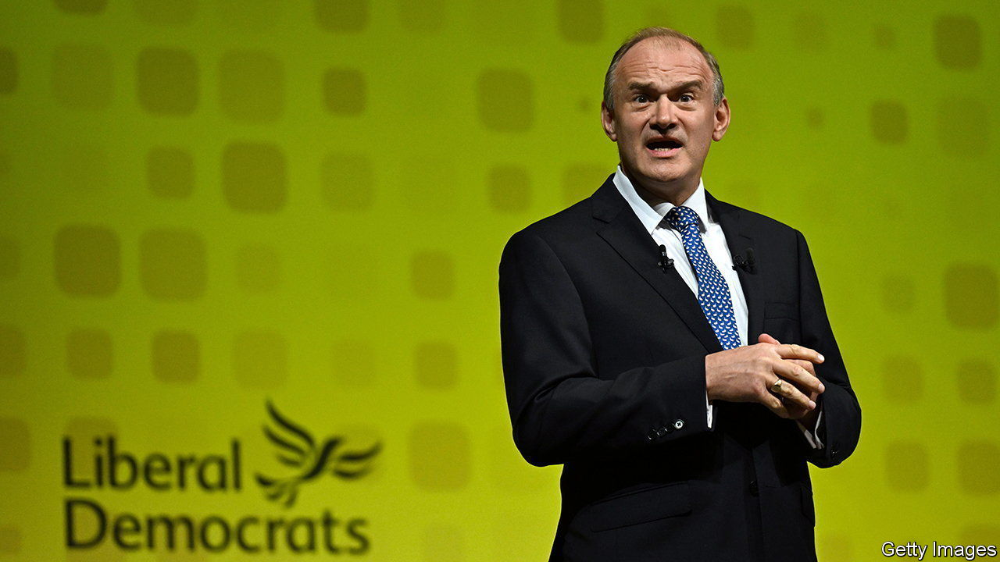

###### The Lib Dems

# Could Britain’s Liberal Democrats matter again? 

##### The party has high hopes for the next election 

 

> Sep 28th 2023 

LIFE IS HARD when you are merely Britain’s fourth-biggest political party. Third place—which the Liberal Democrats held until 2015—at least guarantees some exposure: regular slots at Prime Minister’s Questions and on the airwaves. Fourth, stuck behind even the Scottish National Party, means obscurity. “Calls from the BBC” dry up, laments Sarah Olney, whom even political nerds struggle to name as the party’s finance spokesperson. Half of Britons have never heard of its leader, Sir Ed Davey. 

Could that soon change? At the election in 2019 the Lib Dems scooped up a measly 11 seats, down from a peak of 62 in 2005. But things have started to improve of late. The party has won four by-elections, overturning large Conservative majorities in each constituency. At the party’s conference in Bournemouth on September 26th, Sir Ed talked valiantly of smashing the Blue Wall “for good” at the next general election, almost certainly next year.

The wilderness years were, in effect, self-inflicted. The party joined a coalition with the Conservatives, and then was punished by voters who were fed up with its embrace of the government’s austerity programme and furious that it reneged on election pledges, notably one not to raise university tuition fees. The choppy waters of Brexit proved hard to navigate; three leaders departed in as many years. 

Having helped cause the Lib Dems’ woes, the Conservatives offered them a route back. Brexit, chaotic government and sloppy behaviour all estranged voters from the Tories. Sensibly, Sir Ed wants to take advantage. He says little about the European Union, to the chagrin of his ardently Europhile members. His campaign will instead focus on the cost of living, the NHS and sewage. The last is already a pungent issue in leafy areas. 

Three of the recent by-election victories were in the west of England, the party’s heartland. But success in Chesham and Amersham, a commuter seat near London, has excited hopes of winning in suburban, professional areas. Mark Pack, the party’s president, suggests a focus on places with “big houses and bigger potholes”, where even affluent voters cannot swerve the effects of crumbling services. Rob Ford of Manchester University thinks the party could do well among graduates in seats around London.

The party leadership used the conference to prepare for the campaign, nixing a plan to put a penny on income tax that might have deterred Tory voters. In the conference hall young activists blocked an attempt to drop a national housing target. At the conference bar (mostly older) members grumbled about excessive caution on Europe. Yet the party’s strategy of targeting rich Conservative seats is almost certainly the right one.

If Labour were to fall short of a majority, would Sir Ed contemplate joining another coalition? He won’t say. Many Lib Dems would prefer to shape the next Parliament in a lower-risk way, either as an outright opposition party, or via ad-hoc support for those in office. A good outcome could prove to be a small majority for Labour. That could leave the party with considerable influence to temper some of Labour’s less liberal instincts and to push for its own ambitions.

The holy grail would be electoral reform. Some unions and Labour members are keen but the leadership is opposed, and unlikely to change its stance unless forced. Lib Dems still grouch about Tony Blair breaking a pledge to hold a referendum on the issue after winning a landslide at the 1997 election. Crucially, though, the Lib Dems hope to enjoy attention again, ideally from their traditional, unglamorous perch in third place. ■


