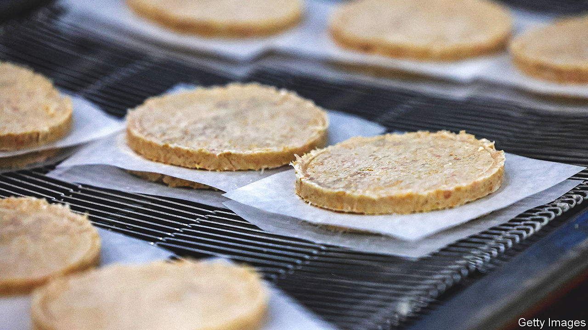

###### Cultivated fat

# Is lab-grown meat kosher? 

##### How fat grown from stem cells could save the plant-based meat industry 

 

> Sep 28th 2023 

FOR A WHILE, it seemed everyone was going vegan. In March 2022 almost half of Britons surveyed by Ipsos, a pollster, said they were thinking of eating fewer animal products. But amid high prices and concerns over ultra-processed food, the industry is proving to be more sizzle than steak. In June Meatless Farm, a plant-based company, fell into administration. Demand for patties of rehydrated textured pea protein have flopped. “Meat alternatives don’t taste good enough,” says Max Jamilly, a co-founder of Hoxton Farms, a startup. 

The “magic ingredient” is fat: the stuff that makes meat sputter, crisp and brown. So Mr Jamilly’s startup set out to make a lab-grown version of it. In a trendy East London office block, his engineers grow stem cells in a broth of plant-based food. To replicate the warm inside of a pig the cells are grown in cultivators, similar to fermenters for brewing beer. The result is animal fat without the carcass (or animal suffering), to be sold to alternative-meat companies. The target consumers are carnivores, not vegans. If fewer pigs are reared, that could be good for the planet: over three-quarters of the world’s agricultural land is used for livestock. 

Would anyone pork out on lab-grown fat? Consumers may recoil at first from the Frankenstein food, versions of which are permitted, for now, only in America and Singapore. Yet people usually come around to new foods because price matters more than how the sausage is made. As long as cultivated meat must be produced with medical-grade equipment it will remain expensive. Once rules are relaxed prices should fall, as could unease about the unfamiliar. A decade ago Mark Post, a Dutch scientist, unveiled a $330,000 lab-grown burger, made of both muscle and fat. He will soon take his products to market, and has even convinced a New York rabbi to say cultivated pork could be kosher. 

To thrive, the cultivated fat industry would have to scale up. Hoxton Farms hopes to be selling fat by 2025, and to lift production from a few kilos now to ten tonnes a year. That’s a tiny drop of lard in the fat ocean: global pork production is 115m tonnes a year. One day, however, Shanghai soup dumplings, Swedish meatballs and Filipino  could all be made with cultivated pork fat. And then, possibly, Hoxton will bring home the lab-grown bacon.■


