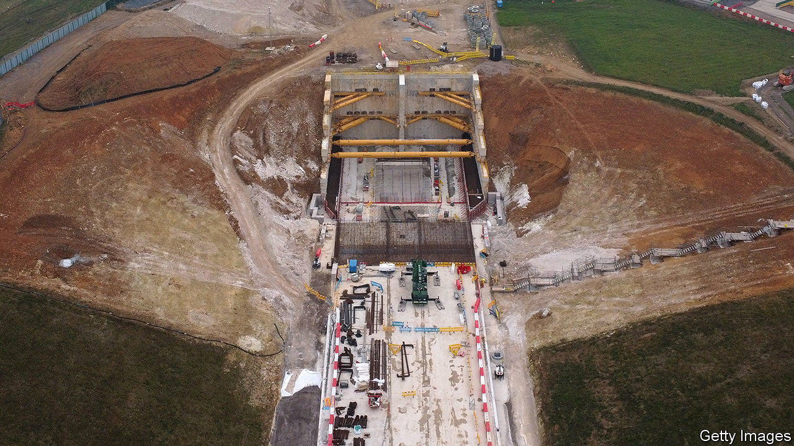
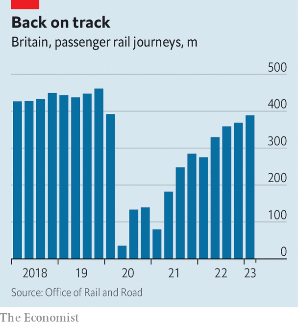

###### Up the junction?

# Why Britain’s government would be wrong to cut HS2 

##### The costs of upgrading the railways have risen, but it is still worth doing 

 

> Sep 25th 2023 

THE RELATIONSHIP between British politicians and the railways has long been difficult. In 1830 the opening ceremony of the world’s first intercity line, between Manchester and Liverpool, was marred by a former cabinet minister being killed by a locomotive. Rumours this week that the government might cancel part of High Speed 2 (HS2), a long-planned upgrade to the rail network, has left less blood on the tracks. But it has provoked a furious reaction from business leaders and politicians, including Conservatives. 

Until the pandemic the railways had been enjoying a multi-decade renaissance. The number of journeys more than doubled between the early 1990s and 2019, to over 1.7bn annually. In the late 2010s passenger numbers reached their highest since the early 1920s, before mass ownership of cars. But whereas Britain had over 32,000km of track a century ago, it now has under 16,000km. 

As a result freight, long-distance journeys and shorter commuting travel must all happen on the same few lines. The Railway Industry Association, a trade body, reckons track use in Britain is around 60% higher than the European Union average. Network Rail, the state-owned firm that manages the track, says congestion is behind 70% of all delays. 

HS2, despite its name, was never really about speed. The line got its green light in 2009 and was to link London and Manchester, and to open between 2035 and 2041. But the core aim was to get more capacity overall, releasing space for local services by moving more intercity journeys to a purpose-built track. Unfortunately, the project has become a case study in how not to do a long-term infrastructure upgrade.

Residents and MPs in areas subject to digging and tunnelling were quick to complain. Environmental protesters forced stoppages. A labyrinthine planning system caused delays. Roughly a decade ago, detailed surveys revealed ground conditions were poorer than expected, so more reinforcement was needed for tunnels. All that put up costs. The work was first, in 2009, expected to cost £37.5bn (then $62bn), around 2.4% of GDP. By 2019, the latest official estimate, that was over £70bn (or 3.1%). After inflation, costs are higher now. The benefit-to-cost ratio was first put at 2.4, so for £1 of public money spent on building the economy would gain £2.40. By 2019 independent analysis found a ratio of just 1.3. It may now be worse. 

Ambitions have already been pared back. In 2021 an eastern leg of HS2, to Leeds, was cancelled. This year work was delayed on the supposed terminus, at Euston station in London. Trains will be expected to arrive at (and depart from) Old Oak Common, 10km away, at least at first. 

More drastic cuts are now being weighed. The government will not confirm that stage two of the project, from Birmingham to Manchester, will happen. BusinessLDN, which represents employers in London, and the Northern Powerhouse Partnership, which speaks for northern firms, say Britain’s reputation as an attractive place to invest could be left in tatters. George Osborne, a former chancellor who was fond of austerity, and Boris Johnson, a spendthrift former prime minister, both oppose the rumoured change. Five city mayors say the north risks being stuck with Victorian infrastructure.

 


The case for a rethink is based on an estimate that the overall bill may be close to £100bn. But on the benefit side, the case for creating more capacity remains. Although many commuters began working from home in the pandemic, passenger numbers have risen in seven of the past eight quarters (see chart); overall volumes are at 83% of pre-pandemic levels and rising. Rail capacity is likely to be stretched to breaking-point by the early 2030s.

The opposition Labour Party, wary of being accused of having a multi-billion-pound “black hole” in its fiscal plans, is reluctant to commit itself to the project. But rail insiders believe that HS2 will get built eventually. The alternative is managed decline, more cancellations and higher fares to cut volumes. Dithering by the government will lead contractors to build an extra risk premium into their fees, adding to the spiralling costs. It is hard to see what a proposed compromise of delaying the work by another seven years would achieve. More uncertainty will mean Britain’s pricey new railway only becomes pricier yet. ■


