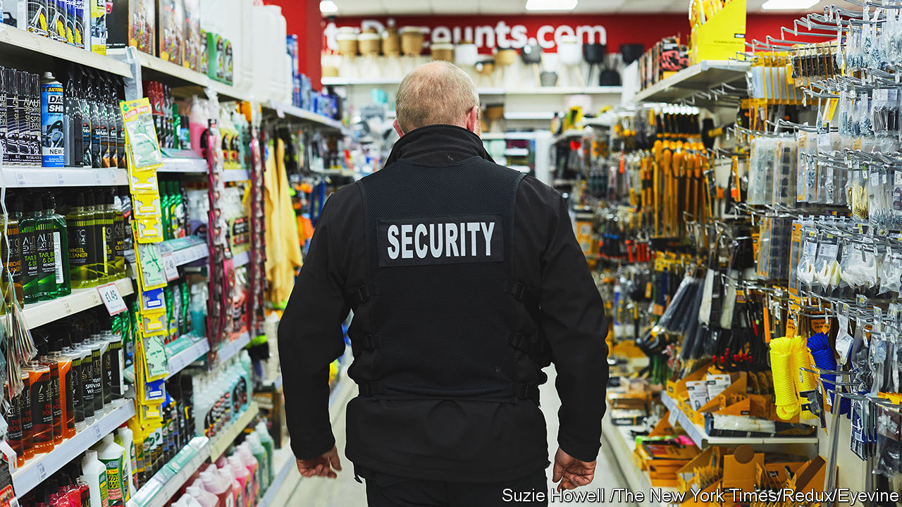

###### Organised retail crime

# Why shoplifting is rising in Britain 

##### Gangs are behind more theft from shops 

 

> Sep 22nd 2023 

The thief was in no hurry. Seeing a pile of electric fans arranged near the front of the shop, on a busy street in Brixton, south London, he sauntered in, tucked one under his arm, and sauntered out. The cashier, fiddling with a broken self-checkout till, didn’t notice. If she had, it is unlikely she would have tried to stop him.

In a period of generally falling crime, shoplifting is rising. In the year to March, police reported 342,343 cases of it, up by 24% on the year before. That tally is, doubtless, a small share of all shop thefts. The British Retail Consortium (brc) has warned shoplifting is soaring across the country. Primark, a fashion chain, said this month that it had dented profits. Dame Sharon White, chair of the John Lewis Partnership (which owns shops and Waitrose, a supermarket), called it an “epidemic”. 

The reported statistics are less dramatic than they first appear: they are, more or less, back to pre-pandemic levels. Shoplifting dropped sharply during the lockdown. Yet the past decade has seen a gradual uptick in such crimes. And the brc says in some cities retail crime is rising sharply.

Patchy data do not reveal exactly who does the swiping, or why. The high cost of living is often blamed. But anecdotal evidence, including from academics, suggests that plays only a small part. The Association of Convenience Stores (acs) which represents 33,500 small shops, says most shoplifters are repeat offenders, often with drug or alcohol problems. 

Emmeline Taylor, a professor of criminology at City University, says thieves may steal to order, after first getting “a shopping list” from a criminal gang. Popular items include alcohol, baby formula, confectionery and meat, which some shops report are grabbed in bulk, to be sold on. Gangs are less likely to be involved in some other types of theft, notably burglaries, which have been declining for 20 years. 

A change to the law in 2014 may have encouraged gangs to recruit shoplifters, while also spurring individuals to steal for themselves. It made shoplifting of goods worth £200 ($245) or less a summary offence, one tried in a magistrates’ (rather than the crown) court. That has probably discouraged police from investigating such crimes, except when repeat offenders are involved. They are often given brief, successive prison sentences that achieve little. Instead, the government should impose drug rehabilitation orders on those stealing in order to fund addiction. That would help address another trend reported by retailers: shoplifters appear to be getting more aggressive, even ready to threaten violence, which discourages staff from confronting them. 

Retailers are working more with police. John Lewis and other shops are funding a project, dubbed “Pegasus”, which will see more cctv footage and other intelligence passed on to officers. Graham Wynn, the assistant director of business and regulation for the brc, calls that “worthy”, but says the police should give greater priority to retail crime.

Is that realistic? Graham Farrell, a professor of crime science at the University of Leeds, points out that only around 2% of crimes (of all sorts) result in a conviction. Therefore it makes more sense for shops to focus instead on making them more difficult to commit in the first place. Big shops full of tempting goods “generate great crime opportunities”, he says. Self-checkouts will not have helped. 

The most effective measures include fitting more “hot products” with security tags, moving high-value items away from entrances and arranging aisles so that staff can see down them more easily. Researchers point out that posting someone to greet shoppers at the door can reduce theft, though only high-end shops tend to do this. Not all petty criminals are as shameless as the fan thief in Brixton. ■


