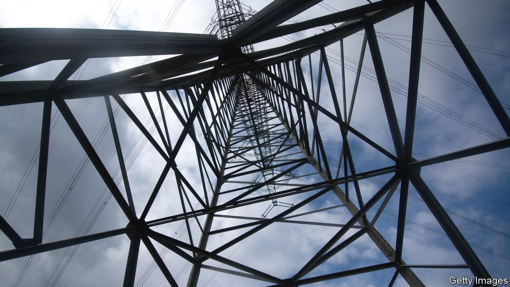

###### Grid unlock

# Can Europe’s power grid cope with the green transition? 

##### The boss of Germany’s biggest grid operator sure hopes so 

 

> Sep 28th 2023 

“More , more business for us,” says Leonhard Birnbaum, chief executive of E.ON, a German power-grid operator that enjoys a near monopoly in Europe’s biggest economy. The set of policies and timetables to which he is referring (and which translates to “energy turning-point”) was first unveiled in 2000 with the aim of making Germany a net-zero emitter of carbon by 2045. It is meant to increase the demand for and the supply of green power exponentially. And it can only work so long as that power can reliably flow from wind and solar farms to users in Germany and the rest of Europe.

This presents an enormous opportunity for E.ON—and an equally formidable challenge. The energy transition requires huge investments in German and European grids, and it requires them right now. That will only happen if the government and regulators fundamentally change the way they deal with power-grid projects, notably by cutting red tape and speeding up permitting for grid expansion and reinforcement. “The limits of infrastructure are the biggest obstacle of Europe’s green transition,” says Mr Birnbaum. At the moment, he explains, the grid expansion can barely cope with the huge surge of producers of renewable energy trying to connect to it.

To illustrate the scale of the task, Mr Birnbaum points out that one charging station for electric cars with 15 outlets needs as much power as a town of 5,000 inhabitants. A new data centre needs as much power as 80,000 households. As a result, electricity consumption in Europe is forecast to increase by around 60% by the end of the decade. And whereas before the  Europe had 200-300 power plants, in October E.ON expects the millionth electricity generator to hook up to its German grid. 

“The challenges of the energy transition make Mr Birnbaum one of Germany’s most political chief executives, along with Markus Krebber,” says Ingo Speich of Deka, an investment fund that owns 1% of e.ON. Mr Krebber runs rwe, a big German power producer (and E.ON’s largest shareholder, with a 15% stake). Mr Birnbaum admits he still “too often” finds himself in Berlin, a six-hour drive away from E.ON’s headquarters in Essen, talking to policymakers. But at least the coalition government is listening to his concerns, he reports. 

Policymakers in Brussels are on the case, too—at least on paper. Earlier this month Kadri Simson, the EU’s energy commissioner, lamented in the  that securing permits for grid reinforcements can take up to ten years in Europe. Without certainty about connection to the grid, she warned, renewables projects were being abandoned. Existing clean-power capacity is underutilised. Solar panels, for instance, are frequently switched off when grids are overloaded, because they are flexible and easy to manage. “This is wasteful and costly,” Ms Simson wrote.

While Mr Birnbaum waits for German and EU regulators to untangle the bureaucracy—a process that, he complains, remains far too selective—his company is starting to ramp up investments. These will add up to €33bn ($35bn) over the next five years, up from an earlier plan to spend €20bn. Most of that will go to its grids, which account for 72% of E.ON’s turnover. 

Among other things, each year Mr Birnbaum is planning to replace between 6,000 and 7,000 of the company’s 100,000 or so analogue transformers, which convert high-voltage power from the grid to voltages needed in homes, with advanced models that monitor performance and detect faults before they occur. Mr Birnbaum is keen on software that can strengthen networks without extra physical infrastructure by optimising the management of solar and wind power’s variable output. “A bigger system with much more renewable energy can only be run digitally,” says Mr Birnbaum. He calls such “smart grids” the basis of 21st-century society. 

After a difficult 2022, when investors fretted about the impact of the energy crisis caused by Russia’s invasion of Ukraine, E.ON’s share price has rallied by nearly 20% this year. That has given Mr Birnbaum some room for manoeuvre. But if €584bn-worth of grid investments is to materialise by 2030, which Ms Simson estimates is necessary to meet the EU’s climate goals, he will need a lot more of it. This means more visits to Berlin and Brussels. ■


