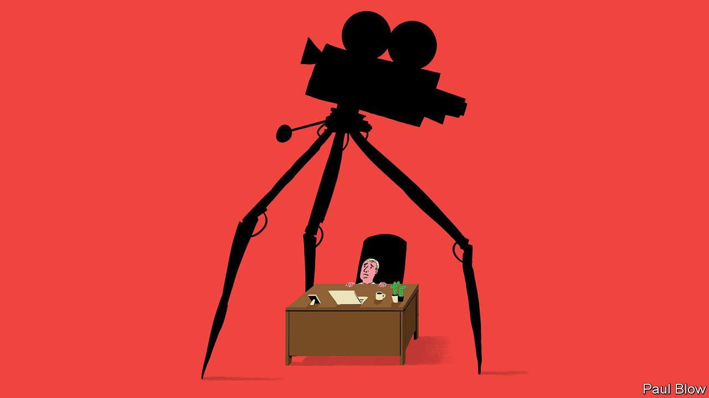

###### Bartleby

# Films and the white-collar workplace 

##### Putting the office into box office 

 

> Sep 28th 2023 

The office is not the most promising setting for films. Desk warriors can occasionally be caught up in dramatic stories, whether journalists (“Spotlight”), lawyers (“Dark Waters”) or whistleblowers (“The Informant”). The greed and fear of high finance (“Dumb Money”) have an enduring appeal. But office-based blockbusters are still pretty thin on the ground: typing, malfunctioning toilets and meetings are just not that exciting. 

There is a simple fix. Take film titles that have already done well with cinema-goers and tweak their plots for the white-collar workplace. Here are pitches for a few such remakes: 

 A newly refitted office contains several small rooms that are expressly designed for focused work. But it rapidly becomes clear that demand for these rooms exceeds supply. In the rush among employees to book them or grab them when they become free, things turn very nasty indeed. Genre: horror/office administration.

 An office worker logs into the Bloomberg terminal for the first time in the hope of quickly finding some information. She finds that it does not respond to normal commands. Several years later, she has neither been able to locate any data nor managed to log off. 

 John is a 40-year-old man who once gave a talk at a TED event. He seems unable to move on from this career highlight, even though the rest of the world has. He talks only in 18-minute monologues that always start with a personal anecdote. When he speaks, he invariably stands up, paces from side to side and ends each sentence staring purposefully into the middle distance. His family and friends find him completely insufferable and all desert him.

 A group of early adopters are given digital alter egos as they prepare to visit another world. They are promised all manner of wonderful experiences in this realm, but feel only disappointment when they find that they have no legs and the one person there is Mark Zuckerberg. 

”. They said it couldn’t be done. But one man believes that it is possible to go to Davos 14 times in a row without completely losing his sanity. Can he survive repeated exposure to Will.i.am, Klaus Schwab and John Kerry? Viewer discretion advised: features distressing scenes of breakfast panels about AI.

 A cleaner at the offices of a hedge fund has a preternatural talent for accounting. One evening he comes across the accounts of a target company and sees immediately that it has overvalued the intangible assets on its balance-sheet. Finance-based suspense from the same team that brought you “Negative Jaws” and “Tombstone”.

 The screen goes blank just as a board meeting is about to begin. The directors panic and press various buttons but all they manage to do is turn off the lights. Only one department can help sort out the chaos. Likely to be the longest-running film franchise in history.

 On the surface it looks like a normal company. But a change to reporting lines causes utter confusion. Nobody knows what is happening; several people lose their grip on reality. Not science fiction.

 A new generation of workers is entering the office. They spend most of their time staring at their phones and laughing to themselves, but occasionally whip themselves into a state of outrage about something or other. Older workers panic about the impact these creatures will have on the company until they realise they were not that different when they were young. 

 Of all the hot desks in the office one is especially sought after. It offers privacy, splendid views of the city and good air-conditioning. Nancy, a mild-mannered customer-service agent, is incensed by the tactics her colleagues use to take the desk. Things again turn very nasty. From the same team that brought you “A Quiet Place”. 

 The office’s reception area is due for a refit. In an extraordinary piece of documentary film-making, the audience follows the facilities team as it decides to install Europe’s largest aquarium. Features profanity, substance abuse and graphic violence. 

 It’s four in the afternoon and Nigel, a mild-mannered actuary, has done his work for the day. He could start out on a new project, but decides to while away the time instead. Unbearably slow-moving drama. 

You can’t just slap a big title on something and hope for the best, surely? If it’s good enough for promoting people, it might work for films, too. ■


